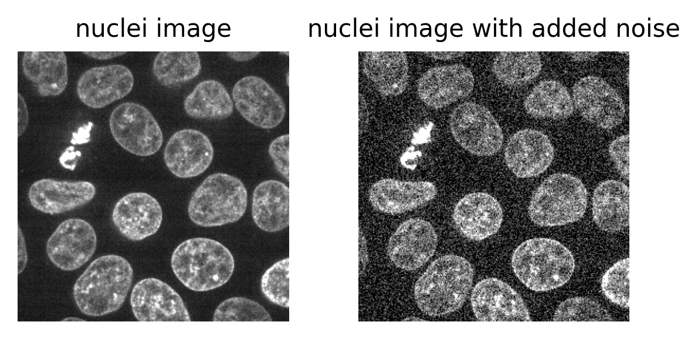

:::::::::::::::::::::::::::::::::::::: questions 

- What are the key factors to consider when choosing acquisition settings?

::::::::::::::::::::::::::::::::::::::::::::::::

::::::::::::::::::::::::::::::::::::: objectives

- Explain some examples of acquisition settings, and factors to consider when 
choosing them

- Explain the difference between resolution and pixel size

- Describe some quality control steps e.g. monitoring the image histogram

::::::::::::::::::::::::::::::::::::::::::::::::

In the last episode we looked at some of the main steps to designing a light microsocpy experiment:

1. Define your research question

2. Define what you need to observe to answer that question

3. Define what you need to measure to answer that question

4. Choose a light microscopy method that fits your data needs

5. Choose acquisition settings that fit your data needs

In this episode, we'll focus on the last step - choosing acquisition settings - as well as looking at some early quality control steps.

## Acquisition settings

Once you've chosen a light microscope to use, there are a wide variety of acquisition settings that can be adjusted. For example, magnification, laser power, exposure time... Different combinations of settings will be best for different samples and research questions. For example, one combination of settings may be best for rapid live cell imaging, while another would be best for high resolution imaging of fixed samples.

There are many different factors that are affected by acquisition settings, but here are some of the main ones to consider:

## Spatial resolution

Spatial resolution is the resolution in 2D (x and y), or 3D (x, y and z). It is defined as the smallest distance between two points on a sample that can still be seen as separate entities. For example, a resolution of one micrometre would mean that objects less than one micrometre apart couldn't be identified separately (i.e. they would appear as one object).

Spatial resolution is affected by many factors including the wavelength of light and the [numerical aperture (NA)](https://www.microscopyu.com/microscopy-basics/numerical-aperture) of the objective lens. Using a shorter wavelength of light and higher NA lenses, can provide higher resolution images.

Spatial resolution can be isotropic (the same in all directions) or anisotropic (different in different directions). Anisotropic resolution is common with 3D datasets, where the x/y resolution tends to be better than the z resolution.

We'll look at spatial resolution in more detail in the [next section](FIXME).

## Temporal resolution

Temporal (or time) resolution, is how fast images can be acquired (usually measured in seconds or milliseconds). This is mainly controlled by the 'exposure time', which is the length of time over which the detector collects light for each image. For a laser scanning confocal microscope, you will instead see a 'dwell time' - this is the time the laser spends illuminating each position on the sample. Decreasing exposure time / dwell time will result in faster overall imaging speeds.

The imaging speed will also depend on some of the mechanical properties of your chosen light microscope. For example, the speed with which a laser-scanning confocal can move the laser across a sample, or (if imaging multiple locations) the speed of the microscope stage movement.

To produce good quality images (with a high signal-to-noise ratio, as we'll look at later), the detector needs to collect as much light as possible in these short timescales.

## Field of view

The field of view is the size of the area you can view with your light microscope. It is often measured as a diameter in millimetres. A larger field of view is useful if you want to, for example, observe a large number of cells at the same time.

The field of view is affected by many factors but, importantly, is directly related to the magnification of the objective lens. Higher levels of magnification result in a smaller field of view.

To image areas larger than the field of view, you will need to acquire multiple images at different positions by moving the microscope's stage. These images can then be stitched together (often with the microscope manufacturer's acquisition software), to give one large final image. This method can provide high resolution images of large areas, but also slows down overall acquisition times.

## Data size

It's important to consider the overall size of your imaging data (e.g. in megabytes (MB), gigabytes (GB) or terabytes (TB)). Light microscopy datasets can be extremely large in size, so you will have to make sure you have appropriate file storage space that is regularly backed up.

The overall size of your data will depend on many factors. For example, increasing your resolution will increase the size of your final images, especially if you are covering a large area by stitching in x/y.

## Light exposure (i.e phototoxicity / photobleaching)

Illuminating our samples with light is an essential part of collecting light microscopy images. This being said, we have to be very careful of the detrimental effects light can have on our samples, especially at high intensity over long time periods. 

Photobleaching is a key issue for fluorescence microscopy. If a fluorophore is exposed to intense light, its structure can degrade over time. This means that it will eventually stop fluorescing entirely.

Another issue is phototoxicity. Light exposure can damage cells resulting in unexpected changes in cell behaviour, morphology and eventually cell death.

Reducing the effects of photobleaching and phototoxicity requires minimising the light exposure of our samples as much as possible. For example, reducing light/laser power, reducing exposure time/dwell time, imaging at lower temporal resolution...

## Signal to noise ratio

Signal to noise ratio is a very useful measure of image quality - in general, it will be easier to identify and measure features of interest in images with a higher signal to noise ratio.

The 'signal' is what we really want to measure - for example, for a fluorescence microscopy image, this would be the light emitted by fluorophores in the sample. In an ideal world the detector would perfectly measure the light intensity, but this isn't really possible. The values the detector records will always be affected by random fluctuations called 'noise'. This noise usually appears as a random 'graininess' over the image and can make details difficult to see.

{alt="Left - the nuclei from Napari's Cells (3D+2Ch) sample image. Right - same image with added gaussian noise"}

To identify and measure our features of interest, the absolute size of the signal and noise are less important than the ratio between them. For example, imagine we are trying to distinguish between two areas with different brightness - one being 1.5x brighter than the other. In a low signal setup where values are small (say 20 vs 30) adding noise can make these areas very difficult to separate. For example, see the diagram below which shows three histograms. The left is the ideal scenario, where there is no noise, and we perfectly see one value of 20 and one of 30. The middle shows the addition of some noise to each value, resulting in wider distributions that overlap extensively. This means that in the combined histogram of these values (right) it becomes impossible to clearly distinguish these two values.

{alt="A screenshot of a 2D image of human cells 
undergoing mitosis in Napari"}

If we imagine a scenario with higher signal, now values of 80 and 120 (one still 1.5x higher than the other), then we can see that the addition of the same noise has a much less drastic effect. As the values are now higher and further apart, the broadening of their distributions only causes them to overlap slightly. We can still clearly distinguish the values in the combined histogram on the right. This demonstrates how increasing the signal to noise ratio can improve our ability to recognise and measure different features.

{alt="A screenshot of a 2D image of human cells 
undergoing mitosis in Napari"}

How can we improve the signal to noise ratio of our images? The main solution is to increase the amount of light that we detect per image, by adjusting our acquisition settings. For example:

- increase light/laser power
- increase exposure time / dwell time
- Use [binning](https://bioimagebook.github.io/chapters/3-fluorescence/4-microscope_types/microscope_types.html#sec-detectors-binning) (this combines multiple pixels into a single larger pixel)
- Average multiple images

If you want to find out more about noise, we recommend the [noise chapter](https://bioimagebook.github.io/chapters/3-fluorescence/3-formation_noise/formation_noise.html) of Pete Bankhead's bioimage book.

:::::::::::::::::::::::::::::::::::::: callout

### Where does noise come from?

Noise comes from many sources - for example, 'photon noise' (also known as 'shot noise') is a key source. Photon noise is caused by inherent statistical fluctuations in the emission of photons (individual light 'packets'). For example, consider a fluorescence microscopy experiment where photons of light are being emitted from a fluorescent label. Even though the average rate of emission is constant, the exact number of photons emitted in a specific time interval (say 30 seconds) will vary each time. Say 20 photons, then 18, then 22... The exact time a photon is emitted is random, so there will always be random variations. These follow a statistical distribution known as a 'poisson distribution' - if you're interested in the details Pete Bankhead's bioimage book has a great chapter on [noise](https://bioimagebook.github.io/chapters/3-fluorescence/3-formation_noise/formation_noise.html).

The important point to consider is that there will always be some photon noise. It is inherit noise in the emission of light, and therefore not dependent on a particular microscope or detector setup.

Other types of noise are dependent on the microscope itself, often associated with the kind of detector used. For example, 'read noise' and 'dark noise' are commonly associated with [CCD (charge-coupled device) cameras](https://www.microscopyu.com/tutorials/ccd-signal-to-noise-ratio). These types of noise relate to slight inaccuracies in quantifying the number of photons that hit the detector - no detector is perfect, so there will always be some variation.

::::::::::::::::::::::::::::::::::::::::::::::::

## Optimising acquisition settings

In an ideal world we could produce the 'perfect' image that optomised for all of the features above: high spatial resolution, high temporal resolution, large field of view, small data size, low light exposure and high signal to noise ratio. This is never possible though! There are always trade-offs and compromises to be made. These different factors are inter-related, usually meaning that optomising for one will reduce the others. For example, increasing spatial resolution requires a reduced field of view and an increased overall data size. As each pixel covers a smaller area, resulting in less signal per pixel, you will likely need to increase light exposure to achieve a reasonable signal to noise ratio. This may mean using higher light intensity, or imaging more slowly (with increased dwell time/exposure time).

{alt="A screenshot of a 2D image of human cells 
undergoing mitosis in Napari" width="80%"}

Different microscopes will provide different ranges for these features - for example, supporting different ranges of spatial or temporal resolution, or providing detectors with different sensitivity that require higher or lower light intensity. Acqusition settings then allow you to fine-tune how that microscope functions, optimising within these ranges for your particular sample and research question. For example, do you need to prioritise temporal resolution for a highly dynamic process? Or perhaps is spatial resolution the priority, as your region of interest is very small? 

[Jonkman et al.'s 2020 paper](https://www.nature.com/articles/s41596-020-0313-9) provides some great advice for choosing confocal microscopes and acquisition settings, with figure 5 as a great example of the different trade-offs.

::::::::::::::::::::::::::::::::::::: challenge 

## Choosing acquisiton settings

In the previous episode, we looked at an example research question, where we were investigating the effects of a specific chemical on cells grown in culture. 

Which acquisition settings would you need to prioritise to answer our research question? - 'Does the chemical affect the number, size or shape of cell nuclei over time?'

Think about the points above and the trade-offs between them to make a list of potential answers. It may be best to discuss in a group, so you can share different ideas.

:::::::::::::::::::::::: solution 

### Solution

:::::::::::::::::::::::::::::::::

::::::::::::::::::::::::::::::::::::::::::::::::

## Resolution vs pixel size

Let's dive deeper into choosing an appropriate spatial resolution for your experiment. First, let's clarify the differences between magnification, pixel size and spatial resolution.

### Spatial resolution 

As [defined above](#Spatial resolution), spatial resolution is the smallest distance between two points on a sample that can still be seen as separate entities. It is a measure of the microscope's ability to resolve small details in an image.

### Magnification

Magnification describes how much larger an object appears through the microscope vs its actual size e.g. 10x larger, 100x larger...

Magnification = (Size of object in microscopy image) / (True size of object)

Note that this is different than the spatial resolution! Magnification just describes how large an object appears, not the size of the details it can resolve. For example, a particular light microscope may have a maximum spatial resolution of one micrometre - meaning that it won't be able to discern features less than this distance apart. It may be possible to magnify images far beyond this limit though, making them appear larger and larger without allowing us to see any more detail. This is known as 'empty magnification' and should be avoided.

### Pixel size

We discussed pixel size in the [filetypes and metadata episode](filetypes-and-metadata.md#pixel-size), but let's recap here. The pixel size states how large a single image pixel is in physical units i.e. 'real world' units of measurement like micrometre, or millimetre. 

Note again that this is different than the spatial resolution! The pixel size helps us understand how large a region each pixel of our image covers, but (as with magnification) it doesn't tell us the size of details the microscope is really capable of resolving.  For example, I could process a microscopy image to artificially give it 4x as many pixels as the original. This would reduce the pixel size without allowing us to see any smaller details i.e. there's no corresponding improvement in spatial resolution!

::::::::::::::::::::::::::::::::::::: challenge 

## Pixel size vs resolution

Consider the 16x16 pixel image below of a circle. If the pixel size in x/y is 1.5 micrometre:

- How wide is the circle (in micrometre)?
- How wide is the entire image (in micrometre)?
- If the circle is displayed as 9cm wide, then what is the magnification?

{alt="A screenshot of a 2D image of human cells 
undergoing mitosis in Napari" width="70%"}

Below is a downsampled version of the same image (now 8x8 pixels).

- What is the new pixel size (in micrometre)?
- How wide is the circle (in micrometre)?
- How wide is the entire image (in micrometre)?
- If the circle is displayed as 9cm wide, then what is the magnification?

{alt="A screenshot of a 2D image of human cells 
undergoing mitosis in Napari" width="70%"}

:::::::::::::::::::::::: solution 

### Solution

### 16x16 image

The circle is 12 pixels wide, which means it is (12 x 1.5) = 18 micrometre wide

The entire image is 16 pixels wide, which means it is (16 x 1.5) = 24 micrometre wide

9cm is equivalent to 90,000 micrometre. The magnification is therefore 90,000 (the displayed size) divided by 18 micrometre (the actual size) = 5000x

### 8x8 image

The image still covers the same total area, but has been downsampled 2x. This means the pixel size will be doubled to 3 micrometre.

As this is an image of the exact same circle as the 16x16 image, the circle width is unchanged. In this image it is 6 pixels wide, which means it is (6 x 3) = 18 micrometre wide (the same as above).

Again, the image still covers the same total area, so its total width will be unchanged too. Here, it's 8 pixels wide, which means it is (8 x 3) = 24 micrometre wide.

The magnification is also unchanged in this case. Magnification depends on the size of an object in the displayed image vs its actual size. If it is still displayed at 9cm wide, then the result will be the same, 5000x.

:::::::::::::::::::::::::::::::::

::::::::::::::::::::::::::::::::::::::::::::::::

### Choosing spatial resolution

Now that we understand the difference between magnification, resolution and pixel size - how do we go about choosing the spatial resolution to use in our experiments? 

The most important thing is to only use the level of resolution that you really require to answer your research question. For example, say you were researching the width of different skin layers using tissue sections on slides. You could image this at extremely high resolution, to resolve individual cells and nuclei, but this wouldn't really be needed to answer the research question. The width of the larger layers could be seen at much lower resolution, allowing you to image a larger area faster, while also keeping your data size as small as possible. Don't increase your resolution without a good reason!  

Equally, you have to be careful not to set your resolution too low. Make sure that it is high enough to resolve the smallest structure you want to be able to see and measure.

## Initial quality control

While acquiring your images, it's good to keep an eye on the image histogram to ensure your images are good quality. Most light microscope's acquisition software will allow you to view a histogram in real time while imaging your sample. Recall from the [image display episode](image-display.md) that histograms provide a quick summary of pixel values in an image. This summary is a useful guide to help us adjust acquisition settings like exposure time / dwell time and laser power. 

In an ideal scenario, we want our histogram to show pixel values over most of the possible intensity range. For example, for an 8-bit image, spread over most of the range from 0 (minimum) to 255 (maximum). This will ensure we are capturing as much information as possible about our sample, and giving ourselves the best chance of distinguishing features that only differ slightly in their brightness. The exercise below covers more features to look for in your image histograms, with more details in the exercise solution.

::::::::::::::::::::::::::::::::::::: challenge 

## Image histogram quality control

Look at the example 8-bit image histograms below. For each:

- Does it represent a good quality image, with an appropriate range of pixel values?

- If not, how might you adjust your acquisition settings to improve it?

{alt="A screenshot of a 2D image of human cells 
undergoing mitosis in Napari"}

:::::::::::::::::::::::: solution 

### Solution

### a

This image is 'underexposed' meaning its pixel values are clustered at low intensity values, without using much of the intensity range. As it uses such a small range of pixel values, it will be difficult to distinguish features of similar brightness.

It could be improved by increasing the amount of light collected - e.g. increasing the exposure time / dwell time or increasing light/laser power.

### b

This image is exposed well - it has pixel values spread throughout most of the range from 0-255.

### c

This image is 'overexposed' meaning its pixel values are clustered at high intensity values. It also shows 'clipping' (also known as 'saturation'), as shown by the very tall peak at the right hand side of the histogram. Clipping means that some pixels are recording light above the maximum limit for the image (in this case 255). As no values beyond this limit can be recorded, they are all 'clipped' to the maximum value, resulting in the abnormally high peak you can see here. Clipping means that information is being irretrievably lost and should be avoided!

It could be improved by reducing the amount of light collected - e.g. reducing exposure time / dwell time or decreasing light/laser power.

### d

This image is exposed well - it has pixel values spread throughout most of the range from 0-255. Note that you will often have image histograms with multiple peaks e.g. a low intensity one for the background and a high intensity one for labelled cells. 

:::::::::::::::::::::::::::::::::

::::::::::::::::::::::::::::::::::::::::::::::::

::::::::::::::::::::::::::::::::::::: keypoints 

- Choosing acquisition settings is a trade-off between many factors including:
spatial resolution, temporal resolution, field of view, data size, 
light exposure and signal to noise ratio

- Signal to noise ratio is a useful measure of image quality

- Magnification describes how much larger an object appears through the microscope vs its actual size. This is not the same as the spatial resolution!

- Pixel size states how large a single image pixel is in physical units e.g. micrometre. Again, this is not the same as spatial resolution.

- Image histograms are a useful quality control measure during acquisition. In general, we want our histogram to show pixel values spread over most of the possible intensity range.

::::::::::::::::::::::::::::::::::::::::::::::::

