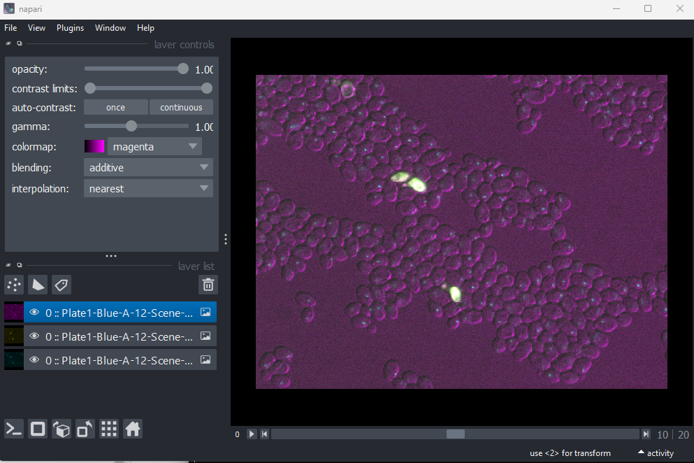
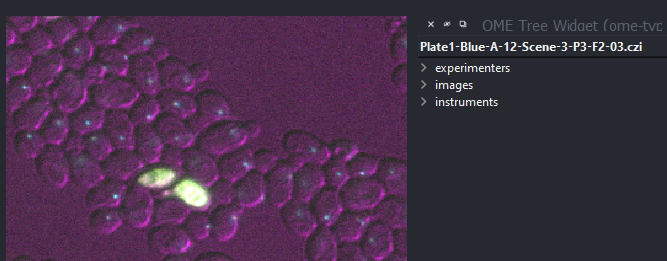
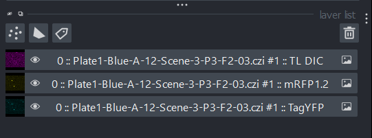

:::::::::::::::::::::::::::::::::::::: questions 

- Which file formats should be used for microscopy images?

::::::::::::::::::::::::::::::::::::::::::::::::

::::::::::::::::::::::::::::::::::::: objectives

- Explain the pros and cons of some popular image file formats
- Explain the difference between lossless and lossy compression
- Inspect image metadata with the napari-aicsimageio plugin
- Inspect and set an image's scale in Napari

::::::::::::::::::::::::::::::::::::::::::::::::

## Image file formats

Images can be saved in a wide variety of file formats - e.g. you may be familiar with some like .jpg, .png or .tiff. Microscopy images have an especially wide range of options, with hundreds of different formats in use, often specific to particular microscope manufacturers. With this being said, how do we choose which format to use?

## Metadata

First, let's look closer at what gets stored inside an image file.

There are two main things that get stored inside image files: _pixel values_ and _metadata_. We've looked at pixel values in previous episodes -  this is the raw image data as an array of numbers with specific dimensions and data type. The metadata, on the other hand, is a wide variety of additional information about the image and how it was acquired.

For example, let's take a look at the metadata in the 'Plate1-Blue-A-12-Scene-3-P3-F2-03.czi' file we downloaded as part of the [setup instructions](../learners/setup.md). To browse the metadata we will use a Napari plugin called [napari-aicsimageio](https://www.napari-hub.org/plugins/napari-aicsimageio). We already installed this as part of the [setup instructions](../learners/setup.md).

:::::::::::::::::::::::::::::::::::::: callout

### Napari-aicsimagio installation

You may be wondering why we didn't install this plugin via `Plugins > Install / Uninstall Plugins...` as we showed in 
the [Image Display episode](./FIXME.md). To support the widest range of file formats, napari-aicsimagio needs integration with Bio-Formats (we'll discuss Bio-Formats later in the episode). Unfortunately, this isn't currently possible via `Plugins > Install / Uninstall Plugins...`, hence why we used [conda to install it](https://github.com/AllenCellModeling/napari-aicsimageio#installation).

::::::::::::::::::::::::::::::::::::::::::::::::

Napari can open a variety of file formats by default, but doesn't support many of the microscope specific file formats. Napari-aicsimagio allows a much wider variety of file formats to be opened in Napari, while also allowing convenient browsing of their metadata.

Let's open the 'Plate1-Blue-A-12-Scene-3-P3-F2-03.czi' file by removing any existing image layers, then dragging and dropping it onto the canvas. Note this can take a while to open, so give it some time! Alternatively, you can select in Napari's top menu-bar:  
`File > Open File(s)...`

{alt="A screenshot of yeast sample data shown in Napari"}

This image is part of a [published dataset on Image Data Resource](https://idr.openmicroscopy.org/search/?query=Name:idr0011-ledesmafernandez-dad4/screenD) (accession number idr0011), and comes from the [OME sample data](https://downloads.openmicroscopy.org/images/Zeiss-CZI/idr0011/). It is a 3D fluorescence microscopy image of yeast with 3 channels.

We can browse its metadata by selecting in the top menu-bar:  
`Plugins > OME Tree Widget (ome-types)`

{alt="A screenshot of yeast sample data shown in Napari"}

This opens a panel on the right-hand side of Napari listing different metadata stored in the file. In this case, we can see it is split into `experimenters`, `images` and `instruments`. You can click on the different categories to expand them and see more detail. For example, under `images > Image:0`, we see useful metadata about this specific image. We can see the `acquisition_date` when this image was acquired. Also, under `pixels` we can see information about the `dimension_order: XYCZT`, the size of different dimensions (`size_c`, `size_t`, `size_x`, `size_y` and `size_z`), the type and bit-depth (`type`) and importantly the pixel size (`physical_size_x`, `physical_size_x_unit` etc.).

This metadata is a vital record of exactly how the image was acquired and what it represents. As we've mentioned in previous episodes - it's important to maintain this metadata as a record for the future. Converting between file formats can result in loss of certain metadata, so it's always worthwhile keeping a copy of your image in its original raw file format.

::::::::::::::::::::::::::::::::::::: challenge 

## Exploring metadata

Explore the metadata in the OME Tree Widget panel to answer the following questions:

- What model of microscope was used to take this image?
- What detector was used to take this image?
- What does each channel show? For example, which fluorophore is used? What is its excitation and emission wavelength?

:::::::::::::::::::::::: solution 
 
## Solution

### Microscope model

Under `instruments > Instrument:0 > microscope`, we can see that this used an Axio Imager.Z2 microscope (which is a type of upright microscope).

### Detector
Under `instruments > Instrument:0 > detectors > Detector:HDCam`, we can see that this used an HDCamC10600-30B (ORCA-R2) detector.

### Channels

Under `images > Image:0 > pixels > channels`, we can see one entry per channel - `Channel:0:0`, `Channel:0:1` and `Channel:0:2`. 

Expanding the first, we can see that its `fluor` is TagYFP, a fluorophore with `emission_wavelength` of 524nm and `excitation_wavelength` of 508nm.

Expanding the second, we can see that its `fluor` is mRFP1.2, a fluorophore with `emission_wavelength` of 612nm and `excitation_wavelength` of 590nm.

Expanding the third, we see that its `fluor` is TL DIC. This stands for Transmitted Light Differential Interference Contrast Microscopy. No emission or excitation wavelength is listed, as no flourophore is used.

You can see which channel is which in the viewer by expanding the layer list to the right, to see the full names. The channel name has been added automatically to the end of each:

{alt="A screenshot of yeast sample data shown in Napari"}
:::::::::::::::::::::::::::::::::

::::::::::::::::::::::::::::::::::::::::::::::::

:::::::::::::::::::::::::::::::::::::: callout

### Napari-aicsimagio image / metadata support

Only certain file types will support browsing metadata via the 'OME Tree Widget' in napari-aicsimageio. The plugin is still under development - so more formats are likely to be supported in future!

If you have difficulty opening a specific file format with napari-aicsimageio, it's worth trying to open it in [Fiji](https://imagej.net/software/fiji/) also. Fiji has very well established integration with Bio-Formats, and so tends to support a wider range of formats. You can always save your image (or part of your image) as another format like .tiff via Fiji to open in Napari (making sure you still retain a copy of the original file and its metadata!)

::::::::::::::::::::::::::::::::::::::::::::::::

## Pixel size

One of the most important pieces of metadata is the pixel size. In our .czi image, this is stored under `images > Image:0 > pixels` as `physical_size` and `physical_size_unit` for each axis (x, y and z). The pixel size states how large a pixel is in physical units i.e. 'real world' units of measurement like micrometre, or millimetre. In this case the unit given is '&mu;m' (micrometre). This means that each pixel has a size of 0.20&mu;m (x axis),  0.20&mu;m (y axis) and 0.35&mu;m (z axis). As this image is 3D, you will sometimes hear the pixels referred to as 'voxels', which is just a term for a 3D pixel.

The pixel size is important to ensure that any measurements made on the image are correct. For example, how long is a particular cell? Or how wide is each nucleus? These answers can only be correct if the pixel size is properly set. It's also useful when we want to overlay different images on top of each other (potentially acquired with different kinds of microscope) - setting the pixel size appropriately will ensure their overall size matches correctly in the Napari viewer.

How do we set the pixel size in Napari? Most of the time, if the pixel size is provided in the image metadata, napari-aicsimageio will set it automatically. We can check this by running the following in the console:

```python
# Get the first image layer
image_layer = viewer.layers[0]

# Print its scale
print(image_layer.scale)
```

```output
# [z y x]
[0.35 0.2047619 0.2047619]
```

Each image layer in Napari has a `.scale` which is equivalent to the pixel size. Here we can see that it is already set to values matching the image metadata. 

If the pixel size isn't listed in the metadata, or napari-aicsimagio doesn't read it correctly, you can set it manually like so:
```python
image_layer.scale = (0.35, 0.2047619, 0.2047619)
```

## Choosing a file format

Now that we've seen an example of browsing metadata in Napari, let's look more closely into how we can decide on a file format. There are many factors to consider, including:

### Dimension support

Some file formats will only support a certain number of dimensions. For example, .png and .jpg only support 2D images, while .tiff can support images with many more dimensions.

### Metadata support

As mentioned above, image metadata is a very important record of how an image was acquired and what it represents. Different file formats have different standards for how to store metadata, and what kind of metadata they accept. This means that converting between file formats often results in loss of some metadata.

### Compatibility with software

Some image analysis software will only support certain image file formats. If an image format isn't supported, you will likely need to make a copy of your data in a new format.

### Proprietary vs open formats

Many light microscopes will save data automatically into their own proprietary file formats (owned by the microscope company). For example, Zeiss microscopes often save to .czi, while Leica microscopes use .lif. These formats will retain all the metadata used during acquisition, but are often difficult to open in software that wasn't created by the same company. 

[Bio-Formats](https://www.openmicroscopy.org/bio-formats/) is an open-source project that helps to solve this problem - allowing over 100 file formats to be opened in many pieces of open source software. Napari-aicsimageio (that we were using earlier in this episode) integrates with Bio-Formats to allow many different file formats to be opened in Napari. Bio-Formats is really essential to allow us to work with these multitude of formats! Even so, it won't support absolutely everything, so you will likely need to convert your data to another file format sometimes. If so, it's good practice to use an open file format whose specification is freely available, that can be opened in many different pieces of software e.g. OME-TIFF. 

### Compression

Different file formats use different types of 'compression'. Compression is a way to reduce image file sizes, by changing the way that the image pixel values are stored. There are two main types:

- **Lossless compression** - when the image file is written, an algorithm is applied to reduce its file size. This process is 'lossless' i.e. when the file is opened again the compression process can be reversed perfectly to give exactly the same pixel values.

- **Lossy compression** - when the image is written, an algorithm is applied to reduce its file size. This process is 'lossy' i.e. when the file is opened again the pixel values will be _different_. Some image quality is lost via this process, but it can achieve much smaller file sizes.

For microscopy data, you should therefore use a file format with no compression, or lossless compression. Lossy compression should be avoided as it degrades the pixel values!

### Handling of large image data

If your images are very large, you may need to use a pyramidal file format that is specialised for handling them. Pyramidal file formats store images at multiple resolutions (and usually in small chunks) so that they can be browsed smoothly without having to load all of the full-resolution data. Specialised software like [QuPath](https://qupath.github.io/), [Fiji's BigDataViewer](https://imagej.net/plugins/bdv/) and [OMERO's viewer](https://www.openmicroscopy.org/omero/) can provide smooth browsing of these kinds of images.

## Common file formats

So there are many factors to consider when choosing file formats! It's very likely that you will use different file formats for different purposes - for example, for acquisition, analysis and display. Pete Bankhead's bioimage book has a great chapter on [Files & file formats](https://bioimagebook.github.io/chapters/1-concepts/6-files/files.html) that goes into more detail.

Let's take a look at some common file formats (this table is from [Pete Bankhead's bioimage book](https://bioimagebook.github.io/chapters/1-concepts/6-files/files.html#table-file-formats) which is released under a CC-BY 4.0 license):

| Format   | Extensions   | Main use   |  Compression | Comment          |
| :------  | :-------     | :-------   | :-------     | :--------------- |
| TIFF     | .tiff, .tiff | Analysis, display (print) | None, lossless, lossy | Very general image format |
| OME-TIFF | .ome.tif, .ome.tiff | Analysis, display (print) | None, lossless, lossy | TIFF, with standardized metadata for microscopy |
| Zarr     | .zarr        | Analysis | None, lossless, lossy | Emerging format, great for big datasets – but limited support currently |
| PNG      | .png         | Display (web, print) | Lossless | Small(ish) file sizes without compression artefacts |
| JPEG     | .jpg, .jpeg  | Display (web) | Lossy (usually) | Small file sizes, but visible artefacts |

You'll notice that many file formats can support different types of compression e.g. none, lossless or lossy. You'll have to make sure that you are avoiding use of lossy compression wherever possible.

Also, note that there are many, many proprietary microscopy file formats in addition to these. When acquiring your images at the microscope, it's usually a good idea to use whatever the standard proprietary format is for that microscope. This will ensure you retain as much metadata as possible, and have maximum compatibility with that company's acquisition and analysis software. If this format can't be used directly in your analysis software of choice, then it's a good idea to switch to one of the formats in the table above specialised for analysis (TIFF and OME-TIFF are popular choices). For display, you will need to use common file formats that can be opened in any imaging software (not just scientific) like png, jpeg or tiff. Note that jpeg usually uses lossy compression, so it's only advisable if you need very small file sizes (for example, for displaying many images on a website).

::::::::::::::::::::::::::::::::::::: keypoints 

- Image files contain pixel values and metadata.
- Metadata is an important record of how an image was acquired and what it 
represents.
- Napari-aicsimagio allows many more image file formats to be opened in Napari,
along with providing easy browsing of some metadata.
- Pixel size states how large a pixel is in physical units (e.g. micrometre).
- Compression can be lossless or lossy - lossless is best for microscopy images.
- There are many, many different microscopy file formats. Different formats are 
best for different uses like acquisition, analysis and display.

::::::::::::::::::::::::::::::::::::::::::::::::

