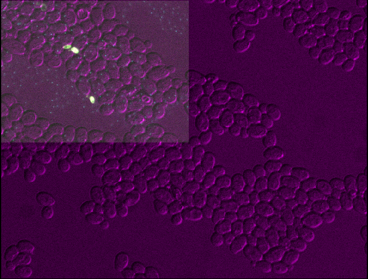

:::::::::::::::::::::::::::::::::::::: questions 

- Which file formats should be used for microscopy images?

::::::::::::::::::::::::::::::::::::::::::::::::

::::::::::::::::::::::::::::::::::::: objectives

- Explain the pros and cons of some popular image file formats
- Explain the difference between lossless and lossy compression
- Inspect image metadata with the napari-aicsimageio plugin
- Inspect and set an image's scale in Napari

::::::::::::::::::::::::::::::::::::::::::::::::

## Image file formats

Images can be saved in a wide variety of file formats. You may be familiar 
with many of these like JPEG (files ending with .jpg or .jpeg extension), 
PNG (.png extension) or TIFF (.tiff or .tif extension). Microscopy images have 
an especially wide range of options, with hundreds of different formats in use, 
often specific to particular microscope manufacturers. With this being said, how 
do we choose which format(s) to use in our research? It's worth bearing in mind 
that the best format to use will vary depending on your research question and 
experimental workflow - so you may need to use different formats on 
different research projects.

## Metadata

First, let's look closer at what gets stored inside an image file.

There are two main things that get stored inside image files: _pixel values_ and 
_metadata_. We've looked at pixel values in previous episodes ([What is an 
image?](what-is-an-image.md), [Image display](image-display.md) and 
[Multi-dimensional images](multi-dimensional-images.md) episodes) -  this is the 
raw image data as an array of numbers with specific dimensions and data type. 
The metadata, on the other hand, is a wide variety of additional information 
about the image and how it was acquired.

For example, let's take a look at the metadata in the 
'Plate1-Blue-A-12-Scene-3-P3-F2-03.czi' file we downloaded as part of the 
[setup instructions](../learners/setup.md). To browse the metadata we will use 
a Napari plugin called [napari-aicsimageio
](https://www.napari-hub.org/plugins/napari-aicsimageio). This plugin allows a 
wide variety of file formats to be opened in Napari that aren't supported by 
default. This plugin was already installed in the [setup instructions
](../learners/setup.md), so you should be able to start using it straight away.

Let's open the 'Plate1-Blue-A-12-Scene-3-P3-F2-03.czi' file by removing any 
existing image layers, then dragging and dropping it onto the canvas. In the 
pop-up menu that appears, select 'napari-aicsimageio'. Note this can take a 
while to open, so give it some time! Alternatively, you can select in Napari's 
top menu-bar:  
`File > Open File(s)...`

{alt="A screenshot of yeast sample data shown in 
Napari"}

This image is part of a [published dataset on Image Data Resource
](https://idr.openmicroscopy.org/search/?query=Name:idr0011-ledesmafernandez-dad4/screenD) 
(accession number idr0011), and comes from the [OME sample data
](https://downloads.openmicroscopy.org/images/Zeiss-CZI/idr0011/). It is a 3D 
fluorescence microscopy image of yeast with three channels (we'll explore what
these channels represent in the [Exploring metadata exercise
](#exploring-metadata)). Napari has automatically recognised these three 
channels and split them into three separate image layers. Recall that we looked
at how Napari handles channels in the [multi-dimensional images 
episode](multi-dimensional-images.md#channels).

We can browse its metadata by selecting in the top menu-bar:  
`Plugins > OME Tree Widget (ome-types)`

{alt="A screenshot of napari-aicsimageio's OME Tree 
Widget"}

This opens a panel on the right-hand side of Napari listing different metadata 
stored in the file. In this case, we can see it is split into categories like 
`experimenters`, `images` and `instruments`... You can click on the different 
categories to expand them and see more detail. For example, under 
`images > Image:0`, we see useful metadata about this specific image. We can 
see the `acquisition_date` when this image was acquired. Also, under `pixels` 
we can see information about the `dimension_order`, the size of different 
dimensions (`size_c`, `size_t`, `size_x`, `size_y` and `size_z`), the type and 
bit-depth (`type`) and importantly the pixel size (`physical_size_x`, 
`physical_size_x_unit` etc.). The pixel size is essential for making accurate
quantitative measurements from our images, and will be discussed [in the next 
section of this episode](#pixel-size).

This metadata is a vital record of exactly how the image was acquired and what 
it represents. As we've mentioned in previous episodes - it's important to 
maintain this metadata as a record for the future. It's also essential to allow
us to make quantitative measurements from our images, by understanding factors 
like the pixel size. Converting between file formats can result in loss of 
metadata, so it's always worthwhile keeping a copy of your image safely in its 
original raw file format. You should take extra care to ensure that additional 
processing steps don't overwrite this original image.


:::::::::::::::::::::::::::::::::::::: callout

### Exploring metadata in the console

Note that you can also inspect some metadata via the console (as below). Here we 
use python's [rich](https://github.com/Textualize/rich) library to add 
colour-coding to make the output easier to read:

```python
import rich
rich.print(viewer.layers[0].metadata)
```

{alt="Screenshot of metadata printed to Napari's 
console"}

See the [napari-aicsimageio readme
](https://github.com/AllenCellModeling/napari-aicsimageio?tab=readme-ov-file#access-to-the-aicsimage-object-and-metadata) 
for details.

::::::::::::::::::::::::::::::::::::::::::::::::

::::::::::::::::::::::::::::::::::::: challenge 

## Exploring metadata

Explore the metadata in the OME Tree Widget panel to answer the following 
questions:

- What manufacturer made the microscope used to take this image?
- What detector was used to take this image?
- What does each channel show? For example, which fluorophore is used? What is 
its excitation and emission wavelength?

:::::::::::::::::::::::: solution 
 
## Solution

### Microscope model

Under `instruments > Instrument:0 > microscope`, we can see that the 
manufacturer was Zeiss.

### Detector
Under `instruments > Instrument:0 > detectors > Detector:HDCam`, we can see 
that this used an HDCamC10600-30B (ORCA-R2) detector.

### Channels

Under `images > Image:0 > pixels > channels`, we can see one entry per channel 
- `Channel:1-0`, `Channel:2-0` and `Channel:3-0`. 

Expanding the first, we can see that its `fluor` is TagYFP, a fluorophore with 
`emission_wavelength` of 524nm and `excitation_wavelength` of 508nm.

Expanding the second, we can see that its `fluor` is mRFP1.2, a fluorophore with 
`emission_wavelength` of 612nm and `excitation_wavelength` of 590nm.

Expanding the third, we see that it has no `fluor`, `emission_wavelength` or 
`excitation_wavelength` listed. Its `illumination_type` is listed as 
'transmitted', so this is simply an image of the yeast cells with no 
fluorophores used.

:::::::::::::::::::::::::::::::::

::::::::::::::::::::::::::::::::::::::::::::::::

:::::::::::::::::::::::::::::::::::::: callout

### Napari-aicsimagio image / metadata support

Only certain file types will support browsing metadata via the 'OME Tree Widget' 
in napari-aicsimageio. The plugin is still under development - so more formats 
are likely to be supported in future!

Napari-aicsimageio also has [limits on the size of images
](https://github.com/AllenCellModeling/napari-aicsimageio?tab=readme-ov-file#reading-mode-threshold) 
it will load directly into memory. Only images with a filesize less than 4GB and 
less than 30% of available memory will be loaded directly. Otherwise, images are 
loaded as smaller chunks as required.

If you have difficulty opening a specific file format with napari-aicsimageio, 
it's worth trying to open it in [Fiji](https://imagej.net/software/fiji/) also. 
Fiji has very well established integration with Bio-Formats, and so tends to 
support a wider range of formats. Note that you can always save your image (or 
part of your image) as another format like .tiff via Fiji to open in Napari 
later (making sure you still retain a copy of the original file and its 
metadata!)

::::::::::::::::::::::::::::::::::::::::::::::::

## Pixel size

One of the most important pieces of metadata is the pixel size. In our .czi 
image, this is stored under `images > Image:0 > pixels` as `physical_size` and 
`physical_size_unit` for each axis (x, y and z). The pixel size states how large 
a pixel is in physical units i.e. 'real world' units of measurement like 
micrometre, or millimetre. In this case the unit given is 'μm' (micrometre). 
This means that each pixel has a size of 0.20μm (x axis),  0.20μm (y axis) 
and 0.35μm (z axis). As this image is 3D, you will sometimes hear the pixels 
referred to as 'voxels', which is just a term for a 3D pixel.

The pixel size is important to ensure that any measurements made on the image 
are correct. For example, how long is a particular cell? Or how wide is each 
nucleus? These answers can only be correct if the pixel size is properly set. 
It's also useful when we want to overlay different images on top of each other 
(potentially acquired with different kinds of microscope) - setting the pixel 
size appropriately will ensure their overall size matches correctly in the 
Napari viewer.

How do we set the pixel size in Napari? Most of the time, if the pixel size is 
provided in the image metadata, napari-aicsimageio will set it automatically 
in a property called `scale`. We can check this by running the following in 
Napari's console:

```python
# Get the first image layer
image_layer = viewer.layers[0]

# Print its scale
print(image_layer.scale)
```

```output
# [z y x]
[0.35 0.2047619 0.2047619]
```

Each image layer in Napari has a `.scale` which is equivalent to the pixel size. 
Here we can see that it is already set to values matching the image metadata. 

If the pixel size isn't listed in the metadata, or napari-aicsimagio doesn't 
read it correctly, you can set it manually like so:
```python
image_layer.scale = (0.35, 0.2047619, 0.2047619)
```

::::::::::::::::::::::::::::::::::::: challenge 

## Pixel size / scale

Copy and paste the following into Napari's console to get `image_layer_1`, 
`image_layer_2` and `image_layer_3` of the yeast image:

```python
image_layer_1 = viewer.layers[0]
image_layer_2 = viewer.layers[1]
image_layer_3 = viewer.layers[2]
```

1. Check the `.scale` of each layer - are they the same?
2. Set the scale of layer 3 to (0.35, 0.4, 0.4) - what changes in the viewer?
3. Set the scale of layer 3 to (0.35, 0.4, 0.2047619) - what changes in the 
viewer?
4. Set the scale of all layers so they are half as wide and half as tall as 
their original size in the viewer


:::::::::::::::::::::::: solution 

## Solution

### 1

All layers have the same scale

```python
print(image_layer_1.scale)
print(image_layer_2.scale)
print(image_layer_3.scale)
```
```output
[0.35 0.2047619 0.2047619]
[0.35 0.2047619 0.2047619]
[0.35 0.2047619 0.2047619]
```

### 2

{alt="Yeast image shown in Napari with layer 3 
twice as big in y and x"}

```python
image_layer_3.scale = (0.35, 0.4, 0.4)
```
You should see that layer 3 becomes about twice as wide and twice as tall as the 
other layers. This is because we set the pixel size in y and x (which used to 
be 0.2047619μm) to about twice its original value (now 0.4μm).

### 3

{alt="Yeast image shown in Napari with layer 3 
twice as big in y"}

```python
image_layer_3.scale = (0.35, 0.4, 0.2047619)
```
You should see that layer 3 appears squashed - with the same width as other 
layers, but about twice the height. This is because we set the pixel size in y 
(which used to be 0.2047619μm) to about twice its original value (now 
0.4μm). Bear in mind that setting the pixel sizes inappropriately can lead 
to stretched or squashed images like this!

### 4

{alt="Yeast image shown in Napari with all layers 
half size in y/x"}

We set the pixel size in y/x to half its original value of 0.2047619μm:
```python
image_layer_1.scale = (0.35, 0.10238095, 0.10238095)
image_layer_2.scale = (0.35, 0.10238095, 0.10238095)
image_layer_3.scale = (0.35, 0.10238095, 0.10238095)
```
:::::::::::::::::::::::::::::::::

::::::::::::::::::::::::::::::::::::::::::::::::

## Choosing a file format

Now that we've seen an example of browsing metadata in Napari, let's look more 
closely into how we can decide on a file format. There are many factors to 
consider, including:

### Dimension support

Some file formats will only support certain dimensions e.g. 2D, 3D, a specific 
number of channels... For example, .png and .jpg only support 2D images (either 
grayscale or RGB), while .tiff can support images with many more dimensions 
(including any number of channels, time, 2D and 3D etc.).

### Metadata support

As mentioned above, image metadata is a very important record of how an image 
was acquired and what it represents. Different file formats have different 
standards for how to store metadata, and what kind of metadata they accept. This 
means that converting between file formats often results in loss of some 
metadata.

### Compatibility with software

Some image analysis software will only support certain image file formats. If a 
format isn't supported, you will likely need to make a copy of your data in a 
new format.

### Proprietary vs open formats

Many light microscopes will save data automatically into their own proprietary 
file formats (owned by the microscope company). For example, Zeiss microscopes 
often save files to a format with a .czi extension, while Leica 
microscopes often use a format with a .lif extension. These formats will retain 
all the metadata used during acquisition, but are often difficult to open in 
software that wasn't created by the same company. 

[Bio-Formats](https://www.openmicroscopy.org/bio-formats/) is an open-source 
project that helps to solve this problem - allowing over 100 file formats to be 
opened in many pieces of open source software. Napari-aicsimageio (that we used 
earlier in this episode) integrates with Bio-Formats to allow many different 
file formats to be opened in Napari. Bio-Formats is really essential to allow us 
to work with these multitude of formats! Even so, it won't support absolutely 
everything, so you will likely need to convert your data to another file format 
sometimes. If so, it's good practice to use an open file format whose 
specification is freely available, and can be opened in many different pieces of 
software e.g. OME-TIFF. 

### Compression

Different file formats use different types of 'compression'. Compression is a 
way to reduce image file sizes, by changing the way that the image pixel values 
are stored. There are many different compression algorithms that compress files 
in different ways. 

Many compression algorithms rely on finding areas of an image with similar pixel 
values that can be stored in a more efficient way. For example, imagine a 
row of 30 pixels from an 8-bit grayscale image: 

{alt="Diagram of a line of 30 pixels - 10 with pixel 
value 50, then 10 with pixel value 100, then 10 with pixel value 150"}

Normally, this would be stored as 30 individual pixel values, but we can reduce 
this greatly by recognising that many of the pixel values are the same. We could
store the exact same data with only 6 values: 10 50 10 100 10 150, showing that 
there are 10 values with pixel value 50, then 10 with value 100, then 10 with 
value 150. This is the general idea behind 'run-length encoding' and many 
compression algorithms use similar principles to reduce file sizes.

There are two main types of compression:

- **Lossless compression** algorithms are reversible - when the file is opened 
again, it can be reversed perfectly to give the exact same pixel values.

- **Lossy compression** algorithms reduce the size by irreversibly altering the 
data. When the file is opened again, the pixel values will be different to their 
original values. Some image quality may be lost via this process, but it can 
achieve much smaller file sizes.

For microscopy data, you should therefore use a file format with no compression, 
or lossless compression. Lossy compression should be avoided as it degrades the 
pixel values and may alter the results of any analysis that you perform!

::::::::::::::::::::::::::::::::::::: challenge 

## Compression

Let's remove all layers from the Napari viewer, and open the 
'00001_01.ome.tiff' dataset. You should have already downloaded this to your 
working directory as part of the [setup instructions](../learners/setup.md).

Run the code below in Napari's console. This will save a specific timepoint of 
this image (time = 30) as four different file formats (.tiff, .png + low and 
high quality .jpg). Note: these files will be written to the same folder as the 
'00001_01.ome.tiff' image!

```python
from skimage.io import imsave
from pathlib import Path

# Get the 00001_01.ome layer, and get timepoint = 30
layer = viewer.layers["00001_01.ome"]
image = layer.data[30, :, :]

# Save as different file formats in same folder as 00001_01.ome
folder_path = Path(layer.source.path).parent
imsave( folder_path / "test-tiff.tiff", image)
imsave( folder_path / "test-png.png", image)
imsave( folder_path / "test-jpg-high-quality.jpg", image, quality=75)
imsave( folder_path / "test-jpg-low-quality.jpg", image, quality=30)

```

- Go to the folder where '00001_01.ome.tiff' was saved and look at the file 
sizes of the newly written images (`test-tiff`, `test-png`, 
`test-jpg-high-quality` and `test-jpg-low-quality`). Which is biggest? 
Which is smallest?

- Open all four images in Napari. Zoom in very close to a bright nucleus, and 
try showing / hiding different layers with the {alt="A screenshot of Napari's eye button" height='30px'} icon. 
How do they differ? How does each compare to timepoint 30 of the original 
'00001_01.ome' image?

- Which file formats use lossy compression?

:::::::::::::::::::::::: solution 
 
## Solution

### File sizes

'test_tiff' is largest, followed by 'test-png', then 'test-jpg-high-quality', 
then 'test-jpg-low-quality'.

### Differences to original

By showing/hiding different layers, you should see that 'test-tiff' and 
'test-png' look identical to the original image (when its slider is set to 
timepoint 30). In contrast, both jpg files show blocky artefacts around the 
nuclei - the pixel values have clearly been altered. This effect is worse in the 
low quality jpeg than the high quality one.

### Lossy compression

Both jpg files use lossy compression, as they alter the original pixel values. 
The low quality jpeg compresses the file more than the high quality jpeg, 
resulting in smaller file sizes, but also worse alteration of the pixel values. 
The rest of the file formats (.tiff / .png) use no compression, or lossless 
compression - so their pixel values are identical to the original values. 

:::::::::::::::::::::::::::::::::

::::::::::::::::::::::::::::::::::::::::::::::::


### Handling of large image data

If your images are very large, you may need to use a pyramidal file format that 
is specialised for handling them. Pyramidal file formats store images at 
multiple resolutions (and usually in small chunks) so that they can be browsed 
smoothly without having to load all of the full-resolution data. This is similar 
to how google maps allows browsing of its vast quantities of map data. 
Specialised software like [QuPath](https://qupath.github.io/), [Fiji's 
BigDataViewer](https://imagej.net/plugins/bdv/) and [OMERO's viewer
](https://www.openmicroscopy.org/omero/) can provide smooth browsing of these 
kinds of images.

See below for an example image pyramid (using napari's Cells (3D + 2Ch) sample 
image) with three different resolution levels stored. Each level is about twice
as small the last in x and y:

{alt="Diagram of an image pyramid with three 
resolution levels" width="40%"}


## Common file formats

As we've seen so far, there are many different factors to consider when choosing 
file formats. As different file formats have various pros and cons, it is very 
likely that you will use different formats for different purposes. For example, 
having one file format for your raw acquisition data, another for some 
intermediate analysis steps, and another for making diagrams and figures for 
display. Pete Bankhead's bioimage book has a great chapter on 
[Files & file formats
](https://bioimagebook.github.io/chapters/1-concepts/6-files/files.html) that 
explores this in detail.

To finish this episode, let's look at some common file formats you are likely to 
encounter (this table is from [Pete Bankhead's bioimage book
](https://bioimagebook.github.io/chapters/1-concepts/6-files/files.html#table-file-formats) 
which is released under a CC-BY 4.0 license):

| Format   | Extensions   | Main use   |  Compression | Comment          |
| :------  | :-------     | :-------   | :-------     | :--------------- |
| TIFF     | .tif, .tiff | Analysis, display (print) | None, lossless, lossy | Very general image format |
| OME-TIFF | .ome.tif, .ome.tiff | Analysis, display (print) | None, lossless, lossy | TIFF, with standardized metadata for microscopy |
| Zarr     | .zarr        | Analysis | None, lossless, lossy | Emerging format, great for big datasets – but limited support currently |
| PNG      | .png         | Display (web, print) | Lossless | Small(ish) file sizes without compression artefacts |
| JPEG     | .jpg, .jpeg  | Display (web) | Lossy (usually) | Small file sizes, but visible artefacts |

Note that there are many, many proprietary microscopy file formats in addition 
to these! You can get a sense of how many by browsing Bio-Formats list of 
[supported formats
](https://bio-formats.readthedocs.io/en/v7.1.0/supported-formats.html).

You'll also notice that many file formats support different types of compression 
e.g. none, lossless or lossy (as well as different compression settings 
like the 'quality' we saw on jpeg images earlier). You'll have to make sure you 
are using the right kind of compression when you save images into these formats.

To summarise some general recommendations:

- During acquisition, it's usually a good idea to use whatever the standard 
proprietary format is for that microscope. This will ensure you retain as much 
metadata as possible, and have maximum compatibility with that company's 
acquisition and analysis software.

- During analysis, sometimes you can directly use the format you acquired your 
raw data in. If it's not supported, or you need to save new images of e.g. 
sub-regions of an image, then it's a good idea to switch to one of the formats 
in the table above specialised for analysis (TIFF and OME-TIFF are popular 
choices).

- Finally, for display, you will need to use common file formats that can be 
opened in any imaging software (not just scientific) like png, jpeg or tiff. 
Note that jpeg usually uses lossy compression, so it's only advisable if you 
need very small file sizes (for example, for displaying many images on a 
website).

::::::::::::::::::::::::::::::::::::: keypoints 

- Image files contain pixel values and metadata.
- Metadata is an important record of how an image was acquired and what it 
represents.
- Napari-aicsimagio allows many more image file formats to be opened in Napari,
along with providing easy browsing of some metadata.
- Pixel size states how large a pixel is in physical units (e.g. micrometre).
- Compression can be lossless or lossy - lossless is best for microscopy images.
- There are many, many different microscopy file formats. The best format to use 
depends on your use-case e.g. acquisition, analysis or display.

::::::::::::::::::::::::::::::::::::::::::::::::

