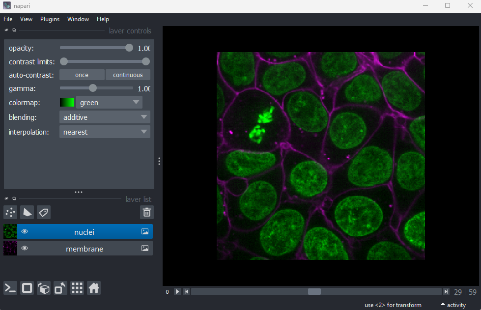
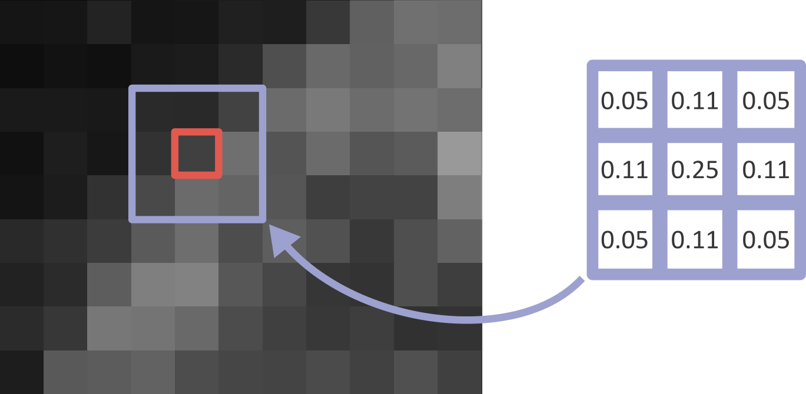
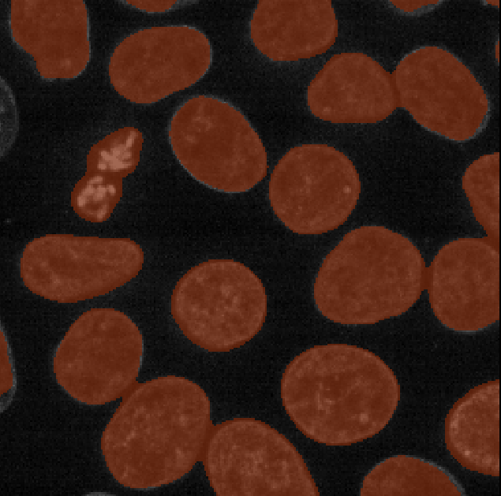

:::::::::::::::::::::::::::::::::::::: questions 

- What is thresholding?
- What are filters?

::::::::::::::::::::::::::::::::::::::::::::::::

::::::::::::::::::::::::::::::::::::: objectives

- Threshold an image manually using its histogram, and display the result in 
Napari

- Use gaussian blur and otsu thresholding from Napari plugins:
`napari-segment-blobs-and-things-with-membranes` and `napari-simple-itk-image-processing`

- Explain how filters work - e.g. what is a kernel? What does the 'sigma' of a 
gaussian blur change?

- Explain the difference between Napari's `.add_labels()` and `.add_image()`

::::::::::::::::::::::::::::::::::::::::::::::::

In the previous episode, we started to develop an image processing workflow to count the number of cells in an image. So far, this focused on manual segmentation like so:

1. Quality Control
2. Manual segmentation of nuclei
3. Count nuclei

The issue with relying on manual segmentation for this task is that it is very slow and time consuming! While it's feasible for a small image, it would take much too long for large images in large quantities. For this, we need to introduce more automated methods, which we will start to look at in this episode. Using more automated methods has the added benefit of making your image processing more _reproducible_ - by having a clear record of every step that produced your final result, it will be easier for other researchers to replicate your work and also try similar methods on their own data.

## Thresholding

If you don't have Napari's 'Cells (3D + 2Ch)' image open, then open it with:  
`File > Open Sample > napari builtins > Cells (3D + 2Ch)`

{alt="A screenshot of a flourescence microscopy image 
of some cells in Napari"}

Remove all layers apart from 'nuclei' from the layer list. Select any additional layers, then click the {alt="A screenshot of Napari's delete layer button" height='30px'} icon to remove them. 

Now that we only have our nuclei image displayed, let's look at how we can create a mask. Recall from the [last episode](quality-control-and-manual-segmentation), that a 'mask' is a segmentation with only two labels - background + your class of interest (in this case nuclei).

One way to create a mask is to use a method called 'thresholding'. Thresholding is simply choosing a specific pixel value to use as the cut-off between background and your class of interest. For example, you could choose a pixel value of 100 and set all pixels with a value less than that as background, and all pixels with a value greater than that as nuclei. How do we go about choosing a good threshold though?

One key method is using the image histogram - recall that we looked at histograms in detail in the [image display episode](image-display.md). Let's go ahead and open a histogram with:  
`Plugins > napari Matplotlib > Histogram`

{alt="A histogram of the 29th z slice of Napari's 
cell sample image"}

From this histogram, we can see two peaks - a larger one at low intensity, then a smaller one at higher intensity. Looking at the image, it would make sense if the lower intensity peak represented the background, with the higher one representing the nuclei. We can verify this by adjusting the contrast limits in the layer controls. If we move the left contrast limits node to just above the low intensity peak (around 8266), we can still clearly see the nuclei:

{alt="A screenshot of a flourescence microscopy image 
of some cells in Napari"}

If we move the left contrast limits node to just above the higher intensity peak (around 28263), most of the nuclei disappear from the image:

{alt="A screenshot of a flourescence microscopy image 
of some cells in Napari"}

Recall that you can set specific values for the contrast limits by right clicking on the contrast limits slider in Napari.

This demonstrates that the higher intensity peak is the one we are interested in, and we should set our threshold to capture this.

We can set this threshold with some commands in Napari's console:

```python

# Get the image data for the nuclei
nuclei = viewer.layers["nuclei"].data

# Create mask with a threshold of 8266
mask = nuclei > 8266

# Add mask to the Napari viewer
viewer.add_labels(mask)

```

Note that we use `.add_labels()` here, rather than `.add_image()` which we used in previous episodes. `.add_labels()` will ensure our mask is added as a `Labels` layer, giving us access to all the annotation tools and settings for segmentations (as covered in the [manual segmentation episode](quality-control-and-manual_segmentation.md)). `add_image()` would create a standard `Image` layer, which is not what we want in this case.

You should see a mask appear that highlights the nuclei in brown. If we set the nuclei contrast limits back to normal (select 'nuclei' in the layer list, then drag the left contrast limits node back to zero), then toggle on/off the mask with the {alt="A screenshot of Napari's eye button" height='30px'} icon, you should see that the brown areas match the nucleus boundaries reasonably well. They aren't perfect though! The brown regions have a speckled appearance where some regions inside nuclei aren't labelled and some areas in the background are incorrectly labelled. We need to find a way to smooth out this nucleus mask.

{alt="A screenshot of a flourescence microscopy image 
of some cells in Napari"}

## Adding plugins to help with segmentation

For this next part, we will need to install some additional plugins for Napari. If you need a refresher on the details of how to find and install plugins, see the [image display episode](image-display.md#napari-plugins).

We will use two plugins: [`napari-segment-blobs-and-things-with-membranes`](https://www.napari-hub.org/plugins/napari-segment-blobs-and-things-with-membranes) and [`napari-simpleitk-image-processing`](https://www.napari-hub.org/plugins/napari-simpleitk-image-processing). Both of these plugins add many different features that can aid with image segmentation and other image processing tasks. Here, we've selected only these two to keep installation fast and easy for this course. If you use Napari more in your own work though, you may want to consider using [`devbio-napari`](https://www.napari-hub.org/plugins/devbio-napari) instead. `devbio-napari` bundles many useful plugins together into one useful package (including the two plugins we are about to install!) - there's detailed information on their [documentation pages](https://www.napari-hub.org/plugins/devbio-napari) if you're interested.

In the top menu-bar of Napari select:  
`Plugins > Install/Uninstall Plugins...`

Then search for `napari-segment-blobs-and-things-with-membranes` and click the blue button labelled 'install'. Wait for the installation to complete.

{alt="A screenshot of a flourescence microscopy image 
of some cells in Napari"}

Then search for `napari-simpleitk-image-processing` and click the blue install button. Wait for the installation to complete.

{alt="A screenshot of a flourescence microscopy image 
of some cells in Napari"}

Once both plugins are installed, **you will need to close and re-open Napari**.

## Filters

With these new plugins installed, you should see many new options under `Tools` in the top menu-bar of Napari. You can find out more about these image processing tools using the plugin's documentation which was linked in the [previous section](#adding-plugins-to-help-with-segmentation).

For now, we are interested in the options under:  
`Tools > Filtering / noise removal`

Specifically, the two options labelled 'Gaussian' - you should see one ending in 'n-SimpleITK' and another ending 'scikit-image, nsbatwm'. These are two slightly different implementations of a _gaussian blur_, one from `napari-simpleitk-image-processing` and the other from `napari-segment-blobs-and-things-with-membranes`. Both would work perfectly well for our image, but for now let's use the one ending with 'scikit-image, nsbatwm'.

If you click on this option, you should see a new panel appear on the right side of Napari:

{alt="A screenshot of a flourescence microscopy image 
of some cells in Napari" width='40%'}

Make sure you have 'nuclei(data)' selected on the 'image' row, then click run:

{alt="A screenshot of a flourescence microscopy image 
of some cells in Napari" width='40%'}

You should see a new image appear in the layer list called 'Result of gaussian_blur', which appears as a slightly blurred version of the original nuclei image.

Try increasing the 'sigma' value to three and clicking run again:

{alt="A screenshot of a flourescence microscopy image 
of some cells in Napari" width='40%'}

You should see the nuclei become even more blurred in the new image.

What's happening here? What exactly does a gaussian blur do? A gaussian blur is an example of a 'filter' which is used to manipulate pixel values in images. When a filter is applied to an image, each pixel value is replaced by some combination of the pixel values around it. For example, below is shown a small, zoomed-in area of the nucleus image. Here, the pixel value of the red pixel could be affected by all values within the displayed 3x3 box:

{alt="A screenshot of a flourescence microscopy image 
of some cells in Napari" width="60%"}

Exactly what this effect is, and the size of the region it involves, is controlled by the filter's 'kernel'. The kernel can be thought of as another very small image, where the pixel values control the effect of the filter. An example 3x3 kernel is shown below:

{alt="A screenshot of a flourescence microscopy image 
of some cells in Napari"}

Bear in mind that kernels can have many different sizes! For example 3x3, 5x5, 9x9... To determine the new value of a pixel (like the red pixel above), the kernel is placed over the target image centred on the pixel of interest. Then, for each position in the kernel, we multiply the image pixel value with the kernel pixel value. For example, multiplying the top left image pixel value with the top left kernel value, then the top middle pixel value with the top middle kernel value and so on... The values at each position are then summed together to give the new value of the central pixel. To process an entire image, the kernel is moved across the image pixel by pixel calculating the new value at each location. Pete Bankhead's bioimage book has a [really nice animation of this process](https://bioimagebook.github.io/chapters/2-processing/4-filters/filters.html#mean-filters), which is worth taking a look at.

For the gaussian filter we looked at above, the values in the kernel are based on a 2D 'Gaussian function'. This gives a peak over our pixel of interest that reduces in height as we move further away from the centre. For example:

{alt="A screenshot of a flourescence microscopy image 
of some cells in Napari"}

The shape of this peak is controlled by the 'sigma' of the gaussian function, with a larger sigma resulting in a wider peak. In effect, larger sigmas mean that each pixel value is affected by a larger area of the image, enhancing the blurring effect:

{alt="A screenshot of a flourescence microscopy image 
of some cells in Napari"}

If you want more information about how filters work, both the [data carpentry image processing lesson](https://datacarpentry.org/image-processing/06-blurring.html) and Pete Bankhead's [bioimage book](https://bioimagebook.github.io/chapters/2-processing/4-filters/filters.html) have chapters going into great detail. 


## Thresholding the blurred image

Now let's try thresholding our image again, after a gaussian blur. Make sure you set your gaussian sigma to three, then click 'Run'.

Then, we'll apply the same threshold as before, now to the 'Result of gaussian_blur' layer:

```python

# Get the image data for the blurred nuclei
blurred = viewer.layers["Result of gaussian_blur"].data

# Create mask with a threshold of 8266
blurred_mask = blurred > 8266

# Add mask to the Napari viewer
viewer.add_labels(blurred_mask)

```

You'll see that we get an odd result - a totally empty image! What went wrong here? Let's looked at the blurred image's shape and data type in the console:

```python
print(blurred.shape)
print(blurred.dtype)
```

```output
(60, 256, 256)
float64
```

The shape is as expected, but what happened to the data type! It's now a 64-bit float image (rather than the usual unsigned integer 8-bit/16-bit for images). Recall from the ['What is an image?' episode](what-is-an-image.md#type) that float images allow values with a decimal point to be stored e.g. 3.14.

Many image processing operations will convert images to `float32` or `float64`, to provide the highest precision possible. For example, imagine you have an unsigned-integer 8-bit image with pixel values of all 75. If you divided all pixel values by 2 (to give 37.5), but kept the same data type, then all values would be rounded to 38 when stored (as `uint8` can't store decimal numbers). Only by converting to a different data type (float) could we store the exact value of this operation. In addition, by having the highest bit-depth (64-bit), we ensure the highest possible precision which can be useful to avoid slight errors after multiple operations are applied one after the other. In summary, changes in data type are expected in image processing, and it's good to keep an eye out for when this is required!

Let's return to thresholding our image. Close the gaussian panel by clicking the tiny {alt="A screenshot of Napari's hide button" height='20px'} icon at its top left corner. Then select the 'blurred_mask' in the layer list and remove it by clicking the {alt="A screenshot of Napari's delete layer button" height='30px'} icon. Finally, if you don't have the `napari-matplotlib` histogram open, select:  
`Plugins > napari Matplotlib > Histogram`

{alt="A screenshot of a flourescence microscopy image 
of some cells in Napari"}

Make sure you have 'Result of gaussian_blur' selected in the layer list (should be highlighted in blue).

You should see that this histogram now runs from 0 to 1, reflecting the new values after the gaussian blur and its new data type. Let's again choose a threshold between the two peaks - around 0.134:

```python

# Get the image data for the blurred nuclei
blurred = viewer.layers["Result of gaussian_blur"].data

# Create mask with a threshold of 0.134
blurred_mask = blurred > 0.134

# Add mask to the Napari viewer
viewer.add_labels(blurred_mask)

```

{alt="A screenshot of a flourescence microscopy image 
of some cells in Napari"}

Now we see a much more sensible result - a brown mask that again highlights the nuclei in brown. If we compare to the previous mask, we can see that this one seems much smoother and has fewer areas inside nuclei that aren't labelled, as well as fewer areas of the background that are incorrectly labelled. 

This workflow of blurring an image then thresholding it is a very common method to provide a smoother, more complete mask. Note that it isn't perfect though! If you browse through the z slices with the slider at the bottom of the image, it's clear that some areas are missed or incorrectly labelled.

## Automated thresholding

So far we have chosen our threshold manually by looking at the image histogram, but it would be better to find an automated method to do this for this. Many such methods exist - for example, see the various options starting with 'Threshold' under `Tools > Segmentation / binarization`. One of the most common methods is _Otsu thresholding_, which we will look at now.

Let's go ahead and apply this to our blurred image:  
`Tools > Segmentation / binarization > Threshold (Otsu et al 1979, scikit-image, nsbatwm)`

This will open a panel on the right side of Napari. Select 'Result of gaussian_blur(data)' in the image row, then click Run:

{alt="A screenshot of a flourescence microscopy image 
of some cells in Napari"}

This should produce a mask that is almost identical to the one we created with a manual threshold.

How is Otsu finding the correct threshold? The details are rather complex, but to summarise - Otsu's method is trying to find a threshold that minimises the spread of pixel values in both the background and your class of interest. In effect, it's trying to find two peaks in the image histogram and place a threshold in between them.

This means it's only suitable for images that show two peaks in their histogram (also known as a 'bimodal' histogram). Other images may require different automated thresholding methods to produce a good result. 


## Summary

So to summarise, here are some of the main steps you can use to make a mask:

1. Quality control
2. Blur the image
3. Threshold the image

There are many variations on this standard workflow e.g. different filters could be used to blur the image (or in general to remove noise), different methods could be used to automatically find a good threshold... There's also a wide variety of post processing steps you could use to make your mask as clean as possible. We'll look at some of these options in the next episode.


::::::::::::::::::::::::::::::::::::: keypoints 

- Thresholding is simply choosing a specific pixel value to use as the cut-off between background and your class of interest.

- Thresholds can be chosen manually based on the image histogram

- Thresholds can be chosen automatically with various methods e.g. Otsu

- Filters modify pixel values in an image by using a specific 'kernel'

- Gaussian filters are useful to blur an image before thresholding. The 'sigma' controls the strength of the blurring effect.

- Image processing operations may modify the data type of your image - often converting it to `float32` or `float64`.

::::::::::::::::::::::::::::::::::::::::::::::::

