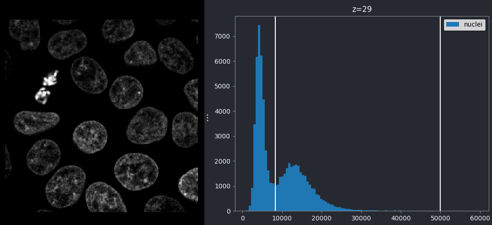
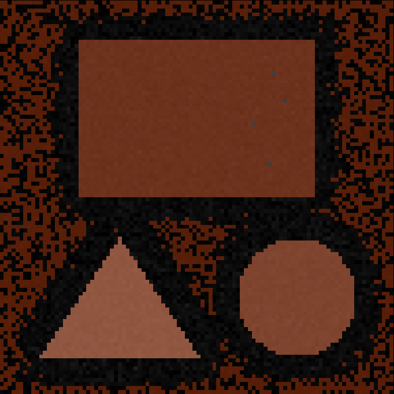

:::::::::::::::::::::::::::::::::::::: questions 

- How can thresholding be used to create masks?
- What are filters and how do they work?

::::::::::::::::::::::::::::::::::::::::::::::::

::::::::::::::::::::::::::::::::::::: objectives

- Threshold an image manually using its histogram, and display the result in 
Napari

- Use some Napari plugins to perform two commonly used image processing steps: 
gaussian blurring and otsu thresholding

- Explain how filters work - e.g. what is a kernel? What does the 'sigma' of a 
gaussian blur change?

- Explain the difference between Napari's `.add_labels()` and `.add_image()`

::::::::::::::::::::::::::::::::::::::::::::::::

In the previous episode, we started to develop an image processing workflow to 
count the number of cells in an image. Our initial pipeline relied on manual 
segmentation:

1. Quality Control
2. Manual segmentation of nuclei
3. Count nuclei

There are a number of issues with relying on manual segmentation for this task. 
For example, as covered in the [previous episode
](quality-control-and-manual-segmentation.md#manual-vs-automated), it is 
difficult to keep manual segmentation fully consistent. If you ask someone to 
segment the same cell multiple times, the result will always be slightly 
different. Also, manual segmentation is very slow and time consuming! While it 
is feasible for small images in small quantities, it would take much too long 
for large datasets of hundreds or thousands of images.

This is where we need to introduce more automated methods, which we will start 
to look at in this episode. Most importantly, using more automated methods has 
the benefit of making your image processing more _reproducible_ - by having a 
clear record of every step that produced your final result, it will be easier 
for other researchers to replicate your work and also try similar methods on 
their own data.

## Thresholding

If you don't have Napari's 'Cells (3D + 2Ch)' image open, then open it with:  
`File > Open Sample > napari builtins > Cells (3D + 2Ch)`

Make sure you only have 'nuclei' in the layer list. Select any additional 
layers, then click the {alt="A screenshot of Napari's delete layer button" height='30px'} icon to 
remove them. Also, select the nuclei layer (should be highlighted in blue), and 
change its colormap from 'green' to 'gray' in the layer controls.

{alt="A screenshot of nuclei in Napari using 
the gray colormap"}

Now let's look at how we can create a mask of the nuclei. Recall from the 
[last episode](quality-control-and-manual-segmentation.md), that a 'mask' is a 
segmentation with only two labels - background + your class of interest (in this 
case nuclei).

A simple approach to create a mask is to use a method called 'thresholding'. 
Thresholding works best when there is a clear separation in pixel values between 
the class of interest and the rest of the image. In these cases, thresholding 
involves choosing one or more specific pixel values to use as the cut-off 
between background and your class of interest. For example, in this image, you 
could choose a pixel value of 100 and set all pixels with a value less than that 
as background, and all pixels with a value greater than that as nuclei. How do 
we go about choosing a good threshold though?

One common approach to choosing a threshold is to use the image histogram - 
recall that we looked at histograms in detail in the [image display episode
](image-display.md). Let's go ahead and open a histogram with:  
`Plugins > napari Matplotlib > Histogram`

{alt="A histogram of the 29th z slice of Napari's 
cell sample image"}

From this histogram, we can see two peaks - a larger one at low intensity, then 
a smaller one at higher intensity. Looking at the image, it would make sense if 
the lower intensity peak represented the background, with the higher one 
representing the nuclei. We can verify this by adjusting the contrast limits in 
the layer controls. If we move the left contrast limits node to the right of the 
low intensity peak (around 8266), we can still clearly see the nuclei:

{alt="Left, nuclei with gray colormap. 
Right, histogram of the same image. Both with left contrast limit set 
to 8266."}

If we move the left contrast limits node to the right of the higher intensity 
peak (around 28263), most of the nuclei disappear from the image:

{alt="Left, nuclei with gray colormap. 
Right, histogram of the same image. Both with left contrast limit set 
to 28263."}

Recall that you can set specific values for the contrast limits by right 
clicking on the contrast limits slider in Napari.

This demonstrates that the higher intensity peak is the one we are interested 
in, and we should set our threshold accordingly.

We can set this threshold with some commands in Napari's console:

```python

# Get the image data for the nuclei
nuclei = viewer.layers["nuclei"].data

# Create mask with a threshold of 8266
mask = nuclei > 8266

# Add mask to the Napari viewer
viewer.add_labels(mask)

```

You should see a mask appear that highlights the nuclei in brown. If we set the 
nuclei contrast limits back to normal (select 'nuclei' in the layer list, then 
drag the left contrast limits node back to zero), then toggle on/off the mask 
or nuclei layers with the {alt="A screenshot of Napari's eye button" height='30px'} icon, you should see 
that the brown areas match the nucleus boundaries reasonably well. They aren't 
perfect though! The brown regions have a speckled appearance where some regions 
inside nuclei aren't labelled and some areas in the background are incorrectly 
labelled. 

{alt="Mask of nuclei (brown) overlaid on nuclei 
image - created with manual thresholding" width="60%"}

This is mostly due to the presence of noise in our image (as we looked at in the 
[choosing acquisition settings episode
](choosing-acquisition-settings.md#signal-to-noise-ratio)). For example, the 
dark image background isn't completely uniform - there are random fluctuations 
in the pixel values giving it a 'grainy' appearance when we zoom in. These 
fluctuations in pixel value make it more difficult to set a threshold that fully 
separates the nuclei from the background. For example, background pixels that 
are brighter than average may exceed our threshold of 8266, while some nuclei 
pixels that are darker than average may fall below it. This is the main cause of 
the speckled appearance of some of our mask regions.

To improve the mask we must find a way to reduce these fluctuations in pixel 
value. This is usually achieved by blurring the image (also referred to as 
smoothing). We'll look at this in detail [later in the episode](#filters).

::::::::::::::::::::::::::::::::::::: callout

## `.add_labels()` vs `.add_image`

In the code blocks above, you will notice that we use `.add_labels()`, rather
than `.add_image()` as we have in previous episodes. `.add_labels()` will ensure 
our mask is added as a `Labels` layer, giving us access to all the annotation 
tools and settings for segmentations (as covered in the [manual segmentation 
episode](quality-control-and-manual-segmentation.md)). `add_image()` would 
create a standard `Image` layer, which doesn't give us easy access to the 
annotation tools.

::::::::::::::::::::::::::::::::::::::::::::::::

::::::::::::::::::::::::::::::::::::: challenge 

## Manual thresholds

In this exercise, we'll practice choosing manual thresholds based on an image's 
histogram. For this, we'll use a simple test image containing three shapes 
(rectangle, circle and triangle) with different mean intensities.

Copy and paste the following into Napari's console to generate and load this 
test image:
```python
import numpy as np
import skimage
from skimage.draw import disk, polygon
from skimage.util import random_noise, img_as_ubyte
from packaging import version

image = np.full((100, 100), 10, dtype="uint8")
image[10:50, 20:80] = 80
image[disk((75, 75), 15)] = 140
rr, cc = polygon([90, 60, 90], [10, 30, 50])
image[rr, cc] = 200
if version.parse(skimage.__version__) < version.parse("0.21"):
  image = img_as_ubyte(random_noise(image, var=0.0005, seed=6))
else:
  image = img_as_ubyte(random_noise(image, var=0.0005, rng=6))
viewer.add_image(image)
```

{alt="Test image containing a 
rectangle, circle and triangle"}

Create a mask for each shape by choosing thresholds based on the image's 
histogram.
You can set a threshold as all pixels above a certain value:
```python
mask = image > 40
viewer.add_labels(mask)
```

Or all pixels below a certain value:
```python
mask = image < 40
viewer.add_labels(mask)
```

Or all pixels between two values:
```python
mask = (image > 20) & (image < 40)
viewer.add_labels(mask)
```

:::::::::::::::::::::::: solution 

## Solution

First, we show a histogram for the image by selecting the 'image' layer, then:  
`Plugins > napari Matplotlib > Histogram`

{alt="Histogram of the 
shape image"}

By moving the left contrast limits node we can figure out what each peak 
represents. You should see that the peaks from left to right are:

- background
- rectangle
- circle
- triangle

Then we set thresholds for each (as below). Note that you may not have exactly 
the same threshold values as we use here! There are many different values that 
can give good results, as long as they fall in the gaps between the peaks in the 
image histogram.

```python
rectangle = (image > 53) & (image < 110)
viewer.add_labels(rectangle)

circle = (image > 118) & (image < 166)
viewer.add_labels(circle)

triangle = image > 171
viewer.add_labels(triangle)
```

:::::::::::::::::::::::::::::::::

::::::::::::::::::::::::::::::::::::::::::::::::

## Adding plugins to help with segmentation

Fortunately for us, segmenting images in the presence of noise is a widely 
studied problem, so there are a many existing plugins we can install to help. If 
you need a refresher on the details of how to find and install plugins in 
Napari, see the [image display episode](image-display.md#napari-plugins).

We will use the [`napari-skimage`](https://napari-hub.org/plugins/napari-skimage.html) 
plugin, which adds many features that can aid with image segmentation and other 
image processing tasks.

In the top menu-bar of Napari select:  
`Plugins > Install/Uninstall Plugins...`

Then search for `napari-skimage` and click the blue button labelled 'install'. 
Wait for the installation to complete.

{alt="Screenshot of plugin 
installation window for napari-skimage"}

Once the plugin is installed, **you will need to close and re-open Napari**.

## Filters

Let's open the cells image in Napari again:  
`File > Open Sample > napari builtins > Cells (3D + 2Ch)`

As before, make sure you only have 'nuclei' in the layer list. Select any 
additional layers, then click the {alt="A screenshot of Napari's delete layer button" height='30px'} icon to 
remove them. Also, select the nuclei layer (should be highlighted in blue), and 
change its colormap from 'green' to 'gray' in the layer controls.

{alt="Nuclei image with gray colormap" width='40%'}

With the new plugin installed, you should see many new options under `Layers` in 
the top menu-bar of Napari. You can find out more about these options using the 
[plugin's documentation](https://github.com/guiwitz/napari-skimage/blob/main/README.md).

For now, we are interested in the _gaussian blur_ under:  
`Layers > Filter > Filtering > Gaussian filter (napari-skimage)`

If you click on this option, you should see a new panel appear on the right side 
of Napari:

{alt="Screenshot of settings for gaussian blur in 
Napari" width='40%'}

Make sure you have 'nuclei' selected on the 'image' row, then click 
'Apply Gaussian Filter':

{alt="Nuclei image after gaussian blur with sigma 
of 1" width='40%'}

You should see a new image appear in the layer list called 
'nuclei_gaussian_σ=1.0', which is a slightly blurred version of the 
original nuclei image.

Try increasing the 'sigma' value to three and clicking run again:

{alt="Nuclei image after gaussian blur with sigma 
of 3" width='40%'}

You should see a new 'nuclei_gaussian_σ=3.0' layer that is much more heavily blurred.

What's happening here? What exactly does a gaussian blur do? A gaussian blur is 
an example of a 'linear filter' which is used to manipulate pixel values in 
images. When a filter is applied to an image, each pixel value is replaced by 
some combination of the pixel values around it. For example, below is shown a 
small, zoomed-in area of the nucleus image. Here, the value of the red pixel 
could be affected by all values within the displayed 3x3 box:

{alt="Small zoomed-in area of the nucleus image 
with a pixel highlighted in red. Around this pixel is shown a 
3x3 box." width="60%"}

Exactly what this effect is, and the size of the region it involves, is 
controlled by the filter's 'kernel'. The kernel can be thought of as another 
very small image, where the pixel values control the effect of the filter. An 
example 3x3 kernel is shown below:

{alt="Left - small area of the nucleus image with a 
pixel highlighted in red. Around this pixel is shown a 3x3 box. Right - example 
of a 3x3 kernel"}

While the above image uses a 3x3 kernel, they can have many different sizes! 
Kernels tend to be odd in size: 3x3, 5x5, 9x9, etc. This is to allow the current 
pixel that you will be replacing to lie perfectly at the centre of the kernel, 
with equal spacing on all sides.

To determine the new value of a pixel (like the red pixel above), the 
kernel is placed over the target image centred on the pixel of interest. Then, 
for each position in the kernel, we multiply the image pixel value with the 
kernel pixel value. For the 3x3 kernel example above, we multiply the image 
pixel value one above and one to the left of our current pixel with the pixel 
value in the top left position of the kernel. Then we multiply the value for the 
pixel just above our current pixel with the top middle kernel value and so on... 
The result of the nine multiplications in each of the nine positions of this 
kernel are then summed together to give the new value of the central pixel. To 
process an entire image, the kernel is moved across the image pixel by pixel 
calculating the new value at each location. Pete Bankhead's bioimage book has a 
[really nice animation of this process
](https://bioimagebook.github.io/chapters/2-processing/4-filters/filters.html#mean-filters)
, which is worth taking a look at.

For the gaussian filter we looked at above, the values in the kernel are based 
on a 'gaussian function'. A gaussian function creates a central peak that 
reduces in height as we move further away from the centre. The shape of the peak 
can be adjusted using different values of 'sigma' (the standard deviation of the 
function), with larger sigma values resulting in a wider peak:

{alt="Plot of a 1D gaussian function 
comparing three different sigma values"}

For a gaussian filter, the values are based on a 2D gaussian function. This 
gives similar results to the plot above (showing a 1D gaussian function) with a 
clear central peak, but now the height decreases in both x and y:

{alt="Plot of a 2D gaussian function 
comparing three different sigma values"}

Gaussian kernels show this same pattern, with values highest at the centre that 
decrease as we move further away. See the example 5x5 kernel below:

{alt="An example of a 5x5 gaussian 
kernel" width="40%"}

The gaussian filter causes blurring (also known as smoothing), as it is 
equivalent to taking a weighted average of all pixel values within its 
boundaries. In a weighted average, some values contribute more to the final 
result than others. This is determined by their 'weight', with a higher weight 
resulting in a larger contribution to the result. As a gaussian kernel has its 
highest weights at the centre, this means that a gaussian filter produces an 
average where central pixels contribute more than those further away.

Larger sigma values result in larger kernels, which average larger areas of the 
image. For example, the 
[`scikit-image`](https://scikit-image.org/docs/stable/api/skimage.filters.html#skimage.filters.gaussian) 
implementation we are currently using truncates the kernel after four standard 
deviations (sigma). This means that the blurring effect of the gaussian filter 
is enhanced with larger sigma, but will also take longer to calculate. This is a 
general feature of kernels for different types of filter - larger kernels tend 
to result in a stronger effect at the cost of increased compute time. This time 
can become significant when processing very large images in large quantities. 

If you want more information about how filters work, both the 
[data carpentry image processing lesson
](https://datacarpentry.org/image-processing/06-blurring.html) 
and Pete Bankhead's [bioimage book
](https://bioimagebook.github.io/chapters/2-processing/4-filters/filters.html) 
have chapters going into great detail. Note that here we have focused on 
'linear' filters, but there are many types of 'non-linear' filter that process 
pixel values in different ways.

::::::::::::::::::::::::::::::::::::: callout

## Sigma vs full width at half maximum (FWHM)

In this episode, we have focused on the gaussian function's standard deviation 
(sigma) as the main way to control the width of the central peak. Some image 
analysis packages will instead use a measure called the 'full width at half 
maximum' or FWHM. The FWHM is the width of the curve at half of its maximum 
value (see the diagram below):

{alt="Diagram of gaussian function with FWHM labelled"
width="80%"}

Similar to increasing sigma, a higher FWHM will result in a wider peak. Note 
that there is a clear relationship between sigma and FWHM where:

\[\large FWHM = sigma\sqrt{8ln(2)}\]

::::::::::::::::::::::::::::::::::::::::::::::::


::::::::::::::::::::::::::::::::::::: challenge 

## Filters

Try some of the other filters included with the `napari-skimage` plugin.
Some of these only support 2D images for now (the plugin is still being 
actively updated - so more 3D support should be added soon).

Create a 2D image by running the following in the console:
```python
nuclei = viewer.layers["nuclei"].data
viewer.add_image(nuclei[30, :, :], name="nuclei_2D")
```

Try the following filters (make sure you use 'nuclei_2D' in the image field):

- What does `Layers > Filter > Filtering > Median filter (napari skimage)` do? 
How does it compare to the gaussian filter we used earlier?

- What does `Layers > Filter > Edge detection > Farid filter (napari skimage)` do?

- What does `Layers > Filter > Filtering > Rank filters (napari skimage)` 
do?
  - Try a 'Filter Type' of 'Maximum` and 'Minimum' + compare
  - (you may say see a warning relating to bin number when you run this - 
  this can be ignored)

If you're not sure what the effect is, try searching for the filter's name 
online.

:::::::::::::::::::::::: solution 

## Solution

### Median

The median filter creates a blurred version of the input image. Larger values 
for the 'Footprint size' result in a greater blurring effect.

The results of the median filter are similar to a gaussian blur, but tend to 
preserve the edges of objects better. For example, here you can see that it 
preserves the sharp edges of each nucleus. You can read more about how the 
median filter works in Pete Bankhead's [bioimage book
](https://bioimagebook.github.io/chapters/2-processing/4-filters/filters.html#rank-filters).

### Farid

Farid is a type of filter used to detect the edges of objects in an image. For 
example, for the nuclei image it gives bright rings around each nucleus, as well 
as around some of the brighter patches inside the nuclei.

### Maximum

A maximum filter replaces each pixel value with the maximum value in a certain 
area around it. For example, for the nuclei, you should see the bright areas 
expand in size. Increasing the 'Footprint size' of the filter enhances the effect.

### Minimum filter

A minimum filter replaces each pixel value with the minimum value in a certain 
area around it. For example, for the nuclei, you should see the bright areas 
shrink in size. Increasing the 'Footprint size' of the filter enhances the effect.

:::::::::::::::::::::::::::::::::

::::::::::::::::::::::::::::::::::::::::::::::::


## Thresholding the blurred image

First, let's clean up our layer list. Make sure you only have the 'nuclei' and 
'nuclei_gaussian_σ=1.0' layers in the layer list - select any others and 
remove them by clicking the {alt="A screenshot of Napari's delete layer button" height='30px'} icon. Also, 
close all filter settings panels on the right side of Napari (apart from the 
gaussian settings) by clicking the tiny `X` icon at their top left corner.

Now let's try thresholding our image again. Make sure you set your gaussian blur 
sigma to three, then click 'Run'.

Then, we'll apply the same threshold as before, now to the 
'nuclei_gaussian_σ=3.0' layer:

```python

# Get the image data for the blurred nuclei
blurred = viewer.layers["nuclei_gaussian_σ=3.0"].data

# Create mask with a threshold of 8266
blurred_mask = blurred > 8266

# Add mask to the Napari viewer
viewer.add_labels(blurred_mask)

```

You'll see that we get an odd result - a totally empty image! What went wrong 
here? Let's look at the blurred image's shape and data type in the console:

```python
print(blurred.shape)
print(blurred.dtype)
```

```output
(60, 256, 256)
float64
```

The shape is as expected, but what happened to the data type! It's now a 64-bit 
float image (rather than the usual unsigned integer 8-bit/16-bit for images). 
Recall from the ['What is an image?' episode](what-is-an-image.md#type) that 
float images allow values with a decimal point to be stored e.g. 3.14.

Many image processing operations will convert images to `float32` or `float64`, 
to provide the highest precision possible. For example, imagine you have an 
unsigned-integer 8-bit image with pixel values of all 75. If you divided by two 
to give 37.5, then these values would all be rounded to 38 when stored (as 
`uint8` can't store decimal numbers). Only by converting to a different data 
type (float) could we store the exact value of this operation. In addition, by 
having the highest bit-depth (64-bit), we ensure the highest possible precision 
which can be useful to avoid slight errors after multiple operations are applied 
one after the other. In summary, changes in data type are expected in image 
processing, and it's good to keep an eye out for when this is required!

Let's return to thresholding our image. Close the gaussian panel by clicking the 
tiny `X` icon at its top left corner. Then select the 'blurred_mask' in the 
layer list and remove it by 
clicking the {alt="A screenshot of Napari's delete layer button" height='30px'} icon. 
Finally, open the `napari-matplotlib` histogram again with:  
`Plugins > napari Matplotlib > Histogram`

{alt="A histogram of the 29th z slice of 
the nuclei image after a gaussian blur. The left contrast limit is set 
to 0.134."}

Make sure you have 'nuclei_gaussian_σ=3.0' selected in the layer list (should 
be highlighted in blue).

You should see that this histogram now runs from 0 to 1, reflecting the new 
values after the gaussian blur and its new data type. Let's again choose a 
threshold between the two peaks - around 0.134:

```python

# Get the image data for the blurred nuclei
blurred = viewer.layers["nuclei_gaussian_σ=3.0"].data

# Create mask with a threshold of 0.134
blurred_mask = blurred > 0.134

# Add mask to the Napari viewer
viewer.add_labels(blurred_mask)

```

{alt="Mask of nuclei (brown) overlaid on 
nuclei image - created with manual thresholding after gaussian blur" 
width="60%"}

Now we see a much more sensible result - a brown mask that again highlights the 
nuclei in brown. To compare to the result with no smoothing, let's run our 
previous threshold again (from the 
[earlier thresholding section](#thresholding)):

```python

# Get the image data for the nuclei
nuclei = viewer.layers["nuclei"].data

# Create mask with a threshold of 8266
mask = nuclei > 8266

# Add mask to the Napari viewer
viewer.add_labels(mask)

```

If we compare 'blurred_mask' and 'mask', we can see that blurring before 
choosing a threshold results in a much smoother result that has fewer areas 
inside nuclei that aren't labelled, as well as fewer areas of the background 
that are incorrectly labelled. 

This workflow of blurring an image then thresholding it is a very common method 
to provide a smoother, more complete mask. Note that it still isn't perfect! If 
you browse through the z slices with the slider at the bottom of the image, it's 
clear that some areas are still missed or incorrectly labelled.

## Automated thresholding

First, let's clean up our layer list again. Make sure you only have the 
'nuclei', 'mask', 'blurred_mask' and 'nuclei_gaussian_σ=3.0' layers in the 
layer list - select any others and remove them by clicking the {alt="A screenshot of Napari's delete layer button" height='30px'} icon. Then, 
if you still have the `napari-matplotlib` histogram open, close it by clicking 
the tiny `x` icon in the top left corner.

So far we have chosen our threshold manually by looking at the image histogram, 
but it would be better to find an automated method to do this for us. Many 
such methods exist - for example, open 
`Layers > Filter > Thresholding > Automated Threshold (napari skimage)`. One of 
the most common methods is _Otsu thresholding_, which we will look at now.

Let's go ahead and apply this to our blurred image:

- Select 'nuclei_gaussian_σ=3.0' in the `Image` row
- Select 'otsu' as the method
- Click the 'Apply Thresholding' button

{alt="Mask of nuclei (brown) overlaid on 
nuclei image - created with Otsu thresholding after gaussian blur" width="60%"}

This should produce a mask (in a new layer ending with 'threshold_otsu') 
that is very similar to the one we created with a manual threshold. To make it 
easier to compare, we can rename some of our layers by double clicking on their 
name in the layer list - for example, rename 'mask' to 'manual_mask', 
'blurred_mask' to 'manual_blurred_mask', and '...threshold_otsu' to 
'otsu_blurred_mask'. Recall that you can change the colour of a mask by clicking 
the {alt="A screenshot of Napari's shuffle button" height='30px'} icon in the top 
row of the layer controls. By toggling on/off the relevant {alt="A screenshot of Napari's eye button" height='30px'} icons, you should see 
that Otsu chooses a slightly different threshold than we did in our 
'manual_blurred_mask', labelling slightly smaller regions as nuclei in the final 
result.

How is Otsu finding the correct threshold? The details are rather complex, but 
to summarise - Otsu's method is trying to find a threshold that minimises the 
spread of pixel values in both the background and your class of interest. In 
effect, it's trying to find two peaks in the image histogram and place a 
threshold in between them.

This means it's only suitable for images that show two clear peaks in their 
histogram (also known as a 'bimodal' histogram). Other images may require 
different automated thresholding methods to produce a good result. 

::::::::::::::::::::::::::::::::::::: challenge 

## Automated thresholding

For this exercise, we'll use the same example image as the [manual thresholding 
exercise](#manual-thresholds). If you don't have that image open, run the top 
code block in that exercise to open the image:

{alt="Test image containing a 
rectangle, circle and triangle"}

Try some of the other automatic thresholding options provided by the 
`napari-skimage` plugin. Set the 'method' to different options in 
`Layers > Filter > Thresholding > Automated Threshold (napari skimage)`

Try:

- `mean`
- `yen`
- `li`
- `sauvola`

How do they compare to standard `otsu` thresholding?

Recall that you can change the colour of a mask by clicking the {alt="A screenshot of Napari's shuffle button" height='30px'} icon in the top 
row of the layer controls.

:::::::::::::::::::::::: solution 

## Solution

Standard Otsu thresholding chooses a threshold that separates the background 
from the three shapes:

{alt="Mask of shapes (brown) overlaid on shapes image - 
made with Otsu thresholding"}

Li and mean thresholding gives a very similar result.

Yen gives a different result - isolating the triangle and circle from the rest 
of the image. Some of the pixels in the rectangle are also labelled, but only 
in patchy areas:

{alt="Mask of shapes (brown) overlaid on shapes image - 
made with Yen thresholding"}

Finally, Sauvola gives a completely different result, including a large number 
of pixels from the background:

{alt="Mask of shapes (brown) overlaid on shapes 
image - made with Sauvola thresholding" width="60%"}

The important point is that different automatic thresholding methods will work 
well for different kinds of images, and depending on which part of an image you 
are trying to segment. It's worth trying a variety of options on your images to 
see which performs best for your specific dataset. 

:::::::::::::::::::::::::::::::::

::::::::::::::::::::::::::::::::::::::::::::::::

## Summary

To summarise, here are some of the main steps you can use to make a mask:

1. Quality control
2. Blur the image
3. Threshold the image

There are many variations on this standard workflow e.g. different filters could 
be used to blur the image (or in general to remove noise), different methods 
could be used to automatically find a good threshold... There's also a wide 
variety of post processing steps you could use to make your mask as clean as 
possible. We'll look at some of these options in the next episode.


::::::::::::::::::::::::::::::::::::: keypoints 

- Thresholding is simply choosing a specific pixel value to use as the cut-off 
between background and your class of interest.

- Thresholds can be chosen manually based on the image histogram

- Thresholds can be chosen automatically with various methods e.g. Otsu

- Filters modify pixel values in an image by using a specific 'kernel'

- Gaussian filters are useful to blur an image before thresholding. The 'sigma' 
controls the strength of the blurring effect.

- Image processing operations may modify the data type of your image - often 
converting it to `float32` or `float64`.

::::::::::::::::::::::::::::::::::::::::::::::::

