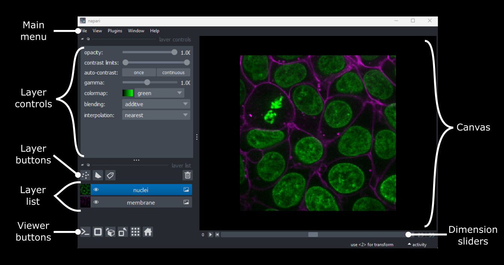
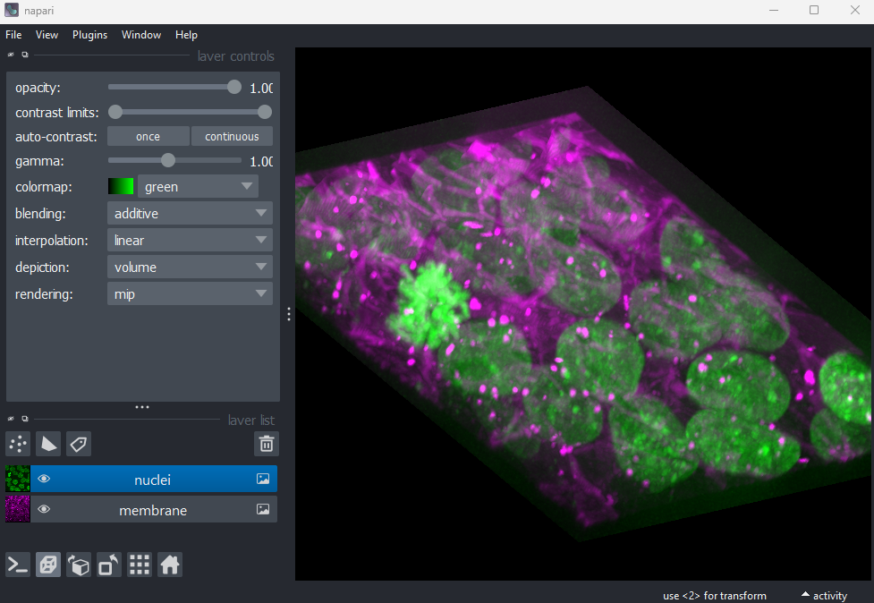
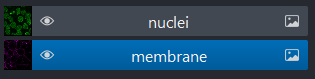
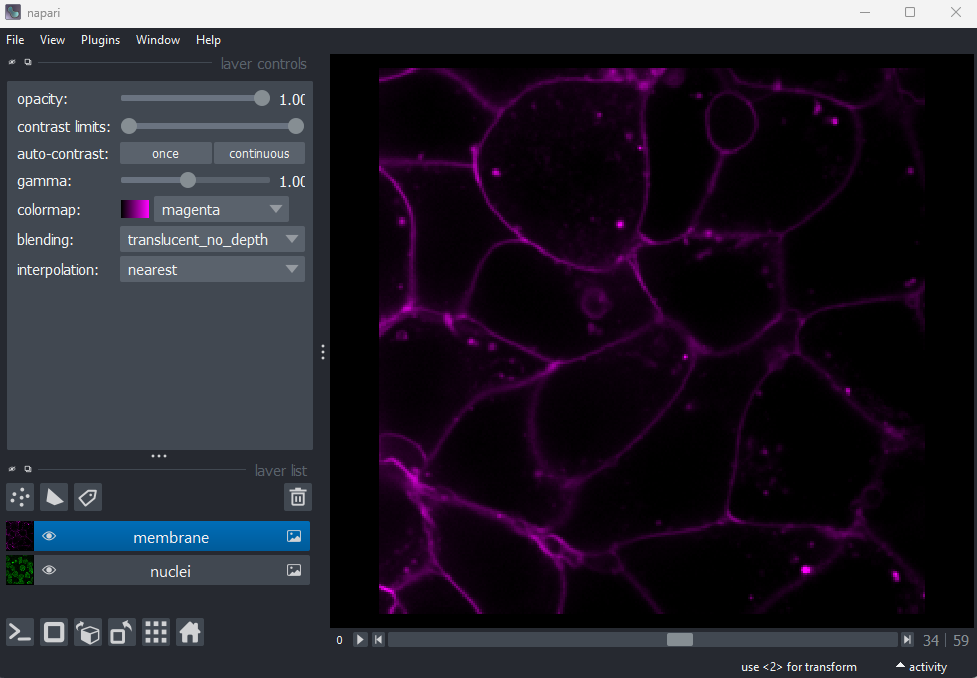

:::::::::::::::::::::::::::::::::::::: questions 

- What are the different software options for viewing microscopy images?
- How can Napari be used to view images?

::::::::::::::::::::::::::::::::::::::::::::::::

::::::::::::::::::::::::::::::::::::: objectives

- Explain the pros and cons of different image visualisation tools (e.g. ImageJ, napari and proprietary options)
- Use napari to open images
- Navigate the napari viewer (pan/zoom/swapping between 2D and 3D views…)
- Explain the main parts of the napari user interface

::::::::::::::::::::::::::::::::::::::::::::::::

## Choosing the right tool for the job

Light microscopes can produce a very wide range of image data - for example:

- 2D or 3D
- Time series or snapshots
- Different channels
- Small to large datasets

With such a wide range of data, there comes a huge variety of software that can work with these images. Different software may be specialised to specific types of image data, or to specific research fields. There is no one 'right' software to use - it's about choosing the right tool for your data and research question!

Some points to consider when choosing software are:

- **What is common in your research field?**  
Having a good community around the software you work with can be extremely helpful - so it's worth considering what is popular in your department, or in relevant papers in your field.
- **Open source or proprietary?**  
We'll look at this more in the next section, but it's important to consider if the software you are using is freely available, or requires a one-off payment or subscription to use.
- **Support for image types?**  
For example, does it support 3D images, or timeseries?
- **Can it be customised/extended?**  
Can you automate certain steps with your own scripts or plugins? This is useful if you want to add extra features to a piece of software, or automate steps for large numbers of images.

:::::::::::::::::::::::::::::::::::::: callout

### Scripts and plugins?

Scripts and plugins are ways to automate certain software steps or add new features.

#### Scripts

Scripts are lists of commands to be carried out by a piece of software e.g. load an image, then threshold it, then measure its size...  They are normally used to automate certain processing steps - for example, rather than having to load each image individually and click the same buttons again and again in the user interface, a script could load each image automatically and run all those steps in one go. They tend to be specific to a particular dataset and research question, so are less likely to be easily re-useable than plugins.

#### Plugins

Plugins, in contrast to scripts, are focused on adding optional new features to a piece of software (rather than automating use of existing features). They allow members of the community, outside the main team that develops the software, to add features they need for a particular image type or processing task. They're designed to be re-useable so other members of the community can also easily benefit from these new features.

::::::::::::::::::::::::::::::::::::::::::::::::

A good place to look for advice on software is the [image.sc forum](https://forum.image.sc/) - a popular forum for image analysis (mostly related to biological or medical images).

## Open source vs proprietary

A key factor to consider when choosing software is whether it is open source or proprietary:

- **Open source**: Software that is made freely available to use and modify.

- **Proprietary**: Software that is owned by a company and usually requires either a one-off fee or subscription to use.

Both can be extremely useful, and it is very likely that you will use a mix of both to view and analyse your images. For example, proprietary software is often provided by the manufacturer when you purchase a light microscope. You will likely use this during acquisition of your images and for some processing steps after. This being said, we encourage using open-source software wherever possible, as it is free to use and easy to extend with extra features.

## Fiji/ImageJ and Napari

While there are many pieces of software to choose from, two of the most popular open-source options are [Fiji/ImageJ](https://imagej.net/software/fiji/) and [Napari](https://napari.org/).
They are both:

- Freely available
- 'General' imaging software i.e. applicable to many different research fields
- Supporting a wide range of image types
- Customisable with scripts + plugins

Both are great options for working with a wide variety of images - so why choose one over the other? Some of the main differences are listed below if you are interested:

:::::::::::::::::::::::::::::::::::::: spoiler

### Differences between Fiji/ImageJ and Napari

**Python vs Java**  
A big advantage of Napari is that it is made with the Python programming language (vs Fiji/ImageJ which is made with Java). In general, this makes it easier to extend with scripts and plugins as Python tends to be more widely used in the research community. It also means Napari can easily integrate with other python tools e.g. Python's popular machine learning libraries.

**Maturity**    
Fiji/ImageJ has been actively developed [for many years now (>20 years)](https://imagej.net/software/imagej/), while Napari is a more recent development [starting around 2018](https://napari.org/stable/community/team.html#project-history). 	This difference in age comes with pros and cons - in general, it means that the core features and layout of Fiji/ImageJ are very well established, and less likely to change than Napari. With Napari, you will likely have to adjust your image processing workflow with new versions, or update any scripts/plugins more often. Equally, as Napari is new and rapidly growing in popularity, it is quickly gaining new features and attracting a wide range of new plugin developers.

**Built-in tools**    
Fiji/ImageJ comes with many image processing tools built-in by default - e.g. making image histograms, thresholding and gaussian blur (we will look at these terms in a later episode). Napari, in contrast, is more minimal by default - mostly focusing on image display. It requires installation of additional plugins to add many of these features.

**Specific plugins**   
There are excellent plugins available for Fiji/ImageJ and Napari that focus on specific types of image data or processing steps. The availability of a specific plugin will often be a deciding factor on whether to use Fiji/ImageJ or Napari for your project.


**Ease of installation and user interface**  
As Fiji/ImageJ has been in development for longer, it tends to be simpler to install than Napari (especially for those with no prior Python experience). In addition, as it has more built-in image processing tools, it tends to be simpler to use fully from its user interface. Napari meanwhile is often strongest when you combine it with some Python scripting (although this isn't required for many workflows!)

::::::::::::::::::::::::::::::::::::::::::::::::

For this lesson, we will use Napari as our software of choice. It's worth bearing in mind though that Fiji/ImageJ can be a useful alternative - and many workflows will actually use both Fiji/ImageJ and Napari together! Again, it's about choosing the right tool for your data and research question.


## Opening Napari

Let's get started by opening a new Napari window - you should have already followed the [installation instructions](../learners/setup.md). Note this can take a while the first time, so give it a few minutes!

```python
conda activate napari-env
napari
```

{alt="A screenshot of the default Napari user interface"}

## Opening images

Napari comes with some example images, let's open one now:

```
Go to the top menu-bar of Napari and select:
File > Open Sample > napari builtins > Cells (3D+2Ch)
```

You should see a fluorescence microscopy image of some cells:

{alt="A screenshot of a flourescence microscopy image of some cells in Napari"}

## Napari's User interface

Napari's user interface is split into a few main sections, as you can see in the diagram below:

{alt="A screenshot of Napari with the main user interface sections labelled"}

Let's take a brief look at each of these sections - for full information see the [Napari documentation](https://napari.org/stable/tutorials/fundamentals/viewer.html).

## Main menu

We already used the main menu in the last section to open a sample image. The main menu contains various commands for opening images, changing preferences and installing plugins (we'll see more of these options in later episodes).

## Canvas

The canvas is the main part of the Napari user interface. This is where we display and interact with our images. 

To navigate the canvas use the following commands:
```
Pan - Click and drag
Zoom - Scroll in/out
```

## Dimension sliders

Dimension sliders appear at the bottom of the canvas depending on the type of image displayed. For example, the current cells image is 3D, so clicking and dragging the slider allows us to move up and down in the image stack.The arrow buttons at either end of the slider allow us to step through one image at a time. Also, the 'play' button at the very left of the slider allows us to move automatically through the stack until pressed again.

We will see in later episodes, that more sliders can appear if our image has more dimensions (e.g. time series, or further channels).

Maybe image of 3 different slider posisitons put next to eachother?

## Viewer buttons

The viewer buttons control various aspects of the Napari viewer:

{alt="A screenshot of Napari's console button"} -- **Console**

This button opens Napari's built-in python console - we'll look at this in later episodes.

{alt="A screenshot of Napari's 2D-3D button"} -- **2D/3D**  

This switches the canvas between 2D and 3D display. For example, for our cell image this is the 3D view:

{alt="A screenshot of 3D cells in Napari"}

{alt="A screenshot of Napari's roll dimensions button"} -- **Roll dimensions**  

This switches the order of dimensions in the viewer. For our cells image, it allows us to view orthgonal slices through the image (i.e. at 90 degrees to our starting view).

{alt="A screenshot of Napari's transpose dimensions button"} -- **Roll dimensions**  

This button swaps the two currently displayed dimensions.

{alt="A screenshot of Napari's grid button"} -- **Grid**  

This button displays all images in a grid. For our cells image, this displays the nuclei (green) next to the cell membranes (purple), rather than on top of each other.

{alt="A screenshot of Napari's home button"} -- **Home**  

This button brings the canvas back to its default view. This is useful if you have panned/zoomed to a specific region and want to quickly get back to an overview of the full image.

## Layer list

Next we come to the layer list, this shows each layer as its own named row. Layers can be of different types - for example ```Image```, ```Points``` and ```Shapes```. Image layers are the most common, and this is what we see for our cells image. There are currently two image layers - one for the nuclei (green) and one for the cell membranes (purple).

{alt="A screenshot of Napari's layer list, showing two image layers named 'nuclei' and 'membrane'"}

Layers can be toggled on/off by clicking the eye icon on the left side of their row. They can be renamed by double clicking on the row.

Layers are displayed in order, with those further up the list on top and those further down on the bottom. Here, the nuclei image is displayed on top of the membranes. Layers can be re-ordered by dragging and dropping the rows into a new order. For example, if we drag the membranes row to be above the nuclei, then we see the nuclei disappear from the viewer (as the membrane image hides them).

{alt="A screenshot of Napari with the nuclei and membrane layer swapped"}

## Layer controls

Next we come to the layer controls - these show controls for the currently selected layer (i.e. the one that is highlighted in blue in the layer list). Selecting a different layer will result in different settings being shown. For example, clicking on the nuclei layer shows a ```colormap``` of green, while clicking on the membrane layer shows a ```colormap``` of magenta.

Controls will also vary between different types of layer (like ```Image``` vs ```Points```) as we will see in later episodes.

Let's take a quick look at some of the image layer controls:

**Opacity**  
This changes the opacity of the layer - lower values are more transparent. For example, reducing the opacity of the membrane layer (if it is still on top of the nuclei), will allow us to see the nuclei again.

**Contrast limits**  
We'll discuss this in detail in a later episode, but briefly - the contrast limits adjust what parts of the image we can see and how bright they appear in the viewer. Moving the left node adjusts what is shown as fully black, while moving the right node adjusts what is shown as fully bright.

**Colormap**  
Again, we'll discuss this in detail in a later episode, but briefly - the colormap determines what colours an image is displayed with. Clicking in the dropdown shows a wide range of options that you can swap between.

**Blending**    
This controls how multiple layers are blended together to give the final result in the viewer. There are [many different options to choose from](https://napari.org/stable/guides/layers.html#blending-layers). For example, if we put the nucleus layer back above the membrane one and change its blending to 'opaque' - then we see that it completely hides the membrane layer underneath. Changing it back to 'additive' will allow the nucleus and membrane layers to be seen together again.

## Layer buttons

The layer buttons allow us to add additional layers of new types:

{alt="A screenshot of Napari's point layer button"} -- **Points**  

This button creates a new [points layer](https://napari.org/stable/howtos/layers/points.html). This can be used to mark specific locations in an image.

{alt="A screenshot of Napari's shape layer button"} -- **Shapes**  

This button creates a new [shapes layer](https://napari.org/stable/howtos/layers/shapes.html). Shapes can be used to mark regions of interest e.g. with rectangles, ellipses or lines.

{alt="A screenshot of Napari's labels layer button"} -- **Labels**  

This button creates a new [labels layer](https://napari.org/stable/howtos/layers/labels.html). This is usually used to label specific regions in an image e.g. to label individual nuclei.

{alt="A screenshot of Napari's delete layer button"} -- **Remove layer**  

This button removes the currently selected layer (highlighted in blue) from the layer list.


::::::::::::::::::::::::::::::::::::: keypoints 

- There are many software options for light microscopy images
- Napari and Fiji/ImageJ are popular open-source options
- Napari's user interface is split into a few main sections including the canvas, layer list, layer controls...
- Layers can be of different types e.g. ```Image```, ```Point```, ```Label```
- Different layer types have different layer controls

::::::::::::::::::::::::::::::::::::::::::::::::

