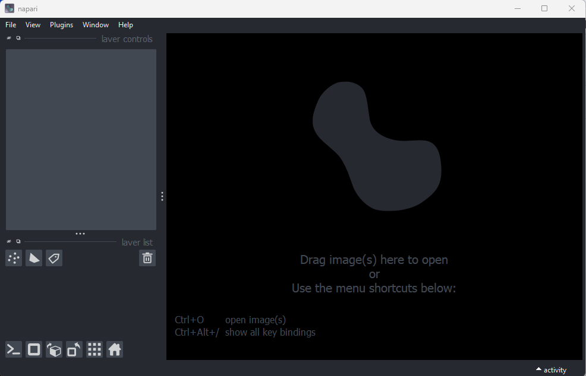

:::::::::::::::::::::::::::::::::::::: questions 

- What are the different software options for viewing microscopy images?
- How can Napari be used to view images?

::::::::::::::::::::::::::::::::::::::::::::::::

::::::::::::::::::::::::::::::::::::: objectives

- Explain the pros and cons of different image visualisation tools (e.g. ImageJ, 
Napari and proprietary options)
- Use Napari to open images
- Navigate the Napari viewer (pan/zoom/swapping between 2D and 3D views…)
- Explain the main parts of the Napari user interface

::::::::::::::::::::::::::::::::::::::::::::::::

## Choosing the right tool for the job

Light microscopes can produce a very wide range of image data (we'll see some 
examples in the [multi-dimensional images episode](multi-dimensional-images.md)) 
- for example:

- 2D or 3D
- Time series or snapshots
- Different channels
- Small to large datasets

{alt="A mosaic of screenshots of some of Napari's 
included sample data" width='80%'}

With such a wide range of data, there comes a huge variety of software that can 
work with these images. Different software may be specialised to specific types 
of image data, or to specific research fields. There is no one 'right' software 
to use - it's about choosing the right tool for yourself, your data, and your 
research question!

Some points to consider when choosing software are:

- **What is common in your research field?**  
Having a good community around the software you work with can be extremely 
helpful - so it's worth considering what is popular in your department, 
or in relevant papers in your field.

- **Open source or proprietary?**  
We'll look at this more in the next section, but it's important to consider if 
the software you are using is freely available, or requires a one-off payment or 
a regular subscription fee to use.

- **Support for image types?**  
For example, does it support 3D images, or timeseries?

- **Can it be automated/customised/extended?**  
Can you automate certain steps with your own *scripts or plugins*? This is useful 
to make sure your analysis steps can be easily shared and reproduced by other 
researchers. It also enables you to add extra features to a piece of software, 
and automate repetitive steps for large numbers of images.

:::::::::::::::::::::::::::::::::::::: callout

### What are scripts and plugins?

Scripts and plugins are ways to automate certain software steps or add new 
features.

#### Scripts

Scripts are lists of commands to be carried out by a piece of software e.g. 
load an image, then threshold it, then measure its size...  They are normally 
used to automate certain processing steps - for example, rather than having to 
load each image individually and click the same buttons again and again in the 
user interface, a script could load each image automatically and run all those 
steps in one go. Not only does this save time and reduce manual errors, 
but it also ensures your workflow can easily be shared and reproduced by other 
researchers.

#### Plugins

Plugins, in contrast to scripts, are focused on adding optional new features to 
a piece of software (rather than automating use of existing features). They 
allow members of the community, outside the main team that develops the 
software, to add features they need for a particular image type or processing 
task. They're designed to be re-useable so other members of the community can 
easily benefit from these new features.

::::::::::::::::::::::::::::::::::::::::::::::::

A good place to look for advice on software is the 
[image.sc forum](https://forum.image.sc/) - a popular forum for image analysis 
(mostly related to biological or medical images).

::::::::::::::::::::::::::::::::::::: challenge 

## Using the image.sc forum

Go to the [image.sc forum](https://forum.image.sc/) and take a look at the 
pinned post called 'Welcome to the Image.sc Forum!'

- Search for posts in the category 'Announcements' tagged with 'napari'

- Search for posts in the category 'Image Analysis' tagged with 'napari'

- Click on some posts to see how questions and replies are laid out

::::::::::::::::::::::::::::::::::::::::::::::::

## Open source vs proprietary

A key factor to consider when choosing software is whether it is open source or 
proprietary:

- **Open source**: Software that is made freely available to use and modify.

- **Proprietary**: Software that is owned by a company and usually requires 
either a one-off fee or subscription to use.

Both can be extremely useful, and it is very likely that you will use a mix of 
both to view and analyse your images. For example, proprietary software is often 
provided by the manufacturer when a microscope is purchased. You will 
likely use this during acquisition of your images and for some processing steps 
after. 

There are pros and cons to both, and it's worth considering the following:

:::::::::::::::::::::::::::::::::::::: spoiler

### Pros and cons of open-source / proprietary

**Cost**  
One of the biggest advantages of open source software is that it is free. This 
means it is always available, even if you move to a different institution that 
may not have paid for other proprietary software.

**Development funding/team**  
Proprietary software is usually maintained by a large team of developers that 
are funded full time. This may mean it is more stable and thoroughly 
tested/validated than some open-source software. Some open-source projects will 
be maintained by large teams with very thorough testing, while others will only 
have a single developer part-time.

**Flexibility/extension**  
Open-source software tends to be easier to extend with new features, and more 
flexible to accommodate a wide variety of workflows. Although, many pieces of 
proprietary software have a plugin system or scripting to allow automation.

**Open file formats and workflows**  
Open-source software uses open file formats and workflows, so anyone can see the 
details of how the analysis is done. Proprietary software tends to keep the 
implementation details hidden and use file formats that can't be opened easily 
in other software.

::::::::::::::::::::::::::::::::::::::::::::::::

As always, the right software to use will depend on your preference, your data 
and your research question. This being said, we will only use open-source 
software in this course, and we encourage using open-source software where 
possible.

## Fiji/ImageJ and Napari

While there are many pieces of software to choose from, two of the most popular 
open-source options are [Fiji/ImageJ](https://imagej.net/software/fiji/) and 
[Napari](https://napari.org/).
They are both:

- Freely available
- 'General' imaging software i.e. applicable to many different research fields
- Supporting a wide range of image types
- Customisable with scripts + plugins

Both are great options for working with a wide variety of images - so why 
choose one over the other? Some of the main differences are listed below if you 
are interested:

:::::::::::::::::::::::::::::::::::::: spoiler

### Differences between Fiji/ImageJ and Napari

**Python vs Java**  
A big advantage of Napari is that it is made with the Python programming 
language (vs Fiji/ImageJ which is made with Java). In general, this makes it 
easier to extend with scripts and plugins as Python tends to be more widely used 
in the research community. It also means Napari can easily integrate with other 
python tools e.g. Python's popular machine learning libraries.

**Maturity**    
Fiji/ImageJ has been actively developed 
[for many years now (>20 years)](https://imagej.net/software/imagej/), while 
Napari is a more recent development 
[starting around 2018](https://napari.org/stable/community/team.html#project-history). 
This difference in age comes with pros and cons - in general, it means that the 
core features and layout of Fiji/ImageJ are very well established, and less 
likely to change than Napari. With Napari, you will likely have to adjust your 
image processing workflow with new versions, or update any scripts/plugins more 
often. Equally, as Napari is new and rapidly growing in popularity, it is 
quickly gaining new features and attracting a wide range of new plugin 
developers.

**Built-in tools**    
Fiji/ImageJ comes with many image processing tools built-in by default - e.g. 
making image histograms, thresholding and gaussian blur (we will look at these 
terms in the [filters and thresholding episode](filters-and-thresholding.md)). 
Napari, in contrast, is more minimal by default - mostly focusing on image 
display. It requires installation of additional plugins to add many of these 
features.

**Specific plugins**   
There are excellent plugins available for Fiji/ImageJ and Napari that focus on 
specific types of image data or processing steps. The availability of a specific 
plugin will often be a deciding factor on whether to use Fiji/ImageJ or Napari 
for your project.

**Ease of installation and user interface**  
As Fiji/ImageJ has been in development for longer, it tends to be simpler to 
install than Napari (especially for those with no prior Python experience). In 
addition, as it has more built-in image processing tools, it tends to be simpler 
to use fully from its user interface. Napari meanwhile is often strongest when 
you combine it with some Python scripting (although this isn't required for many 
workflows!)

::::::::::::::::::::::::::::::::::::::::::::::::

For this lesson, we will use Napari as our software of choice. It's worth 
bearing in mind though that Fiji/ImageJ can be a useful alternative - and many 
workflows will actually use both Fiji/ImageJ and Napari together! Again, it's 
about choosing the right tool for your data and research question.


## Opening Napari

Let's get started by opening a new Napari window - you should have already 
followed the [installation instructions](../learners/setup.md). Note this can 
take a while the first time, so give it a few minutes!

```bash
conda activate napari-env
napari
```

{alt="A screenshot of the default Napari user 
interface"}

## Opening images

Napari comes with some example images - let's open one now. Go to the top 
menu-bar of Napari and select:  
`File > Open Sample > napari builtins > Cells (3D+2Ch)`

You should see a fluorescence microscopy image of some cells:

{alt="A screenshot of a flourescence microscopy image 
of some cells in Napari"}

## Napari's User interface

Napari's user interface is split into a few main sections, as you can see in the 
diagram below (note that on Macs the main menu will appear in the upper ribbon, 
rather than inside the Napari window):

{alt="A screenshot of Napari with the main user 
interface sections labelled"}

Let's take a brief look at each of these sections - for full information see the 
[Napari documentation](https://napari.org/stable/tutorials/fundamentals/viewer.html).

## Main menu

We already used the main menu in the last section to open a sample image. The 
main menu contains various commands for opening images, changing preferences and 
installing plugins (we'll see more of these options in later episodes).

## Canvas

The canvas is the main part of the Napari user interface. This is where we 
display and interact with our images. 

Try moving around the cells image with the following commands:
```
Pan - Click and drag
Zoom - Scroll in/out (use the same gestures with your mouse 
                      that you would use to scroll up/down 
                      in a document)
```

## Dimension sliders

Dimension sliders appear at the bottom of the canvas depending on the type of 
image displayed. For example, here we have a 3D image of some cells, which 
consists of a stack of 2D images. If we drag the slider at the bottom of the 
image, we move up and down in this stack:

{alt="Three screenshots of the cells image in napari, at 
different z depths"}

Pressing the arrow buttons at either end of the slider steps through one slice 
at a time. Also, pressing the 'play' button at the very left of the slider moves 
automatically through the stack until pressed again.

{alt="Closeup of Napari's dimension slider with
labels" width='80%'}

We will see in later episodes that more sliders can appear if our image has more 
dimensions (e.g. time series, or further channels).

## Viewer buttons

The viewer buttons (the row of buttons at the bottom left of Napari) control 
various aspects of the Napari viewer:

### Console {alt="A screenshot of Napari's console button" height='30px'}

This button opens Napari's built-in python console - we'll use the console more
in later episodes.

### 2D/3D {alt="A screenshot of Napari's 2D button" height='25px'}  / {alt="A screenshot of Napari's 3D button" height='25px'}

This switches the canvas between 2D and 3D display. Try switching to the 3D view 
for the cells image:

{alt="A screenshot of 3D cells in Napari"}

The controls for moving in 3D are similar to those for 2D:
```
Rotate - Click and drag
Pan - Shift + click and drag
Zoom - Scroll in/out
```

### Roll dimensions {alt="A screenshot of Napari's roll dimensions button" height='25px'} 

This changes which image dimensions are displayed in the viewer. For example, 
let's switch back to the 2D view for our cells image and press the roll 
dimensions button multiple times. You'll see that it switches between different 
orthogonal views (i.e. at 90 degrees to our starting view). Pressing it 3 times 
will bring us back to the original orientation.

{alt="Three screenshots of the cells image in napari, 
with different axes being visualised"}

### Transpose dimensions {alt="A screenshot of Napari's transpose dimensions button" height='25px'}

This button swaps the two currently displayed dimensions. Again trying this for 
our cells image, we see that the image becomes flipped. Pressing the button 
again brings us back to the original orientation.

{alt="Two screenshots of the cells image in napari, 
with dimensions swapped"}

### Grid {alt="A screenshot of Napari's grid button" height='25px'}

This button displays all image layers in a grid (+ any additional layer types,
as we'll see [later in the episode](#layer-buttons)). Using this for our cells 
image, we see the nuclei (green) displayed next to the cell membranes (purple), 
rather than on top of each other.

### Home {alt="A screenshot of Napari's home button" height='25px'}

This button brings the canvas back to its default view. This is useful if you 
have panned/zoomed to a specific region and want to quickly get back to an 
overview of the full image.

## Layer list

Now that we've seen the main controls for the viewer, let's look at the layer 
list. 'Layers' are how Napari displays multiple items together in the viewer. 
For example, currently our layer list contains two items - 'nuclei' and 
'membrane'. These are both `Image` layers and are displayed in order, with 
the nuclei on top and membrane underneath.

{alt="A screenshot of Napari's layer list, showing two 
image layers named 'nuclei' and 'membrane'"}

We can show/hide each layer by clicking the eye icon on the left side of their 
row. We can also rename them by double clicking on the row.

We can change the order of layers by dragging and dropping items in the layer 
list. For example, try dragging the membrane layer above the nuclei. You should 
see the nuclei disappear from the viewer (as they are now hidden by the membrane 
image on top).

{alt="A screenshot of Napari with the nuclei and 
membrane layer swapped"}

Here we only have `Image` layers, but there are many more types like `Points`, 
`Shapes` and `Labels`, some of which we will see [later in the episode
](#layer-buttons).


## Layer controls

Next let's look at the layer controls - this area shows controls only for the 
currently selected layer (i.e. the one that is highlighted in blue in the layer 
list). For example, if we click on the nuclei layer then we can see a 
`colormap` of green, while if we click on the membrane layer we see a 
`colormap` of magenta.

Controls will also vary depending on layer type (like `Image` vs `Points`) as we 
will see [later in this episode](#layer-buttons).

Let's take a quick look at some of the main image layer controls:

### Opacity  
This changes the opacity of the layer - lower values are more transparent. For 
example, reducing the opacity of the membrane layer (if it is still on top of 
the nuclei), allows us to see the nuclei again.

### Contrast limits 
We'll discuss this in detail in the [image display episode
](image-display.md#brightness-and-contrast), but briefly - the contrast 
limits adjust what parts of the image we can see and how bright they appear in 
the viewer. Moving the left node adjusts what is shown as fully black, while 
moving the right node adjusts what is shown as fully bright. 

### Colormap
Again, we'll discuss this in detail in the [image display episode
](image-display.md#colormaps-luts), but briefly - the colormap determines what 
colours an image is displayed with. Clicking in the dropdown shows a wide range 
of options that you can swap between.

### Blending    
This controls how multiple layers are blended together to give the final result 
in the viewer. There are [many different options to choose 
from](https://napari.org/stable/guides/layers.html#blending-layers). For 
example, let's put the nuclei layer back on top of the membrane and change 
its blending to 'opaque'. You should see that it now completely hides the 
membrane layer underneath. Changing the blending back to 'additive' will allow 
both the nucleus and membrane layers to be seen together again.

::::::::::::::::::::::::::::::::::::: challenge 

## Using image layer controls

Adjust the layer controls for both nuclei and membrane to give the result below:

{alt="Cells image with blue nuclei and bright 
red membranes"}

:::::::::::::::::::::::: solution 
 
- Click on the nuclei in the layer list
- Change the colormap to cyan
- Click on the membrane in the layer list
- Change the colormap to red
- Move the right contrast limits node to the left to make the membranes 
appear brighter

:::::::::::::::::::::::::::::::::

::::::::::::::::::::::::::::::::::::::::::::::::

## Layer buttons

So far we have only looked at `Image` layers, but there are many more types 
supported by Napari. The layer buttons allow us to add additional layers of 
these new types:

### Points {alt="A screenshot of Napari's point layer button" height='30px'}

This button creates a new 
[points layer](https://napari.org/stable/howtos/layers/points.html). This can 
be used to mark specific locations in an image.

### Shapes {alt="A screenshot of Napari's shape layer button" height='30px'} 

This button creates a new 
[shapes layer](https://napari.org/stable/howtos/layers/shapes.html). Shapes can 
be used to mark regions of interest e.g. with rectangles, ellipses or lines.

### Labels {alt="A screenshot of Napari's labels layer button" height='30px'}

This button creates a new 
[labels layer](https://napari.org/stable/howtos/layers/labels.html). This is 
usually used to label specific regions in an image e.g. to label individual 
nuclei.

### Remove layer {alt="A screenshot of Napari's delete layer button" height='30px'}  

This button removes the currently selected layer (highlighted in blue) from the 
layer list.

:::::::::::::::::::::::::::::::::::::: callout

### Other layer types

Note that there are some layer types that can't be added via clicking buttons
in the user interface, like
[surfaces](https://napari.org/stable/howtos/layers/surface.html),
[tracks](https://napari.org/stable/howtos/layers/tracks.html) and 
[vectors](https://napari.org/stable/howtos/layers/vectors.html). These require 
calling python commands in Napari's console or an external python script.

::::::::::::::::::::::::::::::::::::::::::::::::

::::::::::::::::::::::::::::::::::::: challenge 

## Point layers

Let's take a quick look at one of these new layer types - the `Points` layer.

Add a new points layer by clicking the points button. Investigate the different 
layer controls - what do they do? Note that hovering over buttons will usually 
show a summary tooltip.

Add points and adjust settings to give the result below:

{alt="Cells image with points marking multiple nuclei"}

:::::::::::::::::::::::: solution 
 
- Click the 'add points' button {alt="Screenshot of Napari's add points button" height='30px'}
- Click on nuclei to add points on top of them
- Click the 'select points' button {alt="Screenshot of Napari's select points button" height='30px'}
- Click on the point over the dividing nucleus
- Increase the point size slider
- Change its symbol to star
- Change its face colour to purple
- change its edge colour to white

:::::::::::::::::::::::::::::::::

::::::::::::::::::::::::::::::::::::::::::::::::


::::::::::::::::::::::::::::::::::::: keypoints 

- There are many software options for light microscopy images
- Napari and Fiji/ImageJ are popular open-source options
- Napari's user interface is split into a few main sections including the 
canvas, layer list, layer controls...
- Layers can be of different types e.g. `Image`, `Point`, `Label`
- Different layer types have different layer controls

::::::::::::::::::::::::::::::::::::::::::::::::

