:::::::::::::::::::::::::::::::::::::: questions

- How do we perform instance segmentation in Napari?
- How do we measure cell size with Napari?
- How can computational notebooks be used to build reusable workflows?

::::::::::::::::::::::::::::::::::::::::::::::::

::::::::::::::::::::::::::::::::::::: objectives

- Use simple operations (like erosion and dilation) to clean up a segmentation.
- Use connected components labelling on a thresholded image.
- Calculate the number of cells and average cell volume.
- Save and edit your workflow to reuse on subsequent images.
- Perform more complex cell shape analysis using scikit-image's `regionprops`.

::::::::::::::::::::::::::::::::::::::::::::::::

In this lesson we'll continue to work with the Cells (3D + 2Ch) image we've
been using in past lessons. 

Instead of entering Python commands in Napari’s built‑in console, we will write and run our code in a [computational notebook](https://docs.jupyter.org/en/latest/#what-is-a-notebook) using [JupyterLab](https://jupyterlab.readthedocs.io/en/stable/index.html). This allows us to build a reusable workflow that is easy to repeat and adapt.

We have kept the level of programming knowledge required to the minimum
possible and all code can be run by copy and pasting, so don't worry if
you don't understand it all yet.

Most, if not all, of the functions we will use in this lesson are also
accessible via various Napari plugins, so the analysis pipeline could also be
assembled within Napari if you prefer.

## Creating a notebook in JupyterLab

### 1. Activate your Napari environment
Open Miniforge Prompt and activate the environment you created for Napari:
``` bash
activate napari-env
```
### 2. Create and navigate to your workshop folder
It is best practice to keep all your project files together in a dedicated folder.
``` bash
# Create a folder
mkdir napari-workshop

# Move into that folder
cd napari-workshop
```
Everything you create in JupyterLab will be saved inside this folder.

### 3. Launch JupyterLab
Start JupyterLab from inside the napari-workshop folder:
``` bash
jupyter lab
```
The JupyterLab interface should appear in a browser window.

### 4. Create a new notebook
In the JupyterLab menu bar select: **File > New > Notebook > Python 3 (ipykernel)**

This will open a new Python notebook.

### 5. Name your notebook
Renaming your notebook immediately helps keep your workflow tidy and makes it easier to find later.

Right click the default name at the top of the notebook tab (e.g., *Untitled.ipynb*).

Enter a meaningful name, for example: *instance_segmentation.ipynb*.

## About notebooks
A notebook is made up of building blocks called **cells**.

For this workshop, we will only use **Code Cells**. 

When you run a Code Cell, the output typically appears underneath it. This could be a number, text, a table, an error message.

By splitting code up into cells, you can run one specific part of your code without having to re-run the whole file and get instant feedback.

Be careful about the order of your notebook cells. Running them out of sequence can leave variables outdated or missing, which can lead to confusing results. 

## Running code and adding new cells
Write this in the first cell and run the cell:
``` python
# Everything after the hash is a comment and won't be treated as code

# Python can do basic arithmetic
1 + 1
```

The result will appear directly underneath the cell.

If you want to create another cell, click the **+** button in the toolbar or use **Insert > Insert Cell Below**.

## Using Napari from within JupyterLab 
In the first cell run:
``` python
# Import napari package
import napari
``` 
In the second cell run:
``` python
# Open Cells (3D + 2Ch) sample image in napari's viewer
viewer = napari.Viewer()
viewer.open_sample("napari", "cells3d")
```
A Napari viewer window should open in a separate window, preloaded with the cells3D sample image we have used in previous episodes.

## Create a mask
```python
# Create a semantic segmentation 

# Import the functions we need from scikit-image
from skimage.filters import threshold_otsu, gaussian

# Access the nuclei channel from the viewer
image = viewer.layers["nuclei"].data

# Smooth the image and compute a threshold
blurred = gaussian(image, sigma=3)
threshold = threshold_otsu(blurred)

# Create a binary mask
semantic_seg = blurred > threshold

# Add the mask as a labels layer in Napari
viewer.add_labels(semantic_seg)
```

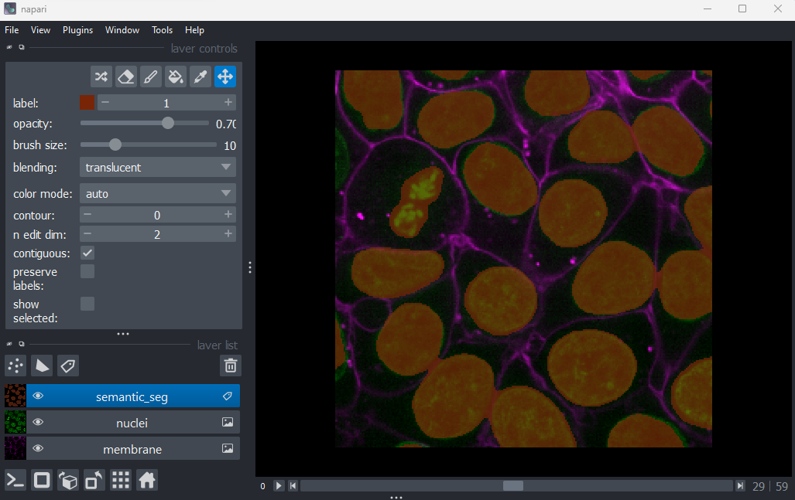{alt="A screenshot of a rough semantic
segmentation of nuclei in Napari"}

In the Napari viewer you should see the image above. 

We will now use Jupyter to make measurements with repeatable, well documented scripts. 

## Our first measurement

We now have a mask image with each pixel classified as either cell nuclei
(pixel value 1) or not (pixel value 0). 

Create a new cell and run:

```python
# Our first measurement: percentage of cell nuclei

# Import the Numpy library.
import numpy as np

# How many pixels are there in total in the image?
total_pixels = semantic_seg.size

# How many pixels are labelled as cell nuclei (pixel value = 1)?
# We'll use Numpy's count_nonzero method.
nuclei_pixels = np.count_nonzero(semantic_seg)

# The percentage of the image that is cell nuclei
nuclei_percent = nuclei_pixels / total_pixels * 100

print("Percent Nuclei =", round(nuclei_percent, 2), "%")
```

```output
Percent Nuclei = 19.47 %
```

Is knowing the percentage of pixels that are classed as nuclei sufficient
for our purposes? Thinking back to some of the research questions
we discussed in the [episode on designing an experiment](
designing-a-light-microscopy-experiment.md#define-your-research-question)
, if the percentage changes over time we can infer that something is
happening but what? We can't say whether the nuclei are changing in
number or in size or shape. For most research questions we will need a more
informative measurement.

## Counting the nuclei

We now need to count the number of nuclei in the image. We can use the
the [label](
https://scikit-image.org/docs/stable/api/skimage.measure.html#skimage.measure.label)
function from scikit-image. The label function is an example of
[connected component analysis](
https://datacarpentry.org/image-processing/08-connected-components.html#connected-component-analysis)
. Connected component analysis will go through the entire image, determine
which parts of the segmentation are connected to each other and form separate
objects. Then it will assign each connected region a unique integer value.
Let's try it.

Create a new cell and run:

```python
# Create an instance segmentation

# Import the label function
from skimage.measure import label

# Run the label function on the mask image
instance_seg = label(semantic_seg)

# Add the result to the viewer
viewer.add_labels(instance_seg)
```
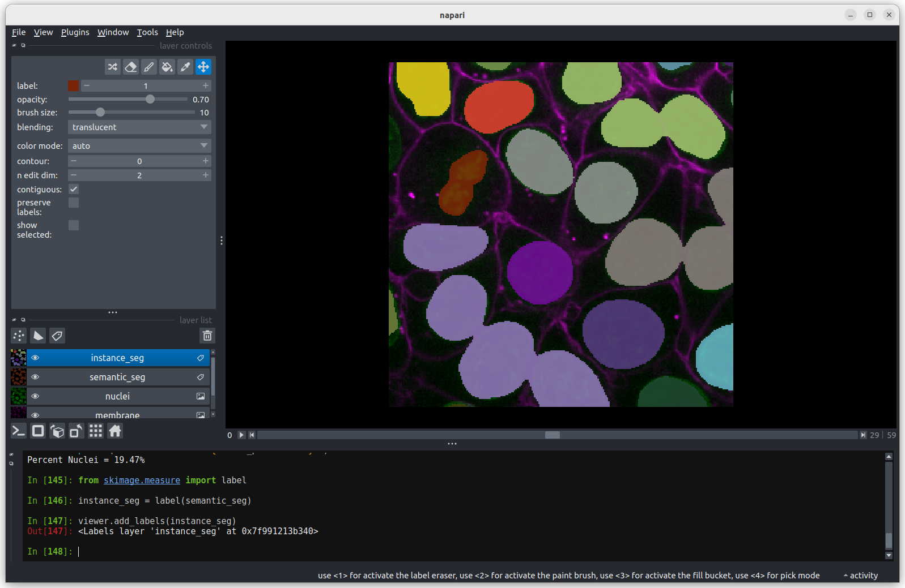{
alt="A screenshot of an instance segmentation of nuclei with some
incorrectly joined instances."}
You should see the above image in the Napari viewer. The different colours
are used to represent different nuclei. The instance segmentation assigns
a different integer value to each nucleus, so counting the number of
nuclei can be done very easily by taking the maximum value of the instance
segmentation image.

```python
# Calculate number of nuclei 
number_of_nuclei = instance_seg.max() 
print("Number of Nuclei =", number_of_nuclei)
```
```output
Number of Nuclei = 18
```

We can reuse Numpy's `count_nonzero` function on an individual nucleus by
specifying an integer value between 1 and 18

```python
# How many pixels are there in nucleus 1
nucleus_id = 1
number_of_pixels = np.count_nonzero(instance_seg == nucleus_id)
print("There are", number_of_pixels,"pixels in nucleus", nucleus_id)
```

```output
There are 43945 pixels in nucleus 1
```

Congratulations, you've measured the size (in pixels) of the first nucleus.
Later in this lesson, we'll cover how to convert the size in pixels to
volume in cubic micrometres and how to get statistics on the sizes of all
the nuclei. Before we do that, we'll use the [napari-skimage](
https://napari-hub.org/plugins/napari-skimage.html) plugin to
interactively examine the size and shape of individual nuclei.

## Using napari-skimage plugin to measure nuclei size

In the napari toolbar, open `Layers > Measure > Regionprops (labels) (skimage)`.
You should see a dialog like this:
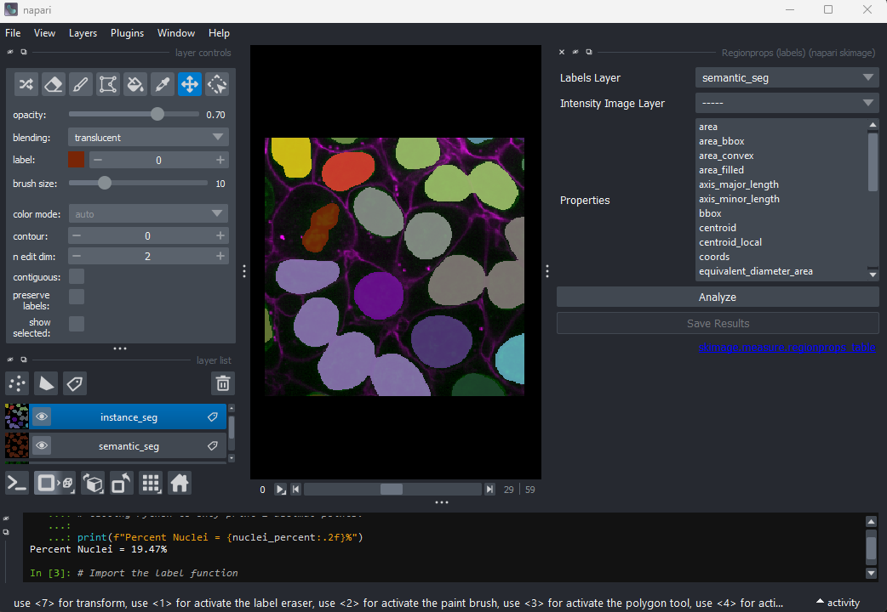{alt="A screenshot of the
napari-skimage Regionprops widget at startup."}

Select `instance_seg` in the 'Labels layer' drop down box and `nuclei` in the 
'Intensity Image Layer' drop down box.You can choose to measure various shape
properties with this plugin but for now let's keep it simple, making
sure that only `area`, `centroid` and `label` are selected. You will need to hold 
down <kbd>ctrl</kbd> to select multiple items in the list.

Click `Analyze` - a table of numeric values should appear in napari. If it 
opens in an inconvenient location, you can click and drag on the header containing the `x`, {alt="Napari's hide visibility icon" height='30px'} and other icons next
to the table window to reposition it. 
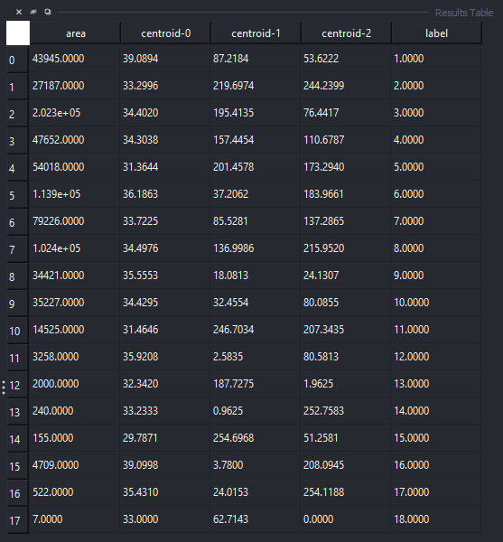{alt="A screenshot of the numeric value table
created by the napari-skimage plugin"}

## How to get Regionprops results as a table in JupyterLab

Instead of using the napari‑skimage plugin, the same measurements can be computed in our notebook.

Create a new cell and run:
``` python
# Create a Regionprops table

# Import tools
from skimage.measure import regionprops_table
import pandas as pd

# Compute region properties
props = regionprops_table(
    label_image=instance_seg,
    properties=["label", "area", "centroid"]
)

# Convert to a pandas DataFrame
props_df = pd.DataFrame(props)

# Display the table
props_df
```

## Sorting and inspecting the results

Regionprops can generate a lot of information on the shape and
size of each connected region. For now we will focus only on the
column headed `area`, which shows the size (in pixels).

Let's look more closely at some the extreme values by sorting our table.

Create a new cell and run:
``` python
# Sort the table based on cell size (area)
sorted_props_df = props_df.sort_values("area")

# Display the table
sorted_props_df
```
### The largest nucleus
According to the table, nucleus 3 is larger than the other nuclei
(202258 pixels). In the [what is an image](what-is-an-image.md#pixels)
lesson, we learnt to use the mouse pointer to find particular values in an
image. Hovering the mouse pointer over the light purple nuclei at the bottom
left of the image we see that these apparently four separate nuclei have
been labelled as a single nucleus. 

:::::::::::::::::::::::::challenge
### Why Are Separate Nuclei Getting the Same Label?

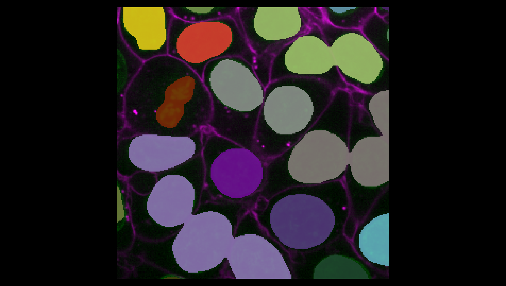{
alt="A screenshot of an instance segmentation of nuclei."}

the images above, three of the light purple nuclei are visibly touching, so
it is not surprising that they have been considered as a single
`connected component` and thus labelled as a single nucleus. What about the
fourth apparently separate nucleus? Why does it have the same label?

:::::::::::::::::::::::::solution
It is important to remember that this is
a three-dimensional image and so pixels will be considered as "connected" if
they are adjacent to another segmented pixel in any of the three dimensions
(and not just in the two-dimensional slice that you are looking at).

You may remember from our [first lesson](imaging-software.md#d3d) that
we can change to 3D view mode by pressing the {alt="Napari's 2D/3D toggle" height='30px'} button.
Try it now.

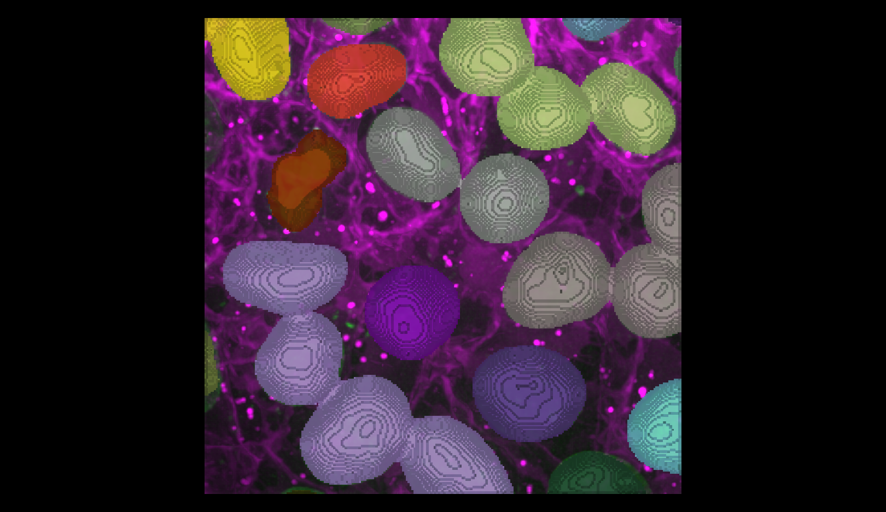{
alt="A screenshot of an instance segmentation of nuclei in 3D mode with some
incorrectly joined instances."}
You should see the image rendered in 3D, with a clear join between the
upper most light purple nucleus and its neighbour.

::::::::::::::::::::::::: 
::::::::::::::::::::::::: 

### The smallest nucleus
The smallest nucleus is labelled 18, with a size of 7 pixels. We can use the position data (the `centroid` columns) in the table to help find this nucleus. We need to navigate to slice 33 and get the mouse near the top left corner (33 64 0) to find label 18 in the image.

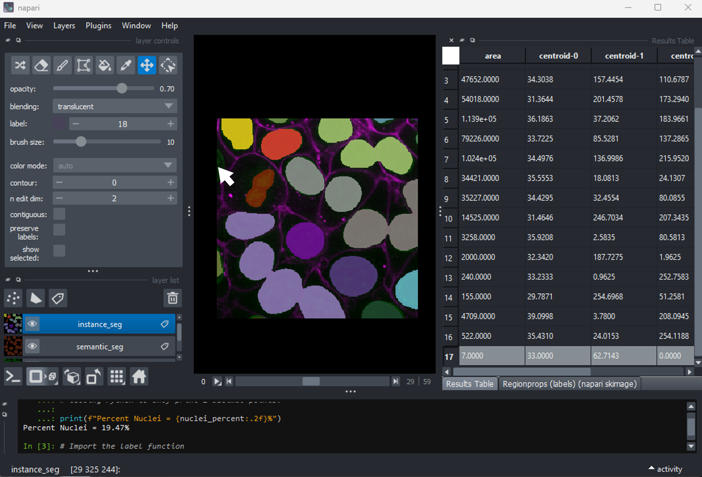{alt="A screenshot
region-props dialog highlighting the smallest nucleus."}

Nucleus 18 is right at the edge of the image, so is only a partial nucleus. Partial nuclei will need to be excluded from our analysis. We'll do this later in the lesson with a [clear border](#removing-border-cells) filter. However, first we need to solve the problem of joined nuclei.


## Separating joined nuclei
Our first problem is how to deal with four apparently distinct nuclei (labelled
with a light purple colour) being segmented as a single nucleus. 


### Erode the semantic segmentation so all nuclei are separate
In order to use the label function to count the cell nuclei we first need
to make sure all the nuclei are separate. We can do this by reducing the
apparent size of the nuclei by eroding the image.
Image erosion is an image filter, similar to those we covered in the
[filters and thresholding](filters-and-thresholding.md) lesson.
We will use scikit-image's
[erosion](
https://scikit-image.org/docs/stable/api/skimage.morphology.html#skimage.morphology.erosion)
function. 

In this lesson we will run the erosion function in our notebook 
to so that we can easily reproduce the results later. It is also
possible to run the erosion function through a plugin:
`Layers > Filter > Morphology > Morphology (napari skimage)`
if you prefer.

The erosion function sets a pixel to the
minimum value in the neighbourhood defined by a `footprint` parameter.
We'll use scikit-image's [ball](
https://scikit-image.org/docs/stable/api/skimage.morphology.html#skimage.morphology.ball)
function to generate a sphere to use as the footprint.

Image erosion has the effect of making bright areas of the image smaller.
In this case the labelled (non-zero) nuclei will become smaller, as any
pixels closer to the edge of the nucleus than the radius of the footprint
will be set to zero. 

Create a new cell and run:
```python
# Erode the semantic segmentation

# import tools
from skimage.morphology import erosion, ball

# Erosion with a radius 1 ball
eroded_mask = erosion(semantic_seg, footprint = ball(1))
viewer.add_labels(eroded_mask, name = "eroded_ball_1")
```

:::::::::::::::::::::::::challenge
### What is a good radius?
We can change the radius of the footprint to control the amount of erosion. 

Try eroding the `semantic_seg` layer with different integer values for the radius. What radius do you need to ensure all nuclei are separate?

Note that larger radius values will take longer to run on your computer. 

Keep your radius values <= 15.

:::::::::::::::::::::::::solution
To test different values of radius, you can assign a different value to
radius, e.g. `radius = 5` and rerun the last two lines from above. Or
you can try with a Python [for loop](
https://swcarpentry.github.io/python-novice-inflammation/05-loop.html)
which enables us to test multiple values of radius quickly.
```python
# Erode the mask using a ball

# Radius 5
eroded_mask = erosion(semantic_seg, footprint=ball(5))
# Add the eroded mask as a new layer in Napari
viewer.add_labels(eroded_mask, name="eroded_ball_5")

# Radius 10
eroded_mask = erosion(semantic_seg, footprint=ball(10))
# Add the eroded mask as a new layer in Napari
viewer.add_labels(eroded_mask, name="eroded_ball_10")

# Radius 15
eroded_mask = erosion(semantic_seg, footprint=ball(15))
# Add the eroded mask as a new layer in Napari
viewer.add_labels(eroded_mask, name="eroded_ball_15")
```

#### Radius 5
Some nuclei that are touching remain **partially connected**.
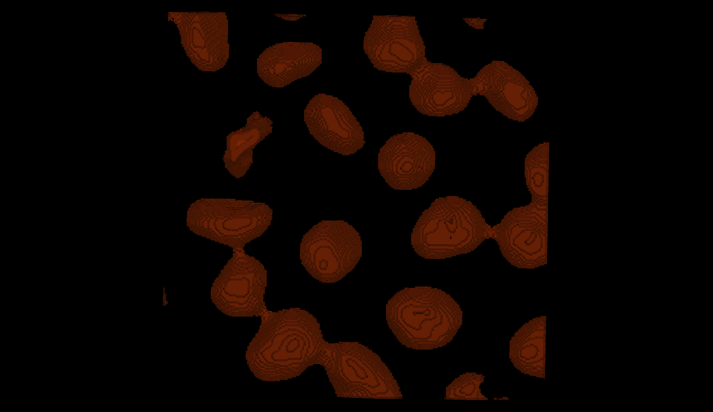{alt="Semantic segmentation mask eroded with a ball of radius 5."}


#### Radius 10
Erosion with a radius of 10 removes enough pixels to **separate touching nuclei**  
while still keeping the nuclei you want to analyse.
{alt="Semantic segmentation mask eroded with a ball of radius 10."}

#### Radius 15
Erosion with a radius of 15 is too strong: several nuclei become **over‑eroded**  
and some disappear completely.
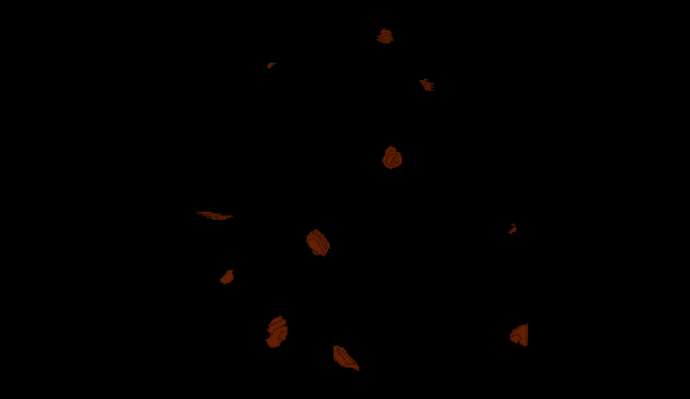{alt="Semantic segmentation mask eroded with a ball of radius 15."}
:::::::::::::::::::::::::
:::::::::::::::::::::::::

:::::::::::::::::::::::::challenge
### For-loop 

Try using a Python `for` loop to test several radius values.

:::::::::::::::::::::::::solution
You can change the radius manually (for example, `radius = 5`) and re‑run the erosion each time.  
But if you want to test **many** radius values quickly, a Python [for loop](https://swcarpentry.github.io/python-novice-inflammation/05-loop.html) lets you repeat the same steps for each radius in a list.

```python
# List of radii to test
radii = [5, 10, 15]
# A for-loop that tests several radii
for radius in radii:
    # Make a name for the output layer
    layer_name = "eroded_ball_" + str(radius)
    # Erode the mask using this radius
    eroded_mask = erosion(semantic_seg, footprint=ball(radius))
    # Add the eroded mask as a new layer in Napari
    viewer.add_labels(eroded_mask, name=layer_name)
```
:::::::::::::::::::::::::
:::::::::::::::::::::::::

### Instance segmentation using the eroded mask

Now we have separate nuclei, lets try creating instance labels
again.

```python
# Create a new instance segmentation using the eroded mask
eroded_semantic_seg = viewer.layers['eroded_ball_10'].data
eroded_instance_seg = label(eroded_semantic_seg)
viewer.add_labels(eroded_instance_seg)

print("Number of nuclei after erosion  =", eroded_instance_seg.max())
```

```output
Number of nuclei after erosion  = 19
```

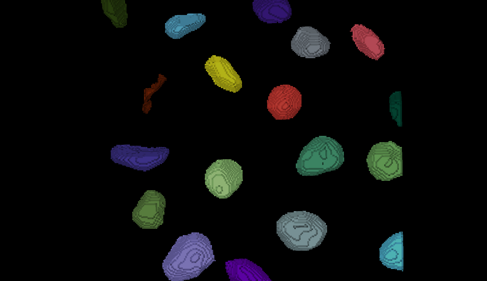{
alt="Instance segmentation on the eroded segmentation mask"}
Looking at the image above, there are no longer any incorrectly joined
nuclei. The absolute number of nuclei found hasn't changed much as the
erosion process has removed some partial nuclei around the edges of the
image.

### Dilation

Performing any size or shape analysis on these nuclei will be flawed, as
they are heavily eroded. We can largely undo much of the erosion by using
the scikit-image's [expand labels](
https://scikit-image.org/docs/stable/api/skimage.segmentation.html#skimage.segmentation.expand_labels)
function. The expand labels function is a filter which performs a `dilation`
, expanding the bright (non-zero) parts of the image.
The expand labels function adds an extra step to stop the dilation
when two neighbouring labels meet, preventing overlapping labels.

```python
from skimage.segmentation import expand_labels

# Dilate eroded instance segmentation with the same radius
dilated_instance_seg = expand_labels(eroded_instance_seg, 10)

viewer.add_labels(dilated_instance_seg)

```

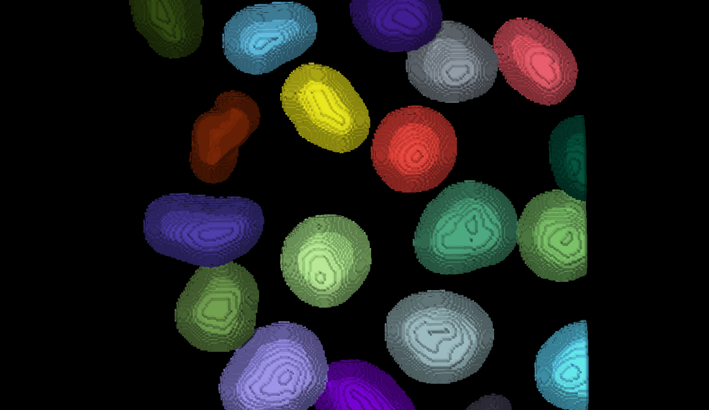{
alt="Dilated instance segmentation on the eroded segmentation mask"}
There are now 19 apparently correctly labelled nuclei that appear to be
the same shape as in the original mask image.

### Opening
In order to create a correct instance segmentation we have performed a
mask erosion followed by a label expansion. This is a common image
operation often used to remove background noise, known as as `opening`,
or an erosion followed by a dilation. In addition to helping us separate
instances it will have the effect of removing objects smaller than the
erosion footprint, in this case a sphere with radius 10 pixels.

:::::::::::::::::::::::::challenge

### Is the erosion completely reversible?
If we compare the eroded and expanded image with the original mask,
what will we see?

:::::::::::::::::::::::::solution

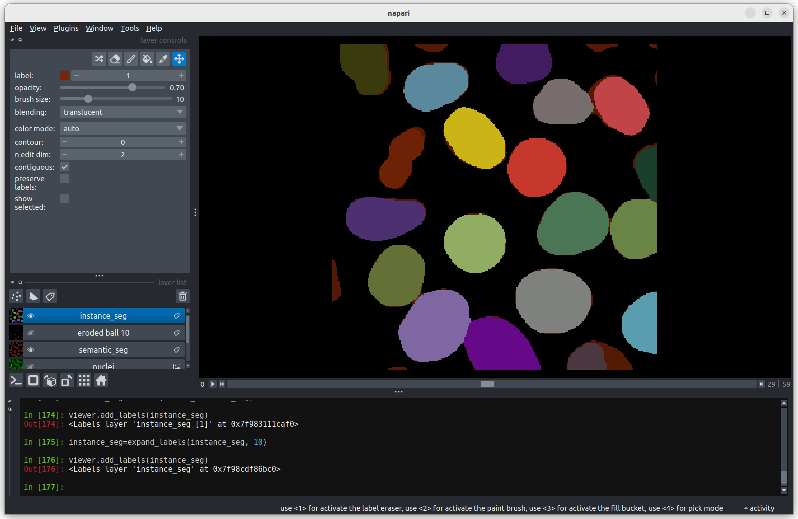{
alt="A comparison between the expanded instance segmentation and the
original semantic segmentation showing some mismatch between the borders."}
Looking at the above image we can see some small mismatches around the
edges of most of the nuclei. It should be remembered when looking at this image
that it is a single slice though a 3D image, so in some cases where the
differences look large (for example the nucleus at the bottom right) they may
still be only one pixel deep. Will the effect of this on the accuracy of
our results be significant?

:::::::::::::::::::::::::
:::::::::::::::::::::::::
## Removing Border Cells
Now we return to the second problem with our initial instance segmentation,
the presence of partial nuclei around the image borders. As we're measuring
nuclei size, the presence of any partially visible nuclei could substantially
bias our statistics. We can remove these from our analysis using scikit-image's
[clear border](
https://scikit-image.org/docs/stable/api/skimage.segmentation.html#skimage.segmentation.clear_border)
function.

```python
# Remove partial nuclei touching the image border

# Import scikit-image's clear_border
from skimage.segmentation import clear_border

# Clear border
clear_border_dilated_instance_seg = clear_border(dilated_instance_seg)
viewer.add_labels(clear_border_dilated_instance_seg)
```

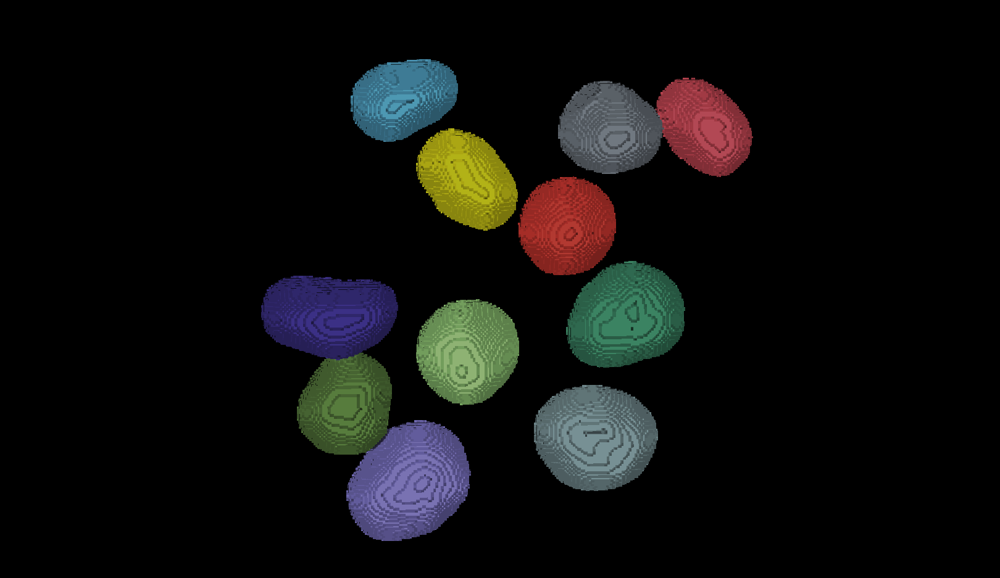{
alt="The instance segmentation with any nuclei crossing the image boundary
removed"}
We now have an image with 11 clearly labelled nuclei.
You may notice that the smaller nucleus (dark orange) near the top left
of the image has been removed even though we can't see where it touches the
image border. Remember that this is a 3D image and clear border removes
nuclei touching any border. This nucleus has been removed because it touches
the top or bottom (z axis) of the image.
Let's check the nuclei count as we did above.

```python
# First count the nuclei
number_of_nuclei = clear_border_dilated_instance_seg.max()
print("There are", number_of_nuclei, "nuclei")
```
```output
There are 19 individual nuclei
```
Why are there still 19 nuclei? When we ran `clear_borders` the pixels
corresponding
to border nuclei were set to zero, however the total number of labels
in the image was not changed, so whilst there are 19 labels in the
image some of them have no corresponding pixels. The easiest way to
correct this is to relabel the image (and replace the old instance
segmentation in the viewer.)

```python
# Relabel
clear_border_dilated_instance_seg = label(clear_border_dilated_instance_seg)

# Remove old instance segmentation
viewer.layers.remove('clear_border_dilated_instance_seg')

# Number of nuclei after relabling
number_of_nuclei = clear_border_dilated_instance_seg.max()
print(f"There are {number_of_nuclei} individual nuclei")

# Add relabeled segmentation as labels layer
viewer.add_labels(clear_border_dilated_instance_seg)
```
```output
There are 11 individual nuclei
```

## Number of pixels per nuclei.
Now that your instance segmentation is correct, you can finish the analysis in our notebook.

Let's start by counting the pixels per nucleus like we did before. 

```python
# Count the pixels per nucleus

# Remove the old instance segmentation
viewer.layers.remove('instance_seg')

# Add new instance segmentation
instance_seg = clear_border_dilated_instance_seg
viewer.add_labels(instance_seg)

# Extract region properties 
props = regionprops_table(
    instance_seg,
    properties=["label", "area"]   # 'area' = number of pixels
)

# Convert to a pandas DataFrame
props_df = pd.DataFrame(props)

props_df
```

**Are these pixel counts good measurements?**
Pixel counts depend on image resolution, not on the biology of the sample.

This is why biologists convert pixel counts into physical units like µm³ that allow comparisons across experiments, microscopes, and labs.

## Volume per nuclei

To convert to volumes we need to know the pixel size. 

In the lesson on [filetypes and metadata](filetypes-and-metadata.md#pixel-size) we learnt how to inspect the image metadata to determine the pixel size. 

Unfortunately the sample image we're using in this lesson has no metadata. Fortunately the image pixel sizes can be found in the [scikit-image documentation](https://scikit-image.org/docs/stable/api/skimage.data.html#skimage.data.cells3d). So we can assign a pixel size of 0.26&mu;m (x axis), 0.26&mu;m (y axis) and 0.29&mu;m (z axis).

Using this pixel size, we can then calculate the nucleus volume in cubic micrometres.

```python
# Volume of a single voxel in cubic micrometres
voxel_volume = 0.26 * 0.26 * 0.29

# Add a physical volume column
props_df["volume_um3"] = props_df["area"] * voxel_volume

props_df
```
Once you know the voxel size, `pandas` makes the conversion and analysis extremely easy:
```python
# Quick stats using pandas
props_df["volume_um3"].describe()
```
 
## Saving, reusing, and sharing your workflow

A key advantage of using a JupyterLab notebook is that your entire analysis is saved in one place. This makes your workflow reproducible, easy to adapt, and simple to share with others.

A tidy notebook is easier to understand for others (and for your future self). 

Good practice include:

- Ensuring the notebook runs without issues from beginning to end.

- Organising the notebook into clear sections (e.g. imports, loading data, segmentation, measurements, exporting results).

- Removing unused cells and tidy temporary experiments.

- Adding short notes explaining key steps and decisions.

Your notebook contains all the analysis steps, but it won’t run correctly unless the software environment is the same. 

Export your conda environment so others can recreate it:

``` bash
conda env export > environment.yml
```
To recreate the same software environment on another computer:

``` bash
conda env create -f environment.yml
```
Read the [conda documentation](https://docs.conda.io/projects/conda/en/latest/user-guide/tasks/manage-environments.html#creating-an-environment-from-an-environment-yml-file) for more information.

Other good practices include:

- Sharing your notebook on a collaborative platform such as [GitHub](https://github.com/) or [GitLab](https://about.gitlab.com/), where others can comment, discuss, or propose improvements.

- Using version control (e.g., [Git](https://git-scm.com/)) to track changes, document improvements, and maintain a clear history of how your workflow evolves. This also gives you the ability to revert to earlier versions whenever a mistake happens, ensuring you never lose work in progress.

::::::::::::::::::::::::::::::::::::: keypoints

- Connected component analysis (the label function) was used to assign
each connected region of a mask a unique integer value.
This produces an instance segmentation
from a semantic segmentation.
- Erosion and dilation filters were used to correct the instance
segmentation. Erosion was used to separate individual nuclei.
Dilation (or expansion) was used to return the nuclei to their
(approximate) original size.
- Partial nuclei at the image edges can be removed with the clear_border
function.
- The napari-skimage plugin can be used to interactively
examine the nuclei shapes.
- JupyterLab notebooks allow you to create reproducible workflows.


::::::::::::::::::::::::::::::::::::::::::::::::

