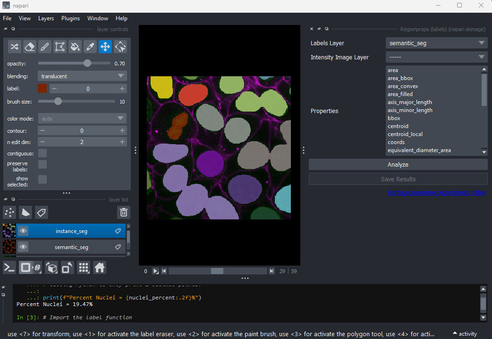
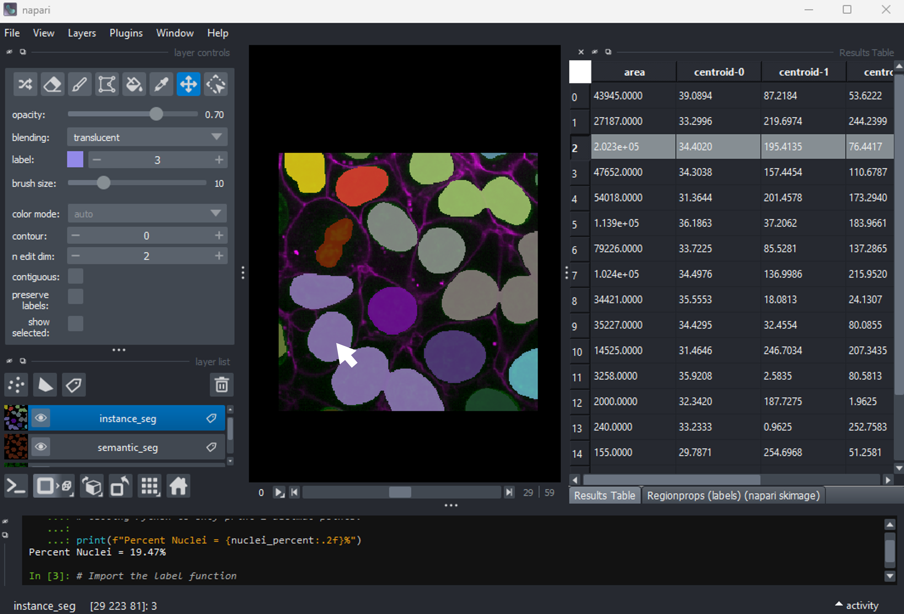

:::::::::::::::::::::::::::::::::::::: questions

- How do we perform instance segmentation in Napari?
- How do we measure cell size with Napari?
- How do we save our work to create re-usable workflows?

::::::::::::::::::::::::::::::::::::::::::::::::

::::::::::::::::::::::::::::::::::::: objectives

- Use simple operations (like erosion and dilation) to clean up a segmentation.

- Use connected components labelling on a thresholded image.

- Calculate the number of cells and average cell volume.

- Save and edit your workflow to re-use on subsequent images.

- Perform more complex cell shape analysis using the regionprops plugin.

::::::::::::::::::::::::::::::::::::::::::::::::

In this lesson we'll continue to work with the Cells (3D + 2Ch) image we've
been using in past lessons. We will expand our use of Napari's Python console
to perform the work and save our workflow to a Python script. We chose to use
the Python console for this lesson to further develop skills in script writing
and automating the image analysis pipeline. Being able to use the console and
save the script will help with automation and repetition in later work.

We have kept the level of programming knowledge required to the minimum
possible and all code can be run by copy and pasting, so don't worry if
you don't understand it all yet.
Most, if not all, of the functions we will use in this lesson are also
accessible via various Napari plugins, so the analysis pipeline could also be
assembled with the Napari assistant if you prefer.

## Before you begin

We'll be using the [napari-skimage-regionprops](
https://www.napari-hub.org/plugins/napari-skimage-regionprops) plugin
in this lesson. If it is not already installed you should do that now.
Use the tool bar to navigate to `Plugins > Install/Uninstall Plugins...`.
Type `region` into the filter bar at the top left and you should
see `napari-skimage-regionprops` in the dialog like the image below.
{alt="A screenshot of the plugin installation
dialog for napari-skimage-regionprops"}
If it is already installed, then nothing else needs to be done.
If it is not installed, press install, and when finished, restart Napari.

## Loading an image and creating a mask
We recommend starting a new session in Napari in order to make sure
the variable names in the console are correct. If you have come
straight from the last lesson the first few steps will be familiar,
but can be quickly repeated by copy and pasting into the console.

First, let's open one of Napari's sample images with:

`File > Open Sample > napari builtins > Cells (3D + 2Ch)`

Open Napari's console by pressing the {alt="A screenshot of Napari's console button" height='30px'} button,
then copy and paste the code below.

```python
from skimage.filters import threshold_otsu, gaussian

image = viewer.layers["nuclei"].data

blurred = gaussian(image, sigma=3)
threshold = threshold_otsu(blurred)

semantic_seg = blurred > threshold
viewer.add_labels(semantic_seg)
```
{alt="A screenshot of a rough semantic
segmentation of nuclei in Napari"}

And you should see the image above. You are now ready to begin this lesson.

## Our first measurement

We now have a mask image with each pixel classified as either cell nuclei
(pixel value 1) or not (pixel value 0). Try running the following code in
the console.

```python
# We're going to need some functions from the Numpy library.
import numpy as np

# How many pixels are there in total in the image?
total_pixels = semantic_seg.size

# How many pixels are labelled as cell nuclei (pixel value = 1)?
# We'll use Numpy's count_nonzero method.
nuclei_pixels = np.count_nonzero(semantic_seg)

# Now we can work out what percentage of the image is cell nuclei
nuclei_percent = nuclei_pixels / total_pixels * 100

# And write the results to the console with some formatting.
# Python's f-string format allows us to easily mix text and
# code in our print statements. The curly brackets contain
# code and the ":2f" provides formatting instructions, here
# telling Python to only print 2 decimal points.

print(f"Percent Nuclei = {nuclei_percent:.2f}%")

```

```output
Percent Nuclei = 19.47%
```

Is knowing the percentage of pixels that are classed as nuclei sufficient
for our purposes? Thinking back to some of the research questions
we discussed in the [episode on designing an experiment](
designing-a-light-microscopy-experiment.md#define-your-research-question)
, if the percentage changes over time we can infer that something is
happening but what? We can't say whether the nuclei are changing in
number or in size or shape. For most research questions we will need a more
informative measurement.

:::::::::::::::::::::::: callout

### Saving and repeating your work

Let's assume that measuring percentage of nuclei is sufficient for your
research question. How do we automate and repeat this workflow on new
images? The Napari Python console has a built in save function.
```python
# Save current session to a file called measure_percent.py
%save measure_percent ~0/
```
Delete the semantic_seg layer from the viewer and run:
```python
load measure_percent.py
```
After pressing enter you should see the calculated percent nuclei and
the semantic_seg layer should reappear. We will reuse the save function
at the end of this lesson.
::::::::::::::::::::::::

## Counting the nuclei

We now need to count the number of nuclei in the image. We can use the
the [label](
https://scikit-image.org/docs/stable/api/skimage.measure.html#skimage.measure.label)
function from scikit-image. The label function is an example of
[connected component analysis](
https://datacarpentry.org/image-processing/08-connected-components.html#connected-component-analysis)
. Connected component analysis will go through the entire image, determine
which parts of the segmentation are connected to each other and form separate
objects. Then it will assign each connected region a unique integer value.
Let's try it.

```python
# Import the label function
from skimage.measure import label

# Run the label function on the mask image
instance_seg = label(semantic_seg)

# Add the result to the viewer
viewer.add_labels(instance_seg)
```
{
alt="A screenshot of an instance segmentation of nuclei with some
incorrectly joined instances."}
You should see the above image in the Napari viewer. The different colours
are used to represent different nuclei. The instance segmentation assigns
a different integer value to each nucleus, so counting the number of
nuclei can be done very easily by taking the maximum value of the instance
segmentation image.

```python

# Calculate number of nuclei from instance segmentation
print(f"Number of Nuclei = {instance_seg.max()}")
```
```output
Number of Nuclei = 18
```

We can reuse Numpy's `count_nonzero` function on an individual nucleus by
specifying an integer value between 1 and 18

```python
# How many pixels are there in nucleus 1
nucleus_id = 1
print(f"There are {np.count_nonzero(instance_seg == nucleus_id)}",
      f"pixels in nucleus {nucleus_id}")
```

```output
There are 43945  pixels in nucleus 1
```

Congratulations, you've measured the size (in pixels) of the first nucleus.
Later in this lesson, we'll cover how to convert the size in pixels to
volume in cubic micrometres and how to get statistics on the sizes of all
the nuclei. Before we do that, we'll use the [napari-skimage-regionprops](
https://www.napari-hub.org/plugins/napari-skimage-regionprops) plugin to
interactively examine the size and shape of individual nuclei.

## Using napari-skimage-regionprops plugin to measure nuclei size

If you followed the instructions [above](#before-you-begin) the
napari-skimage-regionprops plugin should already be installed. If not then
do it now and restart Napari. If the plugin is installed you can use the
toolbar to open `tools > measurement tables > Regionsprops(skimage, nsr)`.
You should see a dialog like this:
{alt="A screenshot of the
napari-skimage-regionprops plugin at startup."}

Select `nuclei(data)` in the image drop down box and `instance_seg(data)`
in the labels drop down box. You can choose to measure various shape
properties with this plugin but for now let's keep it simple, making
sure that only the `size` and `position` tick boxes are selected.
Click `run`. A table of numeric values should appear under the plugin
dialog box, like the image below.
{alt="A screenshot of the numeric value table
created by the napari-skimage-regionprops plugin"}

The regionprops plugin can generate a lot of information on the shape and
size of each connected region. You can use the horizontal scroll bar to
move across the table and see more. For now we will focus only on the
second column, headed `area`, which shows the size (in pixels).
Let's look more closely at some the extreme values.

Let's start with label 3 which is the largest labelled nucleus.
{alt="A screenshot of the
region-props dialog highlighting the largest nucleus."}
According to the table, nucleus 3 is larger than the other nuclei
(202258 pixels). In the [what is an image](what-is-an-image.html#pixels)
lesson, we learnt to use the mouse pointer to find particular values in an
image. Hovering the mouse pointer over the light purple nuclei at the bottom
left of the image we see that these apparently four separate nuclei have
been labelled as a single nucleus. Before we examine the reasons for this
we'll look at the other extreme value, the smallest nucleus.

The smallest nucleus is labelled 18, at the bottom of the table with
a size of 7 pixels. We can use the position data (the `centroid` and `bbox`
columns) in the table to help
find this nucleus. We need to navigate to slice 33 and get the mouse
near the top left corner (33 64 0) to find label 18 in the image.
{alt="A screenshot
region-props dialog highlighting the smallest nucleus."}
Nucleus 18 is right at the edge of the image, so is only a partial
nucleus. Partial nuclei will need to be excluded from our analysis. We'll do
this later in the lesson with a [clear border](#removing-border-cells) filter.
However, first we need to solve the problem of joined nuclei.

## Separating joined nuclei
Our first problem is how to deal with four apparently distinct nuclei (labelled
with a light purple colour) being segmented as a single nucleus. Referring to
the images above, three of the light purple nuclei are visibly touching, so
it is not surprising that they have been considered as a single
`connected component` and thus labelled as a single nucleus. What about the
fourth apparently separate nucleus? It is important to remember that this is
a three-dimensional image and so pixels will be considered as "connected" if
they are adjacent to another segmented pixel in any of the three dimensions
(and not just in the two-dimensional slice that you are looking at).

You may remember from our [first lesson](imaging-software.md#d3d) that
we can change to 3D view mode by pressing the {alt="Napari's 2D/3D toggle" height='30px'} button.
Try it now.

{
alt="A screenshot of an instance segmentation of nuclei in 3D mode with some
incorrectly joined instances."}
You should see the image rendered in 3D, with a clear join between the
upper most light purple nucleus and its neighbour. So now we understand why the
instance labelling has failed, what can we do to fix it?

::::::::::::::::::::::::: challenge

### Erode the semantic segmentation so all nuclei are separate
In order to use the label function to count the cell nuclei we first need
to make sure all the nuclei are separate. We can do this by reducing the
apparent size of the nuclei by eroding the image.
Image erosion is an image filter, similar to those we covered in the
[filters and thresholding](filters-and-thresholding.md) lesson.
We will use scikit-image's
[binary_erosion](
https://scikit-image.org/docs/stable/api/skimage.morphology.html#skimage.morphology.binary_erosion)
function. In this lesson we will run the binary erosion function using
the Napari console to help develop our scripting skills. It is also
possible to run the binary erosion function through a plugin:
`Tools > Segmentation post-processing > Binary erosion (scikit-image, nsbatwm)`
if you prefer.

The binary erosion function sets a pixel to the
minimum value in the neighbourhood defined by a `footprint` parameter.
We'll use scikit-image's [ball](
https://scikit-image.org/docs/stable/api/skimage.morphology.html#skimage.morphology.ball)
function to generate a sphere to use as the footprint.
Image erosion has the effect of making bright areas of the image smaller.
In this case the labelled (non-zero) nuclei will become smaller, as any
pixels closer to the edge of the nucleus than the radius of the footprint
will be set to zero. We can change
the radius of the footprint to control the amount of erosion. Try eroding
the `semantic_seg` layer with different integer values for the radius.
What radius do you need to ensure all nuclei are separate?

```python
from skimage.morphology import binary_erosion, ball

# With radius = 1
radius = 1
eroded_mask = binary_erosion(semantic_seg, footprint = ball(radius))
viewer.add_labels(eroded_mask, name = f'eroded ball {radius}')
```

Note that larger radius values will take longer to run on your computer. Keep 
your radius values <= 10.

:::::::::::::::::::::::::solution
To test different values of radius, you can assign a different value to
radius, e.g. `radius = 5` and rerun the last two lines from above. Or
you can try with a Python [for loop](
https://swcarpentry.github.io/python-novice-inflammation/05-loop.html)
which enables us to test multiple values of radius quickly.
```python
# The for loop will repeat the indented lines of codes for each value
# of radius in the list (1, 5, 10).
for radius in 1, 5, 10:
  eroded_mask = binary_erosion(semantic_seg, footprint = ball(radius))
  viewer.add_labels(eroded_mask, name = f'eroded ball {radius}')

```

{
alt="A screenshot of a semantic segmentation mask before erosion."}
The first image shows the mask without any erosion for comparison.

{
alt="A screenshot of a semantic segmentation mask eroded with a ball of
radius 1."}
Erosion with a radius of 1 makes a small difference, but the nuclei remain
joined.

{
alt="A screenshot of a semantic segmentation mask eroded with a ball of
radius 5."}
Erosion with a radius of 5 makes a more noticeable difference,
but some nuclei remain joined.

{
alt="A screenshot of a semantic segmentation mask eroded with a ball of
radius 10."}
Erosion with a radius of 10 separates all nuclei.

An alternative to performing a single large erosion (radius = 10) is to
perform a small erosion (radius = 1) 10 times. Doing this will give
subtly different results. As an extra activity you could try doing this
using a `for loop` and comparing the results?
:::::::::::::::::::::::::
:::::::::::::::::::::::::

Now we have separate nuclei, lets try creating instance labels
again.

```python
# Remove the incorrect instance segmentation from the viewer
viewer.layers.remove('instance_seg')

eroded_semantic_seg = viewer.layers['eroded ball 10'].data
# Create a new instace segmentation using the eroded mask
instance_seg = label(eroded_semantic_seg)

viewer.add_labels(instance_seg)

print(f"Number of nuclei after erosion  = {instance_seg.max()}")
```

```output
Number of nuclei after erosion  = 19
```

{
alt="Instance segmentation on the eroded segmentation mask"}
Looking at the image above, there are no longer any incorrectly joined
nuclei. The absolute number of nuclei found hasn't changed much as the
erosion process has removed some partial nuclei around the edges of the
image.

Performing any size or shape analysis on these nuclei will be flawed, as
they are heavily eroded. We can largely undo much of the erosion by using
the scikit-image's [expand labels](
https://scikit-image.org/docs/stable/api/skimage.segmentation.html#skimage.segmentation.expand_labels)
function. The expand labels function is a filter which performs a `dilation`
, expanding the bright (non-zero) parts of the image.
The expand labels function adds an extra step to stop the dilation
when two neighbouring labels meet, preventing overlapping labels.

```python
from skimage.segmentation import expand_labels

# Remove the eroded instance segmentation from the viewer
viewer.layers.remove('instance_seg')

# Expand the labels using the same radius we used when eroding them (10)
instance_seg = expand_labels(instance_seg, 10)

# Put the new instance segmentation back in the viewer
viewer.add_labels(instance_seg)
```
{
alt="Expanded instance segmentation on the eroded segmentation mask"}
There are now 19 apparently correctly labelled nuclei that appear to be
the same shape as in the original mask image.

:::::::::::::::::::::::::challenge

### Is the erosion completely reversible?
In order to create a correct instance segmentation we have performed a
mask erosion followed by a label expansion. This is a common image
operation often used to remove background noise, known as as `opening`,
or an erosion followed by a dilation. In addition to helping us separate
instances it will have the effect of removing objects smaller than the
erosion footprint, in this case a sphere with radius 10 pixels.
If we compare the eroded and expanded image with the original mask,
what will we see?

:::::::::::::::::::::::::solution

{
alt="A comparison between the expanded instance segmentation and the
original semantic segmentation showing some mismatch between the borders."}
Looking at the above image we can see some small mismatches around the
edges of most of the nuclei. It should be remembered when looking at this image
that it is a single slice though a 3D image, so in some cases where the
differences look large (for example the nucleus at the bottom right) they may
still be only one pixel deep. Will the effect of this on the accuracy of
our results be significant?

:::::::::::::::::::::::::
:::::::::::::::::::::::::
## Removing Border Cells
Now we return to the second problem with our initial instance segmentation,
the presence of partial nuclei around the image borders. As we're measuring
nuclei size, the presence of any partially visible nuclei could substantially
bias our statistics. We can remove these from our analysis using scikit-image's
[clear border](
https://scikit-image.org/docs/stable/api/skimage.segmentation.html#skimage.segmentation.clear_border)
function.

```python

from skimage.segmentation import clear_border

viewer.layers.remove('instance_seg')

instance_seg = clear_border(instance_seg)

viewer.add_labels(instance_seg)
```

{
alt="The instance segmentation with any nuclei crossing the image boundary
removed"}
We now have an image with 11 clearly labelled nuclei.
You may notice that the smaller nucleus (dark orange) near the top left
of the image has been removed even though we can't see where it touches the
image border. Remember that this is a 3D image and clear border removes
nuclei touching any border. This nucleus has been removed because it touches
the top or bottom (z axis) of the image.
Let's check the
nuclei count as we did above.

```python
# First count the nuclei
number_of_nuclei = instance_seg.max()
print(f"There are {number_of_nuclei} individual nuclei")
```
```output
There are 19 individual nuclei
```
Why are there still 19 nuclei? When we ran `clear_borders` the pixels
corresponding
to border nuclei were set to zero, however the total number of labels
in the image was not changed, so whilst there are 19 labels in the
image some of them have no corresponding pixels. The easiest way to
correct this is to re label the image (and replace the old instance
segmentation in the viewer.)
```python
viewer.layers.remove('instance_seg')

instance_seg = label(instance_seg)
number_of_nuclei = instance_seg.max()
print(f"There are {number_of_nuclei} individual nuclei")

viewer.add_labels(instance_seg)
```
```output
There are 11 individual nuclei
```

You now have a correct instance segmentation. You could return to
using the napari-skimage-regionprops plugin to calculate the sizes
of each nucleus and export the results to a speadsheet or your preferred
analysis software using the `save as csv` function. However you've probably
picked up enough Python during this course to complete the analysis you need
with just the Napari console. Let's give it a try. The following commands
should work with copy and paste, so don't worry too much if you don't think
you've quite mastered Python for loops yet.

Earlier in the lesson we used a Python [for loop](
https://swcarpentry.github.io/python-novice-inflammation/05-loop.html)
to try out three different erosion radii. Now let's use a for loop to
count the number of pixels in each of the 11 nuclei. For this we'll
take advantage of Python's `range` function which returns a list of numbers.

```python

# Create a list of label values for each label in the instance segmentation
# We need to add 1 to the number of nuclei as python's range function
# includes the lower limit (1) but not the upper limit.
labels = range(1, number_of_nuclei + 1)

# Print it to the console to check it's right
for label in labels:
  print (label)

```
```output
1
2
3
4
5
6
7
8
9
10
11
```

Earlier in the lesson we used Numpy's `count_nonzero` function to find the
size of
a single nucleus. Let's put it inside the for loop to find the size of
every nucleus. We'll use a Python list to store the results.

```python
# Create an empty list
nucleus_pixels = []
# Go through each nucleus,
for label in labels:
  # Append the number of pixels to the list
  nucleus_pixels.append(np.count_nonzero(instance_seg == label))
```
We now have a list of nuclei sizes in pixels. We can check what is in the
list with a print statement.
```python
print(nucleus_pixels)
```
```output
[40960, 26847, 60268, 46545, 51409, 46866, 53108, 37869, 36523, 40809, 14548]
```
We see 11 values within the list. Each value tells us the number of pixels
in a particular nucleus.
Before we do too much analysis on the nuclei sizes we should convert
them to a physical value, rather than pixels.

## Size in pixels to cell volume
To convert to volumes we need to know the pixel size.
In the lesson on [filetypes and metadata](
filetypes-and-metadata.md#pixel-size) we learnt how to inspect the image
metadata to determine the pixel size. Unfortunately the sample image
we're using in this lesson has no metadata. Fortunately the image pixel sizes
can be found in the [scikit-image documentation](
https://scikit-image.org/docs/stable/api/skimage.data.html#skimage.data.cells3d)
. So we can assign a pixel size of 0.26&mu;m (x axis), 0.26&mu;m
(y axis) and 0.29&mu;m (z axis).
Using this pixel size, we can then calculate the nucleus volume in
cubic micrometres.

```python
# Let's keep everything in micrometres
pixel_volume = 0.26 * 0.26 * 0.29

# We can multiply all nuclei by the pixel volume by first converting the
# nucleus_pixels to a numpy array.
nucleus_volume = pixel_volume * np.array(nucleus_pixels)

```

We can now use some simple functions to find the range, mean, and
standard deviation of the nuclei in micrometers.
```python

# Find the range of nucleus sizes (maximum - minimum).
print(f"Range of nucleus volumes = {nucleus_volume.max() - nucleus_volume.min():.2f} cubic micrometres.")

# Find the mean nuclei volume
print(f"Nucleus volume mean = {np.mean(nucleus_volume):.2f} cubic micrometres.")

# And the standard deviation
print(f"Nucleus volume standard dev. = {np.std(nucleus_volume):.2f} cubic micrometres.")
```
```output
Range of nucleus volumes = 579.10 cubic micrometres.
Nucleus volume mean = 855.98 cubic micrometres.
Nucleus volume standard dev. = 170.19 cubic micrometres.
```
These numbers provide a good quantitative measure of the quantity and
volume of cell nuclei suitable for an experiment investigating how these
quantities change over time.

We can save our work from the console for re-use on data from subsequent
time points, creating a repeatable measurement workflow.

```python
%save measurement_workflow ~0/
```
This will create a Python file `measurement_pipepine.py` that we can
load into the Napari console and re-run. You may choose to edit the file
with any text editor to remove some of the redundant steps we've made
whilst learning.

::::::::::::::::::::::::::::::::::::: keypoints

- Connected component analysis (the label function) was used to assign
each connected region of a mask a unique integer value.
This produces an instance segmentation
from a semantic segmentation.
- Erosion and dilation filters were used to correct the instance
segmentation. Erosion was used to separate individual nuclei.
Dilation (or expansion) was used to return the nuclei to their
(approximate) original size.
- Partial nuclei at the image edges can be removed with the clear_border
function.
- The napari-skimage-regionprops plugin can be used to interactively
examine the nuclei shapes.
- The Python console can be used to automate and save the image
analysis pipeline.

::::::::::::::::::::::::::::::::::::::::::::::::

