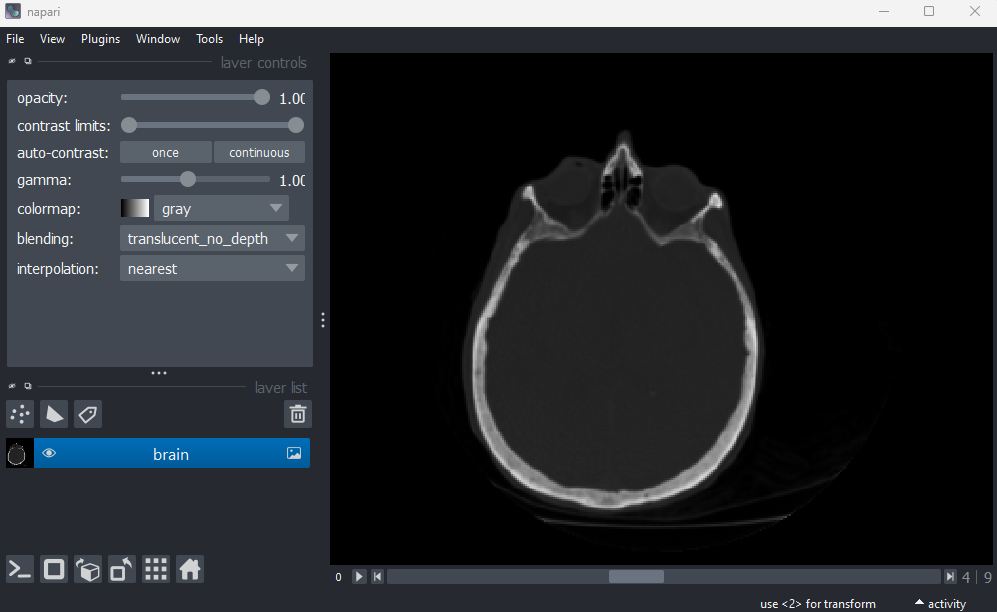
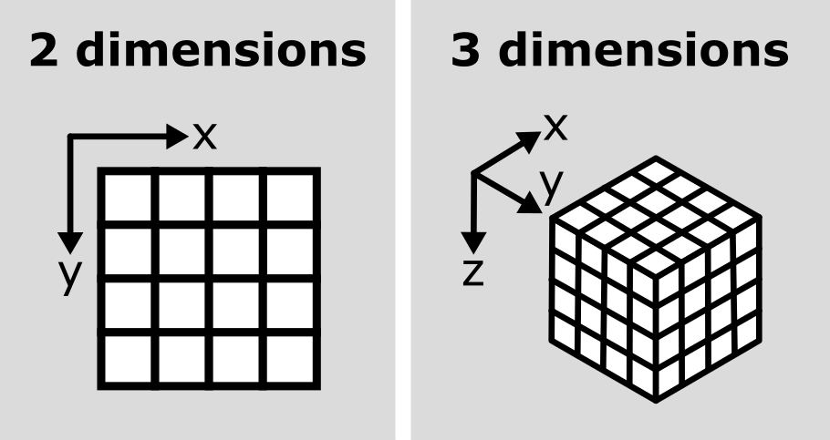
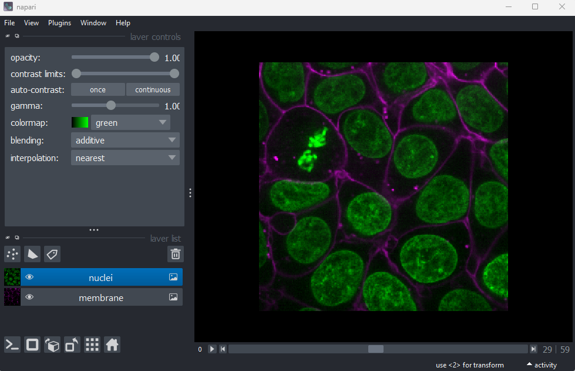
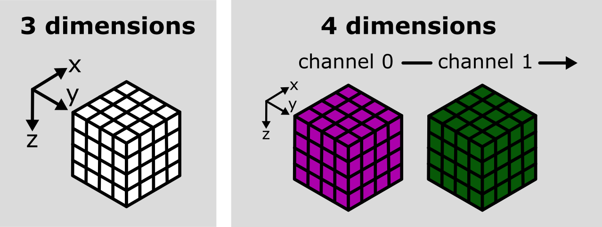
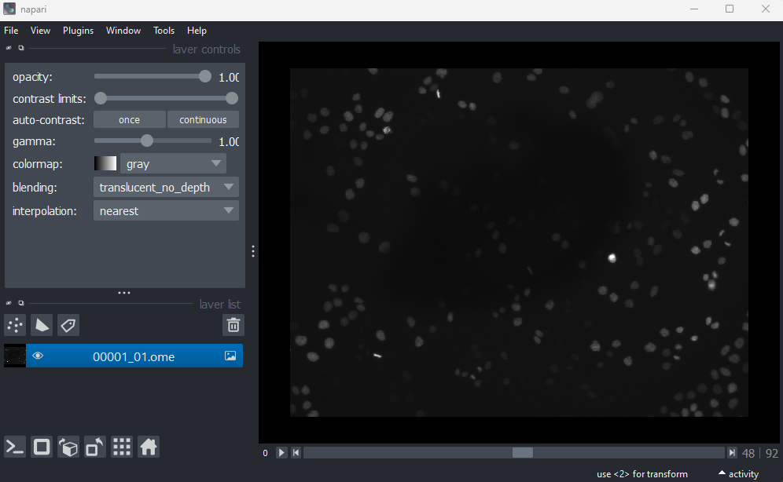
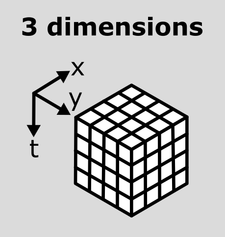
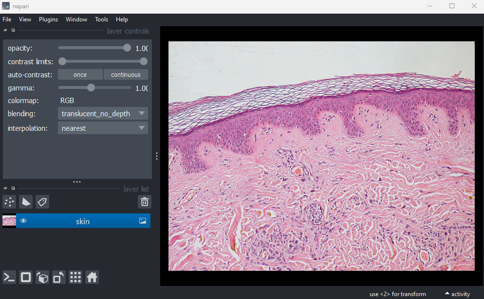
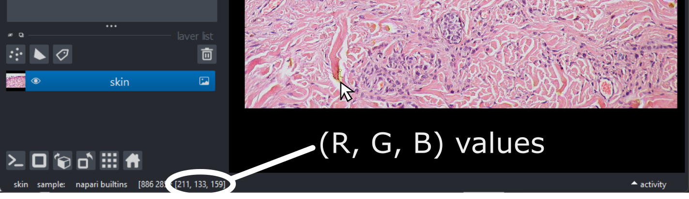
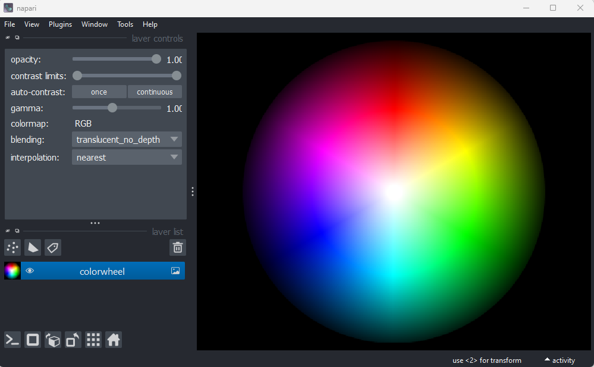

:::::::::::::::::::::::::::::::::::::: questions 

- How are images with more than 2 dimensions handled in Napari?

::::::::::::::::::::::::::::::::::::::::::::::::

::::::::::::::::::::::::::::::::::::: objectives

- Explain how axes are handled in Napari (xyz, channels, time)
- Open and navigate images with different dimensions in Napari
- Explain what RGB images are and how they are handled in Napari
- Split and merge channels in Napari

::::::::::::::::::::::::::::::::::::::::::::::::

## Image dimensions / axes

As we saw in the ['What is an image?' episode](./FIXME.md), image pixel values are stored as arrays of numbers with certain dimensions and data type. So far we have focused on grayscale 2D images that are represented by a 2D array:

{alt="A diagram comparing the array of numbers and image 
display for a simplified image of an arrow" width='80%'}

Light microscopy data varies greatly though, and often has more dimensions representing:

- Time (t)
- Channels (c)
- Spatial axes (z / y / x)

These images will be stored as arrays with a larger number of dimensions than 2. Let's start with our familiar human mitosis image, and work up to some more complex imaging data.

## 2D

Go to the top menu-bar of Napari and select:  
`File > Open Sample > napari builtins > Human Mitosis`

{alt="A screenshot of a 2D image of human cells 
undergoing mitosis in Napari"}

We can see this image only has two dimensions (or two 'axes' as they're also known) due to the lack of sliders under the image, and by checking its shape in the Napari console:

```python
image = viewer.layers["human_mitosis"].data
print(image.shape)
```

```output
# (y, x)
(512, 512)
```

## 3D

Let's remove the mitosis image and move to a 3D image:  
`File > Open Sample > napari builtins > Brain (3D)`

{alt="A screenshot of a head X-ray in Napari"}

We can see this image has three dimensions due to the slider at the base of the image, and the shape output:

```python
image = viewer.layers["brain"].data
print(image.shape)
```

```output
# (z, y, x)
(10, 256, 256)
```

This 3D image can be thought of as a stack of 2D images, where the z axis points along the stack. It is stored as a 3D array:

{alt="A diagram comparing 2D and 3D image arrays" width='80%'}

In Napari (and Python in general), dimensions are referred to by their index e.g. dimension 0 in this case is the z axis, dimension 1 is the y axis and dimension 2 is the x axis. We can check this in Napari by looking at the number at the very left of the slider. Here it's labelled '0', showing that it controls movement along dimension 0 (i.e. the z axis).

## Channels

Next, let's look at a 3D image with channels. Remove the brain image and select:  
`File > Open Sample > napari builtins > Cells (3D+2Ch)`  

{alt="A screenshot of a flourescence microscopy image 
of some cells in Napari"}

Channels are used e.g. with fluorescence microscopy to store images collected with different wavelengths of light. For example, for the cells image there are two channels - one for a fluorescent label that targeted nuclei, and another for a fluorescent label that targeted cell membranes. These channels are shown as separate image layers in Napari's layer list.

This image has 4 dimensions (czyx), so why is there only one slider? This is because Napari automatically recognises the channel dimension and separates it into different image layers. We can see what happens when Napari doesn't recognise the channels, by selecting both image layers (so they're both highlighted in blue), right clicking on them and selecting:  
`Merge to stack`

You should see this merges the two image layers into one, and results in a new slider appearing to switch between channels. Try moving both sliders and see how the image display changes.

We can check the image's dimensions with:

```python

image = viewer.layers["membrane"].data
print(image.shape)
```

```output
# (c, z, y, x)
(2, 60, 256, 256)
```

This clearly shows all 4 dimensions, with dimension 0 as channels and dimensions 1 as z. This matches the labels at the left hand side of each slider. This image is stored as a four dimensional image array, which you can visualise as one 3D image array per channel stacked side by side:

{alt="A diagram comparing 3D and 4D image arrays" width='80%'}

We can get back to the original image by right clicking on the 'membrane' image layer and selecting:  
`Split Stack`

:::::::::::::::::::::::::::::::::::::: callout

## Reading channels in Napari

When we open the cells image through the Napari menu, it is really calling something like:

```
from skimage import data
viewer.add_image(data.cells3d(), channel_axis=1)
```
This adds the cells 3D image (which is stored as zcyx), and specifies that dimension 1 is the channel axis. This allows Napari to split the channels automatically into different layers.

Usually when loading your own images into Napari e.g. with the napari-aicsimageio plugin (as we will see in the next episode), the channel axis should be recognised automatically. If not, you may need to add the image via the console as above, manually stating the channel axis.

::::::::::::::::::::::::::::::::::::::::::::::::


## Time

You should have already downloaded the MitoCheck dataset as part of the [setup instructions](../learners/setup.md) - if not, you can download it by clicking on '00001_01.ome.tiff' on [this page of the OME website](https://docs.openmicroscopy.org/ome-model/5.6.3/ome-tiff/data.html#mitocheck).

To open it in Napari, remove any existing image layers, then drag and drop the 
file over the canvas. Note this can take a while to open, so give it some time! 
Alternatively, you can select in the top menu-bar:  
`File > Open File(s)...`

{alt="A screenshot of a 2D time series in Napari"}

This image is a 2D time series (tyx) of some human cells undergoing mitosis. The slider at the bottom now moves through time, rather than z or channels. Try moving the slider from left to right -  you should see some nuclei divide and the total number of nuclei increase.

We can again check the image dimensions by running the following:

```python
image = viewer.layers["00001_01.ome"].data
print(image.shape)
```

```output
# (t, y, x)
(93, 1024, 1344)
```

Note that this image has a total of 3 dimensions, and so will also be stored in a 3D array:

{alt="A diagram of a tyx image array"}

This makes the point that certain dimensions/axes aren't always in the same positions. For example, a 3D image array with shape (512, 512, 512) could represent a zyx, cyx or tyx image. We'll discuss this more in the next section. 

## Dimension order

As we've seen so far, we can check the number and size of an image's dimensions by running:
```python
image.shape
```

Napari reads this array and displays the image appropriately, with the correct number of sliders, based on these dimensions. It's worth noting though that Napari doesn't usually know what these different dimensions represent e.g. consider a 4 dimensional image with shape (512, 512, 512, 512). This could be tcyx, czyx, tzyx etc... Napari will just display it as an image with 2 additional sliders, not caring about exactly what each represents.

Python has certain conventions for the order of image axes (like [scikit-image's 'coordinate conventions'](https://scikit-image.org/docs/stable/user_guide/numpy_images.html#coordinate-conventions) and [aicsimageio's reader](https://allencellmodeling.github.io/aicsimageio/aicsimageio.aics_image.AICSImage.html)) - but this tends to vary based on the library or plugin you're using. They're not firm rules!

Therefore, it's always worth checking you understand which axes are being shown in Napari and what they represent! Check against your prior knowledge of the experimental setup, and check the metadata in the original image (we'll look at this in the next episode). If you want to change how axes are displayed, remember you can use the roll or transpose dimensions buttons as discussed in the [imaging software episode](imaging-software.md). Also, if loading the image manually from the console, you can provide some extra information like e.g. the `channel_axis` parameter discussed above. 

## RGB

For the final part of this episode, let's turn to a special type of image - RGB. RGB images can be considered as a special case of a 2D image with channels (yxc). In this case, there are always 3 channels - with one representing red (R), one green (G) and one blue (B).

Let's open an example RGB image with the command below. Make sure you remove any existing image layers first!  
`File > Open Sample > napari builtins > Skin (RGB)`

{alt="A screenshot of an H+E slide of skin layers in Napari"}

This image is a hematoxylin and eosin stained slide of dermis and epidermis (skin layers). Let's check its shape:

```python
image = viewer.layers["skin"].data
print(image.shape)
```

```output
# (y, x, c)
(960, 1280, 3)
```

In this case, the channels aren't separated out into different image layers, but rather shown combined together in a single image. If you hover your mouse over the image, you should see three pixel values printed in the bottom left representing (R, G, B).

{alt="A screenshot of an H+E slide of skin layers in Napari, highlighting the (R,G,B) values"}

We can see these different channels more clearly if we right click on the 'skin' image layer and select:  
`Split RGB`

This shows the red, green and blue channels as separate image layers. Try inspecting each one individually, by clicking the {alt="A screenshot of Napari's eye button" height='30px'} icon to hide the other layers then hovering over the image to look at pixel values.

We can understand these RGB pixel values better by opening a different sample image. Remove all layers, then select:  
`File > Open Sample > napari builtins > Colorwheel (RGB)`

{alt="A screenshot of a colorwheel in Napari"}

Try hovering over this image with your mouse, making note of the pixel values shown in the bottom left of Napari. You should see that moving into the red area gives high values for R, and low values for B and G (remember the pixel values are shown as (R, G, B)). Equally, the green area shows high values for G, and the blue area shows high values for B. The red, green and blue values are mixed together to give the final colour.

RGB images are very common in day-to-day life - for example, photos taken with a camera or phone will be RGB. They are less common in microscopy though, although there are particular research fields and types of microscope that commonly use RGB. A key example is imaging of tissue sections for histology or pathology. You will also often use RGB images when preparing figures for papers and presentations - RGB images can be opened in all imaging software (not just scientific research focused ones), so are useful when preparing images for display. It's worth noting though that if your raw image data isn't RGB, be careful when converting it! Always keep a copy of your raw data, as you won't be able to recover the original pixel values after converting to RGB.

:::::::::::::::::::::::::::::::::::::: callout

## Reading RGB in Napari

How does Napari know an image is RGB? If an image's final dimension has a length of 3 or 4, Napari will assume it is RGB and [display it as such](https://napari.org/stable/howtos/layers/image.html#viewing-rgb-vs-luminance-grayscale-images). If loading an image from the console, you can also manually set it to load as rgb:

```python
from skimage import data
viewer.add_image(data.astronaut(), rgb=True)
```

::::::::::::::::::::::::::::::::::::::::::::::::

::::::::::::::::::::::::::::::::::::: keypoints 

- Microscopy images can have many dimensions, usually representing time (t),
channels (c), and spatial axes (z, y, x)
- Napari can open images with any number of dimensions
- Napari (and python in general) has no firm rules for axis order. Different 
libraries and plugins will often use different conventions.
- RGB images always have 3 channels - red (R), green (G) and blue (B). These 
channels aren't separated into different image layers - they're instead combined 
together to give the final image display.

::::::::::::::::::::::::::::::::::::::::::::::::

