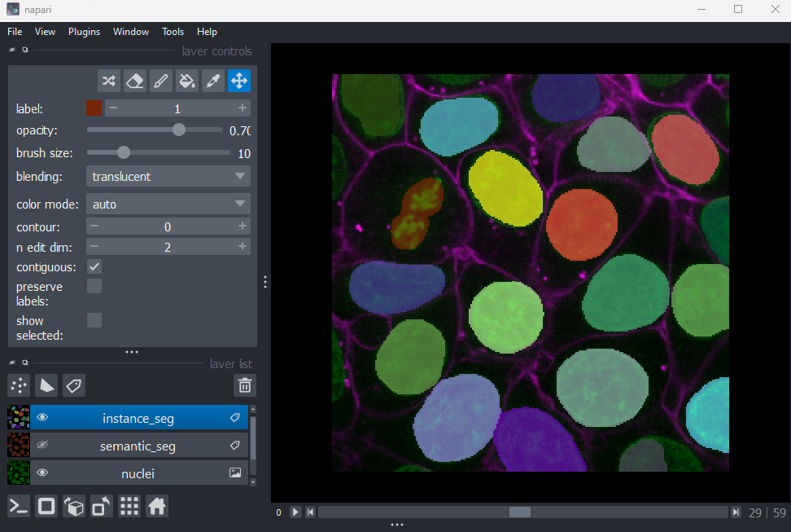
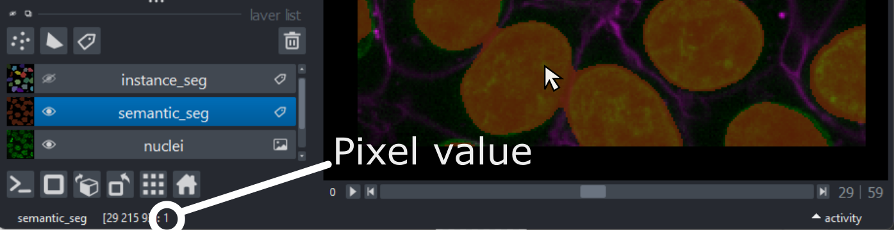
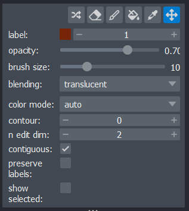
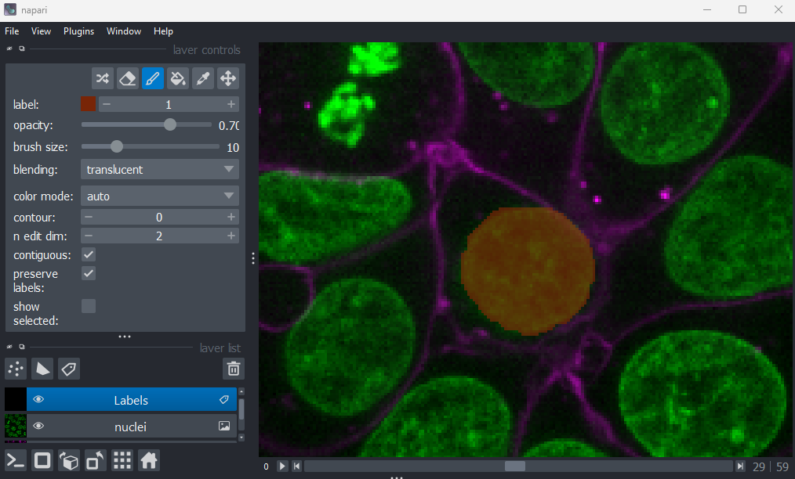
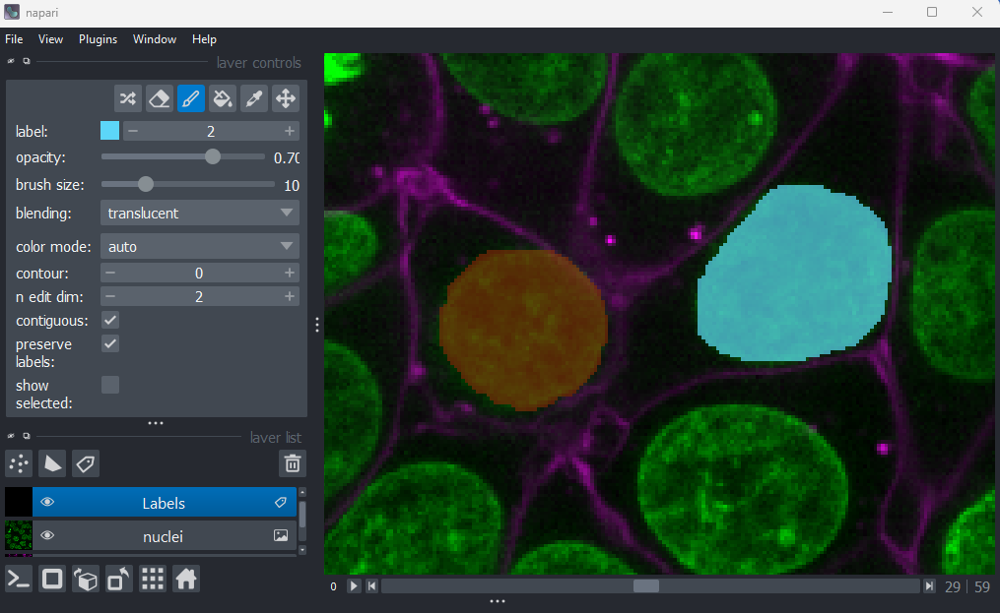

:::::::::::::::::::::::::::::::::::::: questions 

- What is segmentation?
- How do we manually segment images in Napari?

::::::::::::::::::::::::::::::::::::::::::::::::

::::::::::::::::::::::::::::::::::::: objectives

- Explain some common quality control steps e.g. assessing an image's histogram, checking clipping/dynamic range

- Explain what a segmentation, mask and label image are

- Create a label layer in Napari and use some of its manual segmentation tools (e.g. paintbrush/fill bucket)

::::::::::::::::::::::::::::::::::::::::::::::::

For the next few episodes, we will work through an example of counting the number of cells in an image. 

First, let's open one of Napari's sample images with:  
`File > Open Sample > napari builtins > Cells (3D + 2Ch)`

{alt="A screenshot of a flourescence microscopy image 
of some cells in Napari"}

## Quality control

The first step in any image processing workflow is always quality control. We have to check that the images we acquired at the microscope capture the features we are interested in, with a reasonable signal to noise ratio (recall we discussed signal to noise ratio in the [last episode](choosing-acquisition-settings.md#signal-to-noise-ratio)).

In order to count our cells, we will need to see individual nuclei in our images. As there is one nucleus per cell, we will use the nucleus number as the equivalent of cell number. If we look at our cells image in Napari, we can clearly see individual nuclei highlighted in green. If we zoom in we can see some noise (as a slight 'graininess' over the image), but this doesn't interfere with being able to see the locations or sizes of all nuclei.

Next, it's good practice to check the image histogram. Let's plot this with `napari matplotlib`, as we did in the [image display episode](image-display.md#napari-plugins). In the top menu bar of Napari select:  
`Plugins > napari Matplotlib > Histogram`

Make sure you have the 'nuclei' layer selected in the layer list (should be highlighted in blue).

{alt="A screenshot of a flourescence microscopy image 
of some cells in Napari"}

Note that as this image is 3D `napari matplotlib` only shows the histogram of the current z slice (in this case z=29 as shown at the top of the histogram). 

As we covered in the [choosing acquisition settings episode](choosing-acquisition-settings.md#initial-quality-control), we should check that the histogram shows a reasonable spread of pixel values and most importantly, that there is no evidence of 'clipping'. Clipping occurs when pixels are recording light above the maximum limit for the image. Therefore, many values are 'clipped' to the maximum value resulting in a large peak at the right hand side of the histogram. 

For our cells histogram, we see pixel values over much of the possible range. The image is likely a bit underexposed (as there are few values at the right side), but this isn't a big issue. We can still clearly separate the nuclei from the background which is our aim here. Most importantly, we see no evidence of clipping, which means we are avoiding any irretrievable loss of information this would cause.

## What is segmentation?

In order to count the number of cells, we must 'segment' the nuclei in this image. Segmentation is the process of figuring out what each pixel in an image represents e.g. is that pixel part of a nucleus or not? Segmentation comes in two main types - 'semantic segmentation' and 'instance segmentation'. 

Let's take a quick look at a rough semantic segmentation. Open Napari's console by pressing the {alt="A screenshot of Napari's console button" height='30px'} button, then copy and paste the code below. Don't worry about the details of what's happening in the code - we'll look at some of these concepts like gaussian blur and otsu thresholding in later episodes!

```python
from skimage.filters import threshold_otsu, gaussian

image = viewer.layers["nuclei"].data

blurred = gaussian(image, sigma=3)
threshold = threshold_otsu(blurred)

semantic_seg = blurred > threshold
viewer.add_labels(semantic_seg)
```

{alt="A screenshot of a flourescence microscopy image 
of some cells in Napari"}

You should see an image appear that highlights the nuclei in brown. This is an example of a 'semantic segmentation'. In a semantic segmentation, pixels are grouped into different categories (also known as 'classes') - for example, nuclei vs background. Importantly, it doesn't recognise which pixels belong to different objects of the same category - for example, here we don't know which pixels belong to individual, separate nuclei. This is the role of 'instance segmentation' that we'll look at next.

Copy and paste the code below into Napari's console. Again, don't worry about the details of what's happening here - we'll look at some of these concepts in later episodes.

```python
from skimage.morphology import binary_erosion, ball
from skimage.segmentation import expand_labels
from skimage.measure import label

eroded = binary_erosion(semantic_seg, footprint=ball(10))
instance_seg = label(eroded)
instance_seg = expand_labels(instance_seg, distance=10)

viewer.add_labels(instance_seg)
```

{alt="A screenshot of a flourescence microscopy image 
of some cells in Napari"}

You should see an image appear that highlights nuclei in different colours. Let's hide the 'semantic_seg' layer by clicking the {alt="A screenshot of Napari's eye button" height='30px'} icon next to its name in Napari's layer list. 

This image is an example of an 'instance segmentation' - it is recognising which pixels belong to individual 'instances' of our category (nuclei). This is the kind of segmentation we will need in order to count the number of nuclei (and therefore the number of cells) in our image.

## How are segmentations represented?

How are segmentations represented in the computer? What pixel values do they use?

First, let's focus on the 'semantic_seg' layer we created earlier:

- Click the {alt="A screenshot of Napari's eye button" height='30px'} icon next to 'semantic_seg' in the layer list to make it visible. 
- Click the {alt="A screenshot of Napari's eye button" height='30px'} icon next to 'instance_seg' in the layer list to hide it.
- Make sure the 'semantic_seg' layer is selected in the layer list. It should be highlighted in blue.

Try hovering over the segmentation and examining the pixel values down in the bottom left corner of the viewer. Recall that we looked at pixel values in the ['What is an image?' episode](what-is-an-image.md#pixels).

{alt="A screenshot of a flourescence microscopy image 
of some cells in Napari"}

You should see that a pixel value of 0 is used for the background and a pixel value of 1 is used for the nuclei. In fact, segmentations are stored in the computer in the same way as a standard image - as an array of pixel values. We can check this by printing the array into Napari's console, as we did in the ['What is an image?' episode](what-is-an-image.md#images-are-arrays-of-numbers).

```python
# Get the semantic segmentation data
image = viewer.layers['semantic_seg'].data

# Print the image values and type
print(image)
print(type(image))

```

Note the output is shortened here to save space!

```output
[[[0 0 0 ... 0 0 0]
  [0 0 0 ... 0 0 0]
  [0 0 0 ... 0 0 0]
  ...

<class 'numpy.ndarray'>

```

The difference between this and a standard image, is in what the pixel values represent. Here, they no longer represent the intensity of light at each pixel, but rather the assignment of each pixel to different categories or objects e.g. 0 = background, 1 = nuclei. You can also have many more values, depending on the categories/objects you are trying to represent. For example, we could have nucleus, cytoplasm, cell membrane and background, which would give four possible values of 0, 1, 2 and 3.

Let's take a look at the pixel values in the instance segmentation:

- Click the {alt="A screenshot of Napari's eye button" height='30px'} icon next to 'instance_seg' in the layer list to make it visible. 
- Click the {alt="A screenshot of Napari's eye button" height='30px'} icon next to 'semantic_seg' in the layer list to hide it.
- Make sure the 'instance_seg' layer is selected in the layer list. It should be highlighted in blue.

If you hover over the segmentation now, you should see that each nucleus has a different pixel value. We can find the maximum value via the console like so:

```python
# Get the instance segmentation data
image = viewer.layers['instance_seg'].data

# Print the maximum pixel value
print(image.max())

```

```output
19

```

Instance segmentations tend to have many more pixel values, as there is one per object 'instance'. When working with images with very large numbers of cells, you can quickly end up with hundreds or thousands of pixel values in an instance segmentation.

So to summarise - segmentations are just images where the pixel values represent specific categories, or individual instances of that category. You will sometimes see them referred to as 'label images', especially in the context of Napari. Segmentations with only two values (e.g. 0 and 1 for background vs some specific category) are often referred to as 'masks'.

## How to create segmentations?

There are many, many different methods for creating segmentations! These range from fully manual methods where you 'paint' the pixels in each category, to complicated automated methods relying on classical machine learning or deep learning models. The best method to use will depend on your research question and the type of images you have in your datasets. As we've mentioned before, it's usually best to use the simplest method that works well for your data. In this episode we'll look at manual methods for segmentation within Napari, before moving on to more automated methods in later episodes.

## Manual segmentation in Napari

Let's look at how we can create our own segmentations in Napari. First remove the two segmentation layers:

- Click on 'instance_seg', then <kbd>shift</kbd> + click 'semantic_seg'
- Click the {alt="A screenshot of Napari's delete layer button" height='30px'} icon to remove these layers.

Then click on the {alt="A screenshot of Napari's labels layer button" height='30px'} icon (at the top of the layer list) to create a new `Labels` layer.

Recall from the [imaging software episode](imaging-software.md#layer-list), that Napari supports different kinds of layers. For example, `Image` layers for standard images, `Point` layers for points, `Shape` layers for shapes like rectangles, ellipses or lines etc... `Labels` layers are the type used for segmentations, and provide access to many new settings in the layer controls:

{alt="A screenshot of a flourescence microscopy image 
of some cells in Napari"}

Let's start by painting an individual nucleus. Select the paintbrush by clicking the {alt="A screenshot of Napari's paintbrush button" height='30px'} icon in the top row of the layer controls. Then click and drag across the image to label pixels. You can change the size of the brush using the 'brush size' slider in the layer controls. To return to normal movement, you can click the {alt="A screenshot of Napari's pan arrows button" height='30px'} icon in the top row of the layer controls, or hold down spacebar to activate it temporarily (this is useful if you want to pan slightly while painting). To remove painted areas, you can activate the label eraser by clicking the {alt="A screenshot of Napari's erase button" height='30px'} icon.

{alt="A screenshot of a flourescence microscopy image 
of some cells in Napari"}

If you hover over the image and examine the pixel values, you will see that all your painted areas have a pixel value of 1. This corresponds to the number shown next to 'label:' in the layer controls. 

To paint with a different pixel value, either click the + icon on the right side of this number, or type another value into the box. Let's paint another nucleus with a pixel value of 2:

{alt="A screenshot of a flourescence microscopy image 
of some cells in Napari"}

When you paint with a new value, you'll see that Napari automatically assigns it a new colour. This is because `Labels` layers use [a special colormap/LUT for their pixel values](https://napari.org/stable/howtos/layers/labels.html#shuffling-label-colors). Recall from the [image display episode](image-display.md#colormaps-luts) that colormaps are a way to convert pixel values into corresponding colours for display. The colormap for `Labels` layers will assign random colours to each pixel value, trying to ensure that nearby values (like 2 vs 3) are given dissimilar colours. This helps to make it easier to distinguish different labels. You can shuffle the colours used by clicking the {alt="A screenshot of Napari's shuffle button" height='30px'} icon in the top row of the layer controls. Note that the pixel value of 0 will always be shown as transparent - this is because it is usually used to represent the background.

::::::::::::::::::::::::::::::::::::: challenge 

## Manual segmentation in Napari

Try labelling more individual nuclei in this image, making sure each gets its own pixel value (label). Investiagate the other settings in the layer controls:

- What does the {alt="A screenshot of Napari's fill button" height='30px'} icon do?
- What does the {alt="A screenshot of Napari's picker button" height='30px'} icon do?
- What does the 'contour' setting control?
- What does the 'n edit dim' setting control?
- What does the 'preserve labels' setting control?

Remember that you can hover over buttons to see a helpful popup with some more information. You can also look in [Napari's documentation](https://napari.org/stable/howtos/layers/labels.html) on `Labels` layers.

Note that if you make a mistake you can use <kbd>Ctrl</kbd> + <kbd>Z</kbd> to undo your last action. If you need to re-do it use <kbd>Shift</kbd> + <kbd>Ctrl</kbd> + <kbd>Z</kbd>.

:::::::::::::::::::::::: solution 

### Solution

###  {alt="A screenshot of Napari's fill button" height='30px'} icon

This icon activates the 'fill bucket'. It will fill whatever label you click on with the currently active label (as shown next to 'label:' in the layer controls). For example, if your active label is 2, then clicking on a nucleus with label 1 will change it to 2. You can see more details about the fill bucket in [Napari's documentation](https://napari.org/stable/howtos/layers/labels.html#using-the-fill-bucket)

### {alt="A screenshot of Napari's picker button" height='30px'} icon

This icon activates the 'colour picker'. This allows you to click on a pixel in the viewer and immediately select the corresponding label. This is especially useful when you have hundreds of labels, which can make them difficult to keep track of with the 'label:' option only.

### Contour

The contour setting controls how labels are displayed. By default (when 0), labelled pixels are displayed as solid colours. Increasing the contour value to one or higher, will change this to show the outline of labelled regions instead. Higher values will result in a thicker outline. This can be useful if you don't want to obscure the underlying image while viewing your segmentation.

### n edit dim

This controls the number of dimensions that are used for editing labels. By default, this is 2 so all painting and editing of the `Labels` layer will only occur in 2D. If you want to paint/edit in 3D you can increase this to 3. Now painting will not only affect the currently visible image slice, but slices above and below it also. Be careful with the size of your brush when using this option!

### preserve labels

Activating 'preserve labels' will ensure that any painting/erasing you do will only affect your currently active label. This is especially useful if you need to paint very close to existing labels without affecting them.

:::::::::::::::::::::::::::::::::

::::::::::::::::::::::::::::::::::::::::::::::::


## Why manual segmentation?


::::::::::::::::::::::::::::::::::::: keypoints 

- The first step in any image processing workflow is quality control. For example, checking the histograms of your images.

- Segmentation is the process of identifying what each pixel in an image represents e.g. is that pixel part of a nucleus or not?

- Segmentation can be broadly split into 'semantic segmentation' and 'instance segmentation'

- Segmentations are represented in the computer in the same way as standard images. The difference is that pixel values now represent classes or instances, rather than light intensity.

- Napari uses `Labels` layers for segmentations. These offer various annotation tools like the paintbrush, fill bucket etc.

::::::::::::::::::::::::::::::::::::::::::::::::

