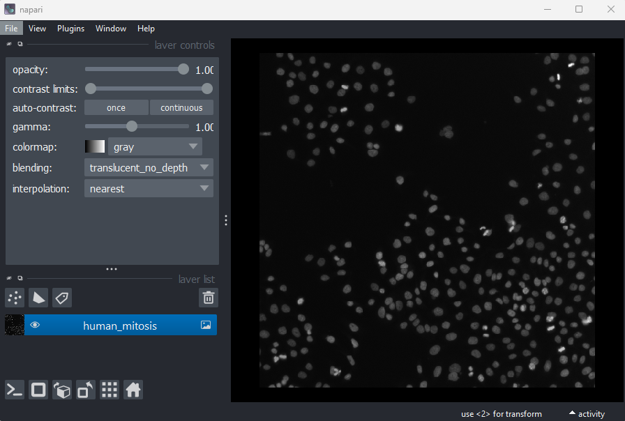
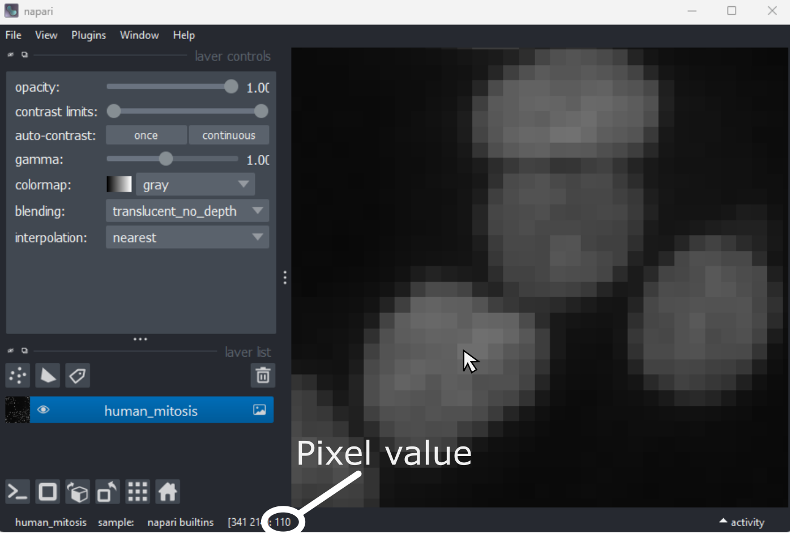
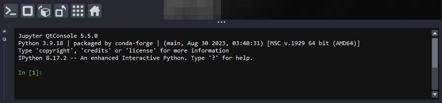
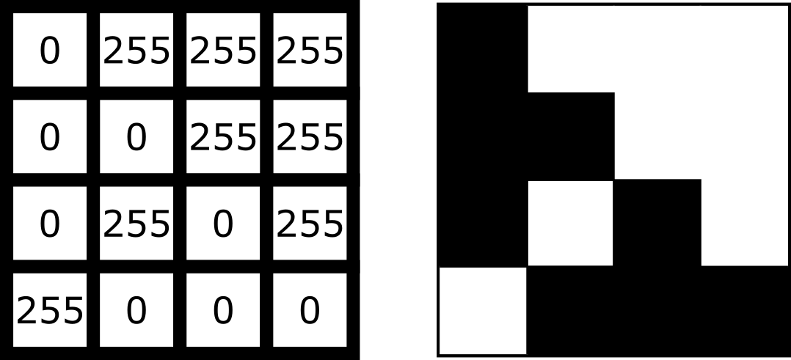
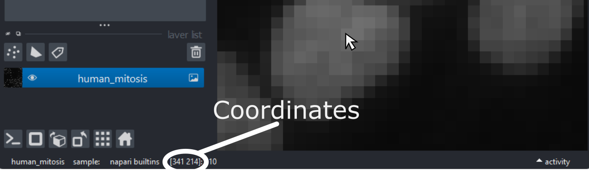
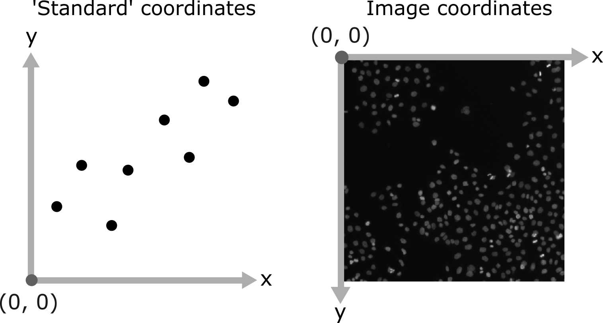

:::::::::::::::::::::::::::::::::::::: questions 

- How are images represented in the computer?

::::::::::::::::::::::::::::::::::::::::::::::::

::::::::::::::::::::::::::::::::::::: objectives

- Explain how a digital image is made of pixels

- Find the value of different pixels in an image in Napari

- Determine an image's dimensions (numpy ndarray `.shape`)

- Determine an image's data type (numpy ndarray `.dtype`)

- Explain the coordinate system used for images

::::::::::::::::::::::::::::::::::::::::::::::::

In the last episode, we looked at how to view images in Napari. Let's take a 
step back now and try to understand how Napari (or ImageJ or any other viewer) 
understands how to display images properly. To do that we must first be able to 
answer the fundamental question - what is an image?

## Pixels

Let's start by removing all the layers we added to the Napari viewer last 
episode. Then we can open a new sample image:

- Click on the top layer in the layer list and <kbd>shift</kbd> + click the 
bottom layer. This should highlight all layers in blue.

- Press the remove layer button {alt="A screenshot of Napari's delete layer button" height='30px'} 

- Go to the top menu-bar of Napari and select:  
`File > Open Sample > napari builtins > Human Mitosis`

{alt="A screenshot of a 2D image of human cells 
undergoing mitosis in Napari"}

This 2D image shows the nuclei of human cells undergoing mitosis. If we really 
zoom in up-close by scrolling, we can see that this image is actually made up of 
many small squares with different brightness values. These squares are the 
image's pixels (or 'picture elements') and are the individual units that make 
up all digital images.

If we hover over these pixels with the mouse cursor, we can see that each pixel 
has a specific value. Try hovering over pixels in dark and bright areas of the 
image and see how the value changes in the bottom left of the viewer:

{alt="A screenshot of Napari - with the mouse cursor 
hovering over a pixel and highlighting the corresponding pixel value"}

You should see that brighter areas have higher values than darker areas (we'll 
see exactly how these values are converted to colours in the 
[image display episode](image-display.md)).

## Images are arrays of numbers

We've seen that images are made of individual units called pixels that have 
specific values - but how is an image really represented in the computer? Let's 
dig deeper into Napari's `Image` layers...

First, open Napari's built-in Python console by pressing the console button {alt="A screenshot of Napari's console button" height='30px'}. 
Note this can take a few seconds to open, so give it some time:

{alt="A screenshot of Napari's console"}

:::::::::::::::::::::::::::::::::::::: callout

### Console readability

You can increase the font size in the console by clicking inside it, then 
pressing <kbd>Ctrl</kbd> and <kbd>+</kbd> together. The font size can also be 
decreased with <kbd>Ctrl</kbd> and <kbd>-</kbd> together.

Note that you can also pop the console out into its own window by clicking the 
small {alt="A screenshot of Napari's float panel button" height='30px'} 
icon on the left side.

::::::::::::::::::::::::::::::::::::::::::::::::

Let's look at the human mitosis image more closely - copy the text in the 
'Python' cell below into Napari's console and then press the <kbd>Enter</kbd> 
key. You should see it returns text that matches the 'Output' cell below in 
response.

All of the information about the Napari viewer can be accessed through the 
console with a variable called `viewer`. A `viewer` has 1 to many layers, and
here we access the top (first) layer with `viewer.layers[0]`. Then, to access 
the actual image data stored in that layer, we retrieve it with `.data`:

```python

# Get the image data for the first layer in Napari
image = viewer.layers[0].data

# Print the image values and type
print(image)
print(type(image))
```

```output
[[ 8  8  8 ... 63 78 75]
 [ 8  8  7 ... 67 71 71]
 [ 9  8  8 ... 53 64 66]
 ...
 [ 8  9  8 ... 17 24 59]
 [ 8  8  8 ... 17 22 55]
 [ 8  8  8 ... 16 18 38]]
 
 <class 'numpy.ndarray'>
```

You should see that a series of numbers are printed out that are stored in a 
Python data type called a `numpy.ndarray`. Fundamentally, this means that all 
images are really just arrays of numbers (one number per pixel). Arrays are just 
rectangular grids of numbers, much like a spreadsheet. Napari is reading those 
values and converting them into squares of particular colours for us to see in 
the viewer, but this is only to help us interpret the image contents - the 
numbers are the real underlying data.

For example, look at the simplified image of an arrow below. On the left is the 
array of numbers, with the corresponding image display on the right. This is 
called a 4 by 4 image, as it has 4 rows and 4 columns:

{alt="A diagram comparing the array of numbers and image 
display for a simplified image of an arrow"}

In Napari this array is a `numpy.ndarray`. [NumPy](https://numpy.org/) is a 
popular python package that provides 'n-dimensional arrays' (or 'ndarray' for 
short). N-dimensional just means they can support any number of dimensions - 
for example, 2D (squares/rectangles of numbers), 3D (cubes/cuboids of numbers) 
and beyond (like time series, images with many channels etc. where we would 
have multiple rectangles or cuboids of data which provide further information 
all at the same location).

## Creating an image

Where do the numbers in our image array come from? The exact details of how an 
image is created will depend on the type of microscope you are using e.g. 
widefield, confocal, superresolution etc. In general though, we have 3 main 
parts: 

- **Sample:** the object we want to image e.g. some cells
- **Objective lens:** the lens that gathers the light and focuses it for 
detection
- **Detector:** the device that detects the light to form the digital image 
e.g. a CCD camera

To briefly summarise for a fluorescence microscopy image:   
an excitation light source (e.g. a laser) illuminates the sample, and this light 
is absorbed by a fluorescent label. This causes it to emit light which is then 
gathered and focused by the objective lens, before hitting the detector. The 
detector might be a single element (e.g. in a laser-scanning microscope) or 
composed of an array of many small, light sensitive areas - these are physical 
pixels, that will correspond to the pixels in the final image. When light hits 
one of the detector elements it is converted into electrons, with more light 
resulting in more electrons and a higher final value for that pixel.

The important factor to understand is that the final pixel value is only ever an 
approximation of the real sample. Many factors will affect this final result 
including the microscope optics, detector performance etc.

::::::::::::::::::::::::::::::::::::: discussion 

Read the ['A simple microscope' section of Pete Bankhead's bioimage book](
https://bioimagebook.github.io/chapters/1-concepts/1-images_and_pixels/images_and_pixels.html#a-simple-microscope).

- What are some factors that influence pixel values?
- Can you come up with suggestions for any more?

::::::::::::::::::::::::::::::::::::::::::::::::

## Image dimensions

Let's return to our human mitosis image and explore some of the key features of 
its image array. First, what size is it?

We can find this out by running the following in Napari's console:
```python

image.shape
```

```output
(512, 512)
```

The array size (also known as its dimensions) is stored in the `.shape`. Here 
we see that it is `(512, 512)` meaning this image is 512 pixels high and 512 
pixels wide. Two values are printed as this image is two dimensional (2D), for 
a 3D image there would be 3, for a 4D image (e.g. with an additional time 
series) there would be 4 and so on...

## Image data type

The other key feature of an image array is its 'data type' - this controls which 
values can be stored inside of it. For example, let's look at the data type for 
our human mitosis image - this is stored in `.dtype`:

```python

image.dtype
```

```output

dtype('uint8')
```

We see that the data type (or 'dtype' for short) is `uint8`. This is short for 
'unsigned integer 8-bit'. Let's break this down further into two parts - the 
type (unsigned integer) and the bit-depth (8-bit).

## Type

The type determines what kind of values can be stored in the array, for example:

- Unsigned integer: positive whole numbers
- Signed integer: positive and negative whole numbers
- Float: positive and negative numbers with a decimal point e.g. 3.14

For our mitosis image, 'unsigned integer' means that only positive whole numbers 
can be stored inside. You can see this by hovering over the pixels in the image 
again in Napari - the pixel value down in the bottom left is always a positive 
whole number.

## Bit depth

The bit depth determines the range of values that can be stored e.g. only values 
between 0 and 255. This is directly related to how the array is stored in the 
computer.

In the computer, each pixel value will ultimately be stored in some binary 
format as a series of ones and zeros. Each of these ones or zeros is known 
as a 'bit', and the 'bit depth' is the number of bits used to store each value. 
For example, our mitosis image uses 8 bits to store each value (i.e. 
a series of 8 ones or zeros like `00000000`, or `01101101`...).

The reason the bit depth is so important is that it dictates the number of 
different values that can be stored. In fact it is equal to:

\[\large \text{Number of values} = 2^{\text{(bit depth)}}\]

Going back to our mitosis image, since it is stored as integers with a 
bit-depth of 8, this means that it can store $2^8 = 256$ 
different values. This is equal to a range of 0-255 for unsigned integers.

We can verify this by looking at the maximum value of the mitosis image:


```python

print(image.max())
```

```output

255
```

You can also see this by hovering over the brightest nuclei in the viewer and 
examining their pixel values. Even the brightest nuclei won't exceed the limit 
of 255.

::::::::::::::::::::::::::::::::::::: challenge 

## Dimensions and data types

Let's open a new image by removing all layers from the Napari viewer, then 
copying and pasting the following lines into the Napari console:

```python

from skimage import data
viewer.add_image(data.brain()[9, :, :], name="brain")
image = viewer.layers["brain"].data

```

This opens a new 2D image of part of a human head X-ray.

- What are the dimensions of this image?

- What type and bit depth is this image?

- What are the possible min/max values of this image array, based on the 
bit depth?

:::::::::::::::::::::::: solution 

### Solution

### Dimensions

The image's dimensions are (256, 256)

```python

image.shape
```

```output

(256, 256)
```

### Type and bit depth

The image's type and bit depth are: unsigned integer 16-bit

```python

image.dtype
```

```output

dtype('uint16')
```

### Min and max

Based on a bit depth of 16, this image can store $2^{16} = 65536$ values. As it 
is of type 'unsigned integer' this corresponds to a min and max of 0 and 65535.

:::::::::::::::::::::::::::::::::

::::::::::::::::::::::::::::::::::::::::::::::::


## Common data types

NumPy supports a [very wide range of data types](
https://numpy.org/doc/stable/reference/arrays.scalars.html#sized-aliases), 
but there are a few that are most common for image data:

| NumPy datatype     | Full name                |
| :---------         | :--------------          |
| `uint8`            | Unsigned integer 8-bit   |
| `uint16`           | Unsigned integer 16-bit  |
| `float32`          | Float 32-bit             |
| `float64`          | Float 64-bit             |

`uint8` and `uint16` are most common for images from light microscopes. 
`float32` and `float64` are common during image processing (as we will see in 
later episodes).

## Choosing a bit depth

Most images are either 8-bit or 16-bit - so how to choose which to use? 
A higher bit depth will allow a wider range of values to be stored, but it will 
also result in larger file sizes for the resulting images. In general, a 16-bit 
image will have a file size that is about twice as large as an 8-bit image 
if no compression is used (we'll discuss compression in the 
[filetypes and metadata episode](filetypes-and-metadata.md#compression)).

The best bit depth choice will depend on your particular imaging experiment and 
research question. For example, if you know you have to recognise features that 
only differ slightly in their brightness, then you will likely need 16-bit to 
capture this. Equally, if you know that you will need to collect a very large 
number of images and 8-bit is sufficient to see your features of interest, then 
8-bit may be a better choice to reduce the required file storage space. As 
always it's about choosing the best fit for your specific project! 

For more information on bit depths and types - we highly recommend 
[the 'Types & bit-depths' chapter from Pete Bankhead's free bioimage book](
https://bioimagebook.github.io/chapters/1-concepts/3-bit_depths/bit_depths.html).

:::::::::::::::::::::::::::::::::::::: callout

### Clipping and overflow

It's important to be aware of what image type and bit depth you are using. If 
you try to store values outside of the valid range, this can lead to _clipping_ 
and _overflow_.

- Clipping: Values outside the valid range are changed to the closest valid 
value. For example, storing 1000 in a `uint8` image may result in 255 being 
stored instead (the max value)

- Overflow: For NumPy arrays, values outside the valid range are 
'wrapped around' to give the new result. For example, storing 256 in a `uint8` 
image (max 255) would give 0, 257 would give 1 and so on...  

Clipping and overflow result in data loss - you can't get the original values 
back! So it's always good to keep the data type in mind when doing image 
processing operations (as we will see in later episodes), and also when 
converting between different bit depths. 

::::::::::::::::::::::::::::::::::::::::::::::::

## Coordinate system

We've seen that images are arrays of numbers with a specific shape (dimensions) 
and data type. How do we access specific values from this array? What coordinate 
system is Napari using?

To look into this, let's hover over pixels in our mitosis image and examine the 
coordinates that appear to the left of the pixel value. If you closed the 
mitosis image, then open it again by removing all layers and selecting: 
`File > Open Sample > napari builtins > Human Mitosis`:

{alt="A screenshot of Napari - with the mouse cursor 
hovering over a pixel and highlighting the corresponding coordinates"}

As you move around, you should see that the lowest coordinate values are at the 
top left corner, with the first value increasing as you move down and the second 
value increasing as you move to the right. This is different to the standard 
coordinate systems you may be used to (for example, from making graphs):

{alt="Diagram comparing a standard graph 
coordinate system (left) and the image coordinate system (right)"}

Note that Napari lists coordinates as [y, x] or [rows, columns], so e.g. [1,3] 
would be the pixel in row 1 and column 3. Remember that these coordinates always 
start from 0 as you can see in the diagram below:

{alt="A diagram showing how pixel coordinates change over a simple 4x4 image" width=50%}

For the mitosis image, these coordinates are in pixels, but we'll see in the 
[filetypes and metadata episode](filetypes-and-metadata.md#pixel-size) that 
images can also be scaled based on resolution to represent distances in the 
physical world (e.g. in micrometres). Also, bear in mind that images with more 
dimensions (e.g. a 3D image) will have longer coordinates like [z, y, x]...

::::::::::::::::::::::::::::::::::::: challenge 

## Reading and modifying pixel values

First, make sure you only have the human mitosis image open (close any others). 
Run the following line in the console to ensure you are referencing the 
correct image:

```python

# Get the image data for the layer called 'human_mitosis'
image = viewer.layers["human_mitosis"].data
```

Pixel values can be read by hovering over them in the viewer, or by running the 
following in the console:
```python

# Replace y and x with the correct y and x coordinate e.g. image[3, 5]
print(image[y, x])
```

Pixel values can be changed by running the following in the console:
```python

# Replace y and x with the correct y and x coordinate, and
# 'pixel_value' with the desired new pixel value e.g. image[3, 5] = 10
image[y, x] = pixel_value
viewer.layers["human_mitosis"].refresh()
```

Given this information:

1. What is the pixel value at x=213 and y=115?
2. What is the pixel value at x=25 and y=63?
3. Change the value of the pixel at x=10 and y=15 to 200. 
Check the new value - is it correct? If not, why not?
4. Change the value of the pixel at x=10 and y=15 to 300. 
Check the new value - is it correct? If not, why not?

:::::::::::::::::::::::: solution 

### Solution

### 1

```python

image[115, 213]
```

```output

162
```

### 2

```python

image[63, 25]
```

```output

9
```

### 3

```python

image[15, 10] = 200
viewer.layers["human_mitosis"].refresh()

print(image[15, 10])
```

```output

200
```

The new value is correct. If you zoom into the top left corner of the image, 
you should see the one bright pixel you just created.

### 4

```python

image[15, 10] = 300
viewer.layers["human_mitosis"].refresh()

print(image[15, 10])
```

```output

44
```

The new value is not correct. This is because 300 exceeds the maximum value for 
this 8-bit image (max 255). The value therefore overflows and 'wraps around' to 
give 44 - an incorrect value.

:::::::::::::::::::::::::::::::::

::::::::::::::::::::::::::::::::::::::::::::::::

::::::::::::::::::::::::::::::::::::: keypoints 

- Digital images are made of pixels
- Digital images store these pixels as arrays of numbers
- Light microscopy images are only an approximation of the real sample
- Napari (and Python more widely) use NumPy arrays to store images - 
these have a `shape` and `dtype`
- Most images are 8-bit or 16-bit unsigned integer
- Images use a coordinate system with (0,0) at the top left, x increasing to 
the right, and y increasing down

::::::::::::::::::::::::::::::::::::::::::::::::

