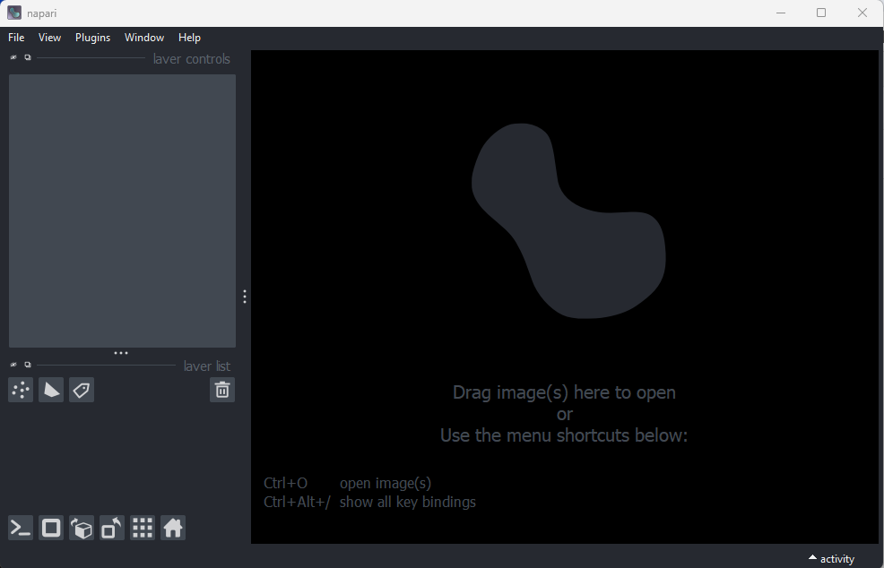

## Download Data

During these lessons we will be using two microscopy images and creating images
of our own. Create an empty folder somewhere on your computer to use during the
course, this will be your `working directory`. You can name it anything you
like but we recommend `microscopy-ideas`.

Download
[00001_01.ome.tiff](
https://downloads.openmicroscopy.org/images/OME-TIFF/2016-06/MitoCheck/00001_01.ome.tiff)
 ([CC BY 4.0 Licence](
https://downloads.openmicroscopy.org/images/OME-TIFF/2016-06/MitoCheck/readme.txt))
 from the open microscopy environment pages to your working directory.

Download
[Plate1-Blue-A-12-Scene-3-P3-F2-03.czi](
https://downloads.openmicroscopy.org/images/Zeiss-CZI/idr0011/Plate1-Blue-A_TS-Stinger/Plate1-Blue-A-12-Scene-3-P3-F2-03.czi)
 ([CC BY 4.0 Licence](
https://downloads.openmicroscopy.org/images/Zeiss-CZI/idr0011/readme.txt))
from the open microscopy environment pages to your working directory.

## Software Setup

During these lessons we will use the [napari](https://napari.org/stable/)
image viewer and the
[napari-aicsimagio](https://github.com/AllenCellModeling/napari-aicsimageio)
 plugin to load imaging data files of various file formats.
For beginners we recommend using Anaconda to install and manage these
packages. The first step is to
[download and install Anaconda](https://www.anaconda.com/download#downloads).

The remaining instructions are written assuming you will be installing and
running the software from a terminal.
Follow the
instructions below to open a terminal on your operating system.

::::::::::::::::::::::::::::::::::::::::::: spoiler

### Opening a Terminal

 - Windows: Click Start > Search for Anaconda Prompt > Click to Open
 - macOS: Launchpad > Other Application > Terminal
 - Linux: Open a terminal window

:::::::::::::::::::::::::::::::::::::::::::

For more information on starting and running Anaconda you may visit the
['Starting Conda' section of the Anaconda getting started pages](
https://conda.io/projects/conda/en/latest/user-guide/getting-started.html#starting-conda).

Run the following commands in the terminal (lines starting
with # are comments and do not need to be run).
You can run the commands by copy and pasting them into the terminal and
pressing the <kbd>Enter</kbd> key.

```bash
# Make sure conda is up to date
conda update -n base conda

# We need to use a python program called pip to install
# the napari-aicsimagio plugin, so we need to configure
# conda to work well with pip
conda config --set pip_interop_enabled True

# This line will create a "virtual environment" (called napari-env)
# that will contain all of the software that will be used in the lessons
conda create -y -n napari-env -c conda-forge python=3.10 bioformats_jar

# Activate the napari-env virtual environment.
# Running this should change the terminal prompt to '(napari-env)'.
conda activate napari-env

# Install napari and plugins using pip
pip install "napari[all]" napari-aicsimageio
```

:::::::::::::::::::::::::::::::::::::: spoiler

## Why is there so much text appearing on the screen?

If you're new to running commands in the terminal you may be alarmed if
running some of these commands results in a lot of text output to the
screen. This is normal and usually helpful for checking things are
working OK. For our purposes you can ignore it. If you see the word
ERROR appear near the end (often highlighted in a different colour)
it is possible something has gone wrong. In this case the best place
to start is any messages in the text expanding on the source of the error.

::::::::::::::::::::::::::::::::::::::

If you are using an M1/M2 mac, you may encounter errors when running the 
commands above. If so, try the alternative commands below:
```bash
# Remove the old environment
conda remove --name napari-env --all

# This line will create a "virtual environment" (called napari-env)
# that will contain all of the software that will be used in the lessons
conda create -y -n napari-env -c conda-forge python=3.10 napari pyqt bioformats_jar napari-aicsimageio

# Activate the napari-env virtual environment.
# Running this should change the terminal prompt to '(napari-env)'.
conda activate napari-env

# Install czi file reader
pip install aicspylibczi>=3.0.5 fsspec>=2022.7.1
```

## Post Setup Checks

Before starting the course it is important to check that your setup is working.

::::::::::::::::::::::::::::::::::::::: challenge

## Check napari opens a tiff image.

Any napari installation should be able to open a tiff image. Start napari.
Note that if you're already in the napari-env virtual environment from the
installation steps it is not necessary to run `conda activate napari-env`.
```bash
conda activate napari-env
napari
```
You should now see the napari viewer like this ...

{alt="A
 screenshot of the default Napari user interface" width='60%'}

Open a file with

`File > Open file(s)...`

- Navigate to the directory where you saved `00001_01.ome.tiff` earlier on.
- Select `00001_01.ome.tiff` and click open.
- If you see a `Choose reader` dialog, select `napari builtins`.

::::::::::::::::::::::::::
::::::::::::::::::: solution

## Expected Output

{alt="A screenshot of freshly
 opened 00001_01.ome.tiff" width='80%'}

Close napari: `File > exit`

::::::::::::::::::::::::::

:::::::::::::::::::: challenge

## Check napari opens a czi image.

During the course we'll be working with czi images. To open these the
napari-aicsimageio plugin is needed. Let's check the plugin is working.

Start napari. Note that if you've already done the previous test (tiff image)
then it should not be necessary to run `conda activate napari-env`.
However, it is necessary to restart napari to ensure the image display
is correctly formatted.

```bash
conda activate napari-env
napari
```

`File > Open file(s)...`

- Navigate to the directory where you saved
`Plate1-Blue-A-12-Scene-3-P3-F2-03.czi` to earlier on.
- Select `Plate1-Blue-A-12-Scene-3-P3-F2-03.czi` and click open.
- If you see a `Choose reader` dialog, select `napari-aicsimageio`.

::::::::::::::::::::::::::
::::::::::::::::::: solution

## Expected Output

{alt="A
 screenshot of freshly opened Plate1-Blue-A-12-Scene-3-P3-F2-03.czi"
 width='80%'}

Close napari: `File > exit`

::::::::::::::::::::::::::
