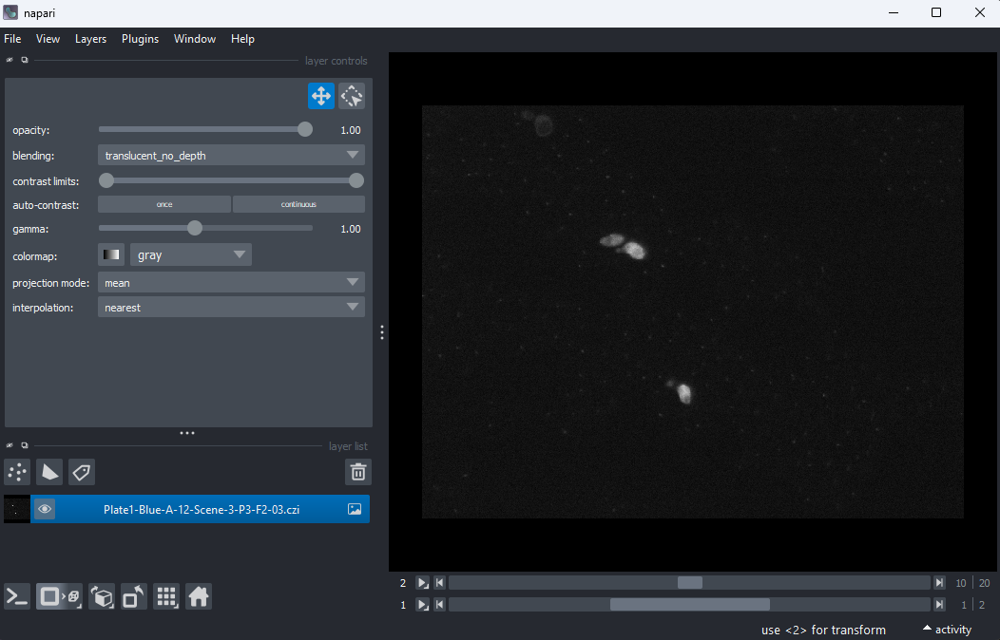

FIXME: Setup instructions live in this document. Please specify the tools and
the data sets the Learner needs to have installed.

## Data Sets

<!--
FIXME: place any data you want learners to use in `episodes/data` and then use
       a relative link ( [data zip file](data/lesson-data.zip) ) to provide a
       link to it, replacing the example.com link.
-->
Download the [data zip file](https://example.com/FIXME) and unzip it to your Desktop

## Software Setup

::::::::::::::::::::::::::::::::::::::: discussion

### Details

During these lessons we will use the [napari](https://napari.org/stable/) image
 viewer and the 
[napari-aicsimagio](https://github.com/AllenCellModeling/napari-aicsimageio)
 plugin to load different image types. 
For beginners we recommend using Anaconda to install and manage these
packages. The first step is to 
[download and install Anaconda](https://www.anaconda.com/download#downloads).

The remaining instructions are written assuming you will be using the 
Anaconda prompt. If you are unfamiliar with Anaconda it may be wise to 
review the [Anaconda getting started pages](https://conda.io/projects/conda/en/latest/user-guide/getting-started.html).

Start the Anaconda prompt and run the following commands (lines starting 
with # are comments and do not need to be run).

```bash
# Make sure conda is upto date
conda update -n base conda

# We need to use pip to install the napari-aicsimagio plugin, so conffigure
# conda to work well with pip
conda config --set pip_interop_enabled True

conda create -y -n napari-env conda-forge python=3.9 bioformats_jar

```

Setup for different systems can be presented in dropdown menus via a `solution`
tag. They will join to this discussion block, so you can give a general overview
of the software used in this lesson here and fill out the individual operating
systems (and potentially add more, e.g. online setup) in the solutions blocks.

:::::::::::::::::::::::::::::::::::::::::::::::::::

:::::::::::::::: solution

### Windows

Use PuTTY

:::::::::::::::::::::::::

:::::::::::::::: solution

### MacOS

Use Terminal.app

:::::::::::::::::::::::::


:::::::::::::::: solution

### Linux

Use Terminal

:::::::::::::::::::::::::

## Post Setup Checks

Before starting the course it is important to check that your setup is working. 

::::::::::::::::::::::::::::::::::::::: challenge

## Check napari opens a tiff image.

Any napari installation should be able to open a tiff image.

Download [00001_01.ome.tiff](https://downloads.openmicroscopy.org/images/OME-TIFF/2016-06/MitoCheck/00001_01.ome.tiff) from the open microscopy environment pages.

Start napari
```bash
conda activate napari-env
napari
```
Open a file with

`File > Open file(s)...`

- Navigate to where you saved `00001_01.ome.tiff` to, most likely your `Downloads` folder. 
- Select `00001_01.ome.tiff` and click open. 
- If you see a `Choose reader` dialog, select `napari builtins`.

::::::::::::::::::::::::::
::::::::::::::::::: solution

## Expected Output

{alt="A screenshot of freshly opened 00001_01.ome.tiff" width='80%'}

Close napari: `File > exit`

::::::::::::::::::::::::::

:::::::::::::::::::: challenge

## Check napari opens a czi image.

During the course we'll be working with czi images. To open these the napari-aicsimageio plugin is needed. Let's check the plugin is working.

Download [Plate1-Blue-A-12-Scene-3-P3-F2-03.czi](https://downloads.openmicroscopy.org/images/Zeiss-CZI/idr0011/Plate1-Blue-A_TS-Stinger/Plate1-Blue-A-12-Scene-3-P3-F2-03.czi) from the open microscopy environment pages.

Start napari. Note that if you've already done the previous test (tiff image) then it should not be neccessary to run `conda activate napari-env`. However, it is necessary to restart napari to ensure the image display is correctly formatted.
 
```bash
conda activate napari-env
napari
```

`File > Open file(s)...`

- Navigate to where you saved `Plate1-Blue-A-12-Scene-3-P3-F2-03.czi` to, most likely your `Downloads` folder. 
- Select `Plate1-Blue-A-12-Scene-3-P3-F2-03.czi` and click open.

::::::::::::::::::::::::::
::::::::::::::::::: solution

## Expected Output

{alt="A screenshot of freshly opened Plate1-Blue-A-12-Scene-3-P3-F2-03.czi" width='80%'}

Close napari: `File > exit`

::::::::::::::::::::::::::
