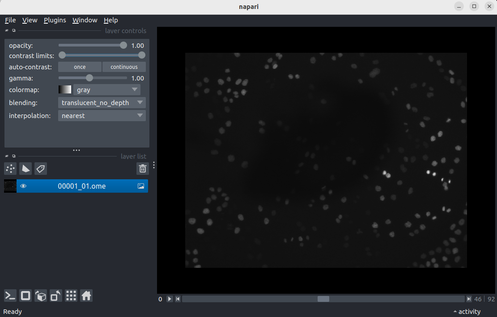

FIXME: Setup instructions live in this document. Please specify the tools and
the data sets the Learner needs to have installed.

## Data Sets

<!--
FIXME: place any data you want learners to use in `episodes/data` and then use
       a relative link ( [data zip file](data/lesson-data.zip) ) to provide a
       link to it, replacing the example.com link.
-->
Download the [data zip file](https://example.com/FIXME) and unzip it to your Desktop

## Software Setup

::::::::::::::::::::::::::::::::::::::: discussion

### Details

Setup for different systems can be presented in dropdown menus via a `solution`
tag. They will join to this discussion block, so you can give a general overview
of the software used in this lesson here and fill out the individual operating
systems (and potentially add more, e.g. online setup) in the solutions blocks.

:::::::::::::::::::::::::::::::::::::::::::::::::::

:::::::::::::::: solution

### Windows

Use PuTTY

:::::::::::::::::::::::::

:::::::::::::::: solution

### MacOS

Use Terminal.app

:::::::::::::::::::::::::


:::::::::::::::: solution

### Linux

Use Terminal

:::::::::::::::::::::::::

## Post Setup Checks

Before starting the course it is important to check that your setup is working. 
Download test data from the open microspcopy environment pages.
https://downloads.openmicroscopy.org/images/OME-TIFF/2016-06/MitoCheck/00001_01.ome.tiff

https://downloads.openmicroscopy.org/images/Zeiss-CZI/idr0011/Plate1-Blue-A_TS-Stinger/Plate1-Blue-A-12-Scene-3-P3-F2-03.czi

Start napari
```bash
conda activate napari-env
napari
```
Check that napari is installed correctly by opening a tiff file.
`File > Open file(s)...`
Should open a file selection dialog. Navigate to wherever you downloaded '00001_01.ome.tiff' to, probably your 'Downloads' folder. Select and click open. This should open a 'Choose reader' dialog. Select 'napari builtins'.
{alt="A screenshot of freshly opened 00001_01.ome.tiff" width='80%'}


Check that the napari-aicsimageio is installed correctly by opening a czi image.

{alt="A screenshot of freshly opened Plate1-Blue-A-12-Scene-3-P3-F2-03.czi" width='80%'}


