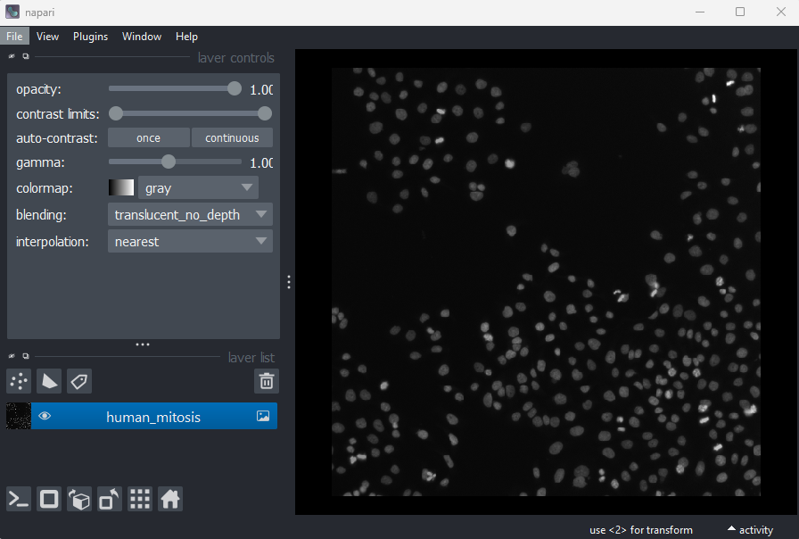
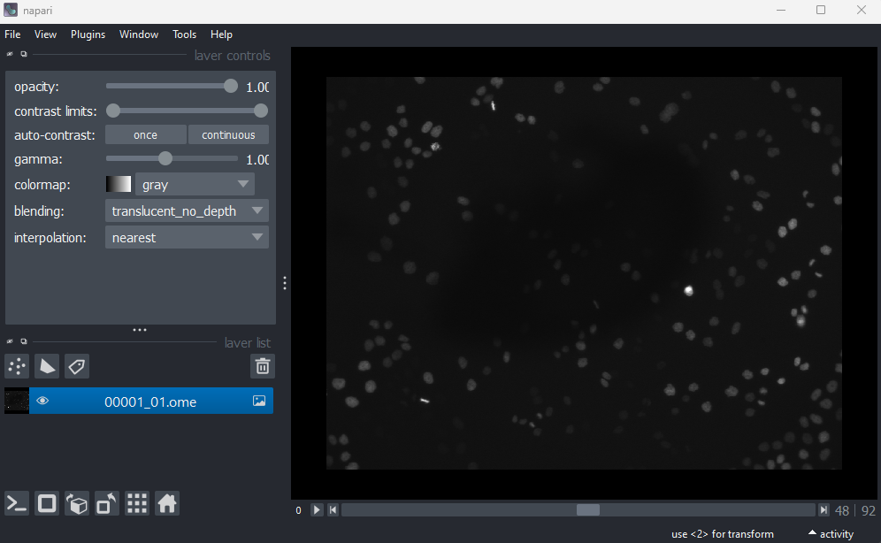
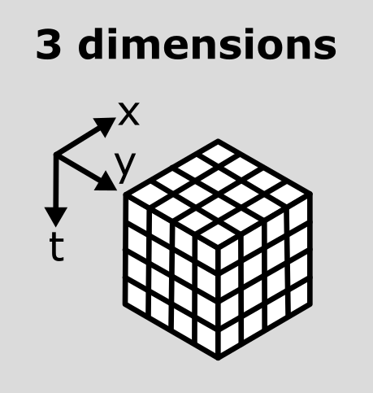
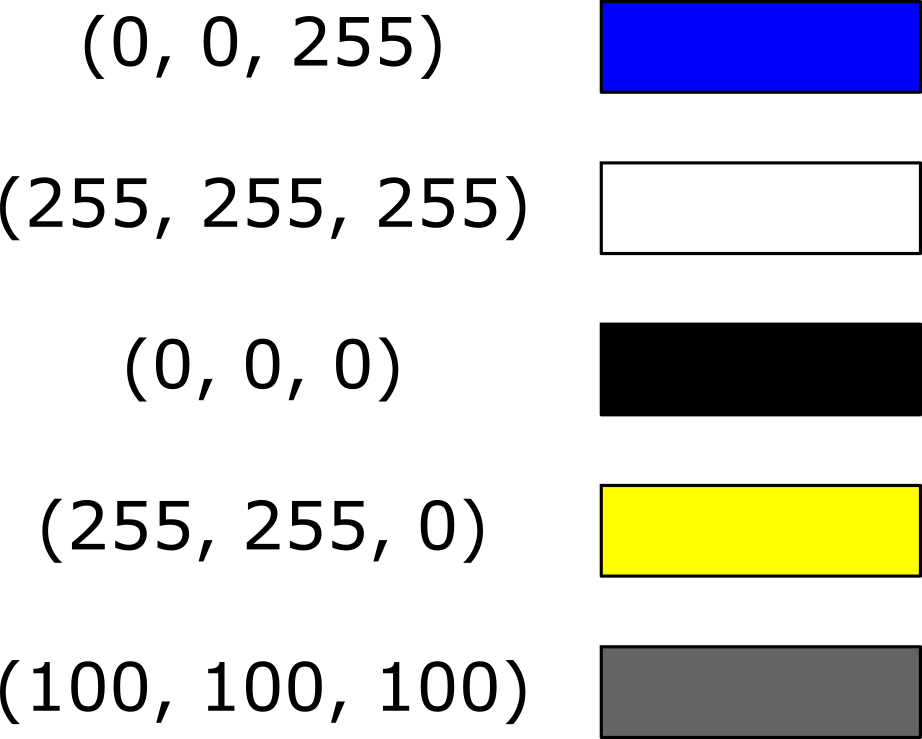

:::::::::::::::::::::::::::::::::::::: questions 

- How do we visualise and work with images with more than 2 dimensions?

::::::::::::::::::::::::::::::::::::::::::::::::

::::::::::::::::::::::::::::::::::::: objectives

- Explain how different axes (xyz, channels, time) are stored in image arrays 
and displayed
- Open and navigate images with different dimensions in Napari
- Explain what RGB images are and how they are handled in Napari
- Split and merge channels in Napari

::::::::::::::::::::::::::::::::::::::::::::::::

## Image dimensions / axes

As we saw in the ['What is an image?' episode](what-is-an-image.md), image pixel 
values are stored as arrays of numbers with certain dimensions and data type. 
So far we have focused on grayscale 2D images that are represented by a 2D array:

{alt="A diagram comparing the array of numbers and image 
display for a simplified image of an arrow" width='80%'}

Light microscopy data varies greatly though, and often has more dimensions 
representing:

- **Time (t):**  
  Multiple images of the same sample over a certain time period - also known as 
  a 'time series'. This is useful to evaluate dynamic processes.
  
- **Channels (c):**  
  Usually, this is multiple images of the same sample under different 
  wavelengths of light (e.g. red, green, blue channels, or wavelengths specific 
  to certain fluorescent markers). Note that channels can represent many more 
  values though, as we will [see below](#channels).

- **Depth (z):**  
  Multiple images of the same sample, taken at different depths. This will 
  produce a 3D volume of images, allowing the shape and position of objects to 
  be understood in full 3D.

These images will be stored as arrays that have more than two dimensions. 
Let's start with our familiar human mitosis image, and work up to some more 
complex imaging data.

## 2D

Go to the top menu-bar of Napari and select:  
`File > Open Sample > napari builtins > Human Mitosis`

{alt="A screenshot of a 2D image of human cells 
undergoing mitosis in Napari"}

We can see this image only has two dimensions (or two 'axes' as they're also 
known) due to the lack of sliders under the image, and by checking its shape in 
the Napari console. Remember that we looked at [how to open the console
](what-is-an-image.md#images-are-arrays-of-numbers) and how to check the 
[`.shape`](what-is-an-image.md#image-dimensions) in detail in the ['What is an 
image?' episode](what-is-an-image.md):

```python
image = viewer.layers["human_mitosis"].data
print(image.shape)
```

```output
# (y, x)
(512, 512)
```

Note that comments have been added to all output sections in this episode (the 
lines starting with #). These state what the dimensions represent (e.g. (y, x) 
for the y and x axes). These comments won't appear in the output in your console.

## 3D

Let's remove the mitosis image by clicking the remove layer button {alt="A screenshot of Napari's delete layer button" height='30px'} at the top 
right of the layer list. Then, let's open a new 3D image:  
`File > Open Sample > napari builtins > Brain (3D)`

{alt="A screenshot of a head X-ray in Napari"}

This image shows part of a human head acquired using X-ray Computerised 
Tomography (CT). We can see it has three dimensions due to the slider at the 
base of the image, and the shape output:

```python
image = viewer.layers["brain"].data
print(image.shape)
```

```output
# (z, y, x)
(10, 256, 256)
```

This 3D image can be thought of as a stack of ten 2D images, with each image 
containing a 256x256 array. The x/y axes point along the width/height of the 
first 2D image, and the z axis points along the stack. It is stored as a 3D 
array:

{alt="A diagram comparing 2D and 
3D image arrays" width='80%'}

In Napari (and Python in general), dimensions are referred to by their index 
e.g. here dimension 0 is the z axis, dimension 1 is the y axis and dimension 2 
is the x axis. We can check this in Napari by looking at the number at the very 
left of the slider. Here it's labelled '0', showing that it controls movement 
along dimension 0 (i.e. the z axis).

:::::::::::::::::::::::::::::::::::::: callout

## Axis labels

By default, sliders will be labelled by the index of the dimension they move 
along e.g. 0, 1, 2... Note that it is possible to re-name these though! For 
example, if you click on the number at the left of the slider, you can freely 
type in a new value. This can be useful to label sliders with informative names 
like 'z', or 'time'. 

You can also check which labels are currently being used with:
```python
viewer.dims.axis_labels
```

::::::::::::::::::::::::::::::::::::::::::::::::

## Channels

Next, let's look at a 3D image where an additional (fourth) dimension contains
data from different 'channels'. Remove the brain image and select:  
`File > Open Sample > napari builtins > Cells (3D+2Ch)`  

{alt="A screenshot of a flourescence microscopy image 
of some cells in Napari"}

Image channels can be used to store data from multiple sources for the same 
location. For example, consider the diagram below. On the left is shown a 2D 
image array overlaid on a simple cell with a nucleus. Each of the pixel 
locations e.g. (0, 0), (1, 1), (2, 1)... can be considered as sampling locations 
where different measurements can be made. For example, this could be the 
intensity of light detected with different wavelengths (like red, green...) at 
each location, or it could be measurements of properties like the surface height 
and elasticity at each location (like from [scanning probe microscopy
](https://www.nature.com/articles/s43586-021-00033-2)). These separate data 
sources are stored as 'channels' in our image.

{alt="A diagram showing different kinds of channels 
for a 4x4 image of a cell e.g. red / green / surface height / elasticity" 
width='80%'}

This diagram shows an example of a 2D image with channels, but this can also be 
extended to 3D images, as we will see now.

Fluorescence microscopy images, like the one we currently have open in Napari, 
are common examples of images with multiple channels. In flourescence 
microscopy, different 'flourophores' are used that target specific features 
(like the nucleus or cell membrane) and emit light of different wavelengths. 
Images are taken filtering for each of these wavelengths in turn, giving one 
image channel per fluorophore. In this case, there are two channels - one for a 
flourophore targeting the nucleus, and one for a fluorophore targeting the cell 
membrane. These are shown as separate image layers in Napari's layer list:

{alt="A screenshot of Napari's layer list, showing two 
image layers named 'nuclei' and 'membrane'"}

Recall from the [imaging software episode](imaging-software.md) that 'layers' 
are how Napari displays multiple items together in the viewer. Each layer could 
be an entire image, part of an image like a single channel, a series of points 
or shapes etc. Each layer is displayed as a named item in the layer list, and 
can have various display settings adjusted in the layer controls. 

Let's check the shape of both layers:

```python
nuclei = viewer.layers["nuclei"].data
membrane = viewer.layers["membrane"].data
print(nuclei.shape)
print(membrane.shape)
```

```output
# (z, y, x)
(60, 256, 256)
(60, 256, 256)
```
This shows that each layer contains a 3D image array of size 60x256x256. Each 
3D image represents the intensity of light detected at each (z, y, x) location 
with a wavelength corresponding to the given fluorophore.

Here, Napari has automatically recognised that this image contains different 
channels and separated them into different image layers. This is not always the 
case though, and sometimes it [may be preferable to not split the channels into 
separate layers](#when-to-split-channels-into-layers-in-napari)! We can merge 
our channels again by selecting both image layers (shift + click so they're 
both highlighted in blue), right clicking on them and selecting:  
`Merge to stack`

You should see the two image layers disappear, and a new combined layer appear 
in the layer list (labelled 'membrane'). This image has an extra slider that 
allows switching channels - try moving both sliders and see how the image 
display changes.

We can check the image's dimensions with:

```python

image = viewer.layers["membrane"].data
print(image.shape)
```

```output
# (c, z, y, x)
(2, 60, 256, 256)
```

Notice how these dimensions match combining the two layers shown above. Two 
arrays with 3 dimensions (60, 256, 256) are combined to give one array with
four dimensions (2, 60, 256, 256) with the first axis representing the 2 channels. 
See the diagram below for a visualisation of how these 3D and 4D arrays compare:

{alt="A diagram comparing image arrays with three 
(z, y, x) and four (c, z, y, x) dimensions" width='80%'}

As we've seen before, the labels on the left hand side of each slider in Napari 
matches the index of the dimension it moves along. The top slider (labelled 1) 
moves along the z axis, while the bottom slider (labelled 0) switches channels.

We can separate the channels again by right clicking on the 'membrane' image 
layer and selecting:  
`Split Stack` 

Note that this resets the contrast limits for membrane and nuclei to defaults of 
the min/max possible values. You'll need to adjust the contrast limits on the 
membrane layer to see it clearly again after splitting.


:::::::::::::::::::::::::::::::::::::: callout

## Reading channels in Napari

When we open the cells image through the Napari menu, it is really calling 
something like:

```
from skimage import data
viewer.add_image(data.cells3d(), channel_axis=1)
```
This adds the cells 3D image (which is stored as zcyx), and specifies that 
dimension 1 is the channel axis. This allows Napari to split the channels 
automatically into different layers.

Often when loading your own images into Napari e.g. with the 
BioIO plugin (as we will see in the 
[filetypes and metadata episode](filetypes-and-metadata.md)), the channel 
axis will be recognised automatically. If not, you may need to add the image 
via the console as above, manually stating the channel axis.

::::::::::::::::::::::::::::::::::::::::::::::::

:::::::::::::::::::::::::::::::::::::: callout

## When to split channels into layers in Napari?

As we saw above, we have two choices when loading images with multiple 
channels into Napari:

- Load the image as one Napari layer, and use a slider to change channel

- Load each channel as a separate Napari layer, e.g. using the `channel_axis`

Both are useful ways to view multichannel images, and which you choose will 
depend on your image and preference. Some pros and cons are shown below:

:::::::::::::::::::::::::::::::: spoiler

### Pros and cons

**Channels as separate layers**

1. Channels can be overlaid on top of each other (rather than only viewed one at 
a time)

2. Channels can be easily shown/hidden with the {alt="A screenshot of Napari's eye button" height='20px'} icons

3. Display settings like contrast limits and colormaps can be controlled 
independently for each channel (rather than only for the entire image)

**Entire image as one layer**

1. Useful when handling a very large number of channels. For example, if we have 
hundreds of channels, then moving between them on a slider may be simpler and 
faster.

2. Napari can become slow, or even crash with a very large number of layers. 
Keeping the entire image as one layer can help prevent this.

3. Keeping the full image as one layer can be helpful when running certain 
processing operations across multiple channels at once

:::::::::::::::::::::::::::::::::

::::::::::::::::::::::::::::::::::::::::::::::::


## Time

You should have already downloaded the MitoCheck dataset as part of the 
[setup instructions](../learners/setup.md) - if not, you can download it by 
clicking on '00001_01.ome.tiff' on [this page of the OME website
](https://docs.openmicroscopy.org/ome-model/5.6.3/ome-tiff/data.html#mitocheck).

To open it in Napari, remove any existing image layers, then drag and drop the 
file over the canvas. A popup may appear asking you to choose a 'reader' - you 
can select either 'napari builtins' or 'Bioio Reader'. We'll see in the 
next episode that BioIO gives us access to useful image metadata.

Note this image can take a while to open, so give it some time! 
Alternatively, you can select in the top menu-bar:  
`File > Open File(s)...`

{alt="A screenshot of a 2D time series in Napari"}

This image is a 2D time series (tyx) of some human cells undergoing mitosis. The 
slider at the bottom now moves through time, rather than z or channels. Try 
moving the slider from left to right -  you should see some nuclei divide and 
the total number of nuclei increase. You can also press the small {alt="A screenshot of Napari's play button" height='20px'} icon at the 
left side of the slider to automatically move along it. The icon will change 
into a {alt="A screenshot of Napari's stop button" height='25px'}- pressing this will 
stop the movement.

We can again check the image dimensions by running the following:

```python
image = viewer.layers["00001_01.ome"].data
print(image.shape)
```

```output
# (t, y, x)
(93, 1024, 1344)
```

Note that this image has a total of 3 dimensions, and so it will also be stored 
in a 3D array:

{alt="A diagram of a tyx image array" width='40%'}

This makes the point that the dimensions don't always represent the same 
quantities. For example, a 3D image array with shape (512, 512, 512) could 
represent a zyx, cyx or tyx image. We'll discuss this more in the next section. 

## Dimension order

As we've seen so far, we can check the number and size of an image's dimensions 
by running:
```python
image.shape
```

Napari reads this array and displays the image appropriately, with the correct 
number of sliders, based on these dimensions. It's worth noting though that 
Napari doesn't usually know what these different dimensions represent e.g. 
consider a 4 dimensional image with shape (512, 512, 512, 512). This could be 
tcyx, czyx, tzyx etc... Napari will just display it as an image with 2 
additional sliders, not caring about exactly what each represents.

Python has certain conventions for the order of image axes (like 
[scikit-image's 'coordinate conventions'
](https://scikit-image.org/docs/stable/user_guide/numpy_images.html#coordinate-conventions) 
and [BioIO's reader
](https://bioio-devs.github.io/bioio/OVERVIEW.html#full-image-reading)) 
- but this tends to vary based on the library or plugin you're using. These 
are not firm rules!

Therefore, it's always worth checking you understand which axes are being shown 
in any viewer and what they represent! Check against your prior knowledge of the 
experimental setup, and check the metadata in the original image (we'll look at 
this in the next episode). If you want to change how axes are displayed, 
remember you can use the roll or transpose dimensions buttons as discussed in 
the [imaging software episode](imaging-software.md). Also, if loading the image 
manually from the console, you can provide some extra information like the 
`channel_axis` parameter discussed above. 

::::::::::::::::::::::::::::::::::::: challenge 

## Interpreting image dimensions

Remove all image layers, then open a new image by copying and pasting the 
following into Napari's console:

```python
from skimage import data
image = viewer.add_image(data.kidney(), rgb=False).data
```

This is a fluorescence microscopy image of mouse kidney tissue. 

1. How many dimensions does it have?

2. What do each of those dimensions represent? (e.g. t, c, z, y, x) **Hint:** 
try using the roll dimensions button {alt="A screenshot of Napari's roll dimensions button" height='25px'} to view 
different combinations of axes.

3. Once you know which dimension represent channels, remove the image and load 
it again with:
  ```python
  # Replace ? with the correct channel axis
  viewer.add_image(data.kidney(), rgb=False, channel_axis=?)
  ```
  Note that using the wrong channel axis may cause Napari to crash. If this 
  happens to you just restart Napari and try again. Bear in mind, as we saw in 
  the [channel splitting section](#when-to-split-channels-into-layers-in-napari) 
  that large numbers of layers can be difficult to handle, so it isn't usually 
  advisable to use 'channel_axis' on dimensions with a large size.

4. How many channels does the image have?

:::::::::::::::::::::::: solution 

## Solution

### 1
The image has 4 dimensions, which we can see with:
```python
image.shape
```

```output
(16, 512, 512, 3)
```

### 2
If we press the roll dimensions button {alt="A screenshot of Napari's roll dimensions button" height='25px'} once, we 
can see an image of various cells and nuclei. Moving the slider labelled '0' 
seems to move up and down in this image (i.e. the z axis), while moving the 
slider labelled '3' changes between highlighting different features like nuclei 
and cell edges (i.e. channels). Therefore, the remaining two axes (1 and 2) must 
be y and x. This means the image's 4 dimensions are (z, y, x, c)

### 3
The channel axis is 3 (remember that the numbering always starts form 0!)

### 4
There are 3 channels which we can see from the `.shape` output, or from the 
number of layers in the layer list.

:::::::::::::::::::::::::::::::::

::::::::::::::::::::::::::::::::::::::::::::::::

## RGB

For the final part of this episode, let's look at RGB images. RGB images can be 
considered as a special case of a 2D image with channels (yxc). In this case, 
there are always 3 channels - with one representing red (R), one representing 
green (G) and one representing blue (B).

Let's open an example RGB image with the command below. Make sure you remove any 
existing image layers first!  
`File > Open Sample > napari builtins > Skin (RGB)`

{alt="A screenshot of an H+E slide of skin layers 
in Napari"}

This image is a hematoxylin and eosin stained slide of dermis and epidermis 
(skin layers). Let's check its shape:

```python
image = viewer.layers["skin"].data
print(image.shape)
```

```output
# (y, x, c)
(960, 1280, 3)
```

Notice that the channels aren't separated out into different image layers, as 
they were for the multichannel images above. Instead, they are shown combined 
together as a single image. If you hover your mouse over the image, you should 
see three pixel values printed in the bottom left representing (R, G, B).

{alt="A screenshot of an H+E slide of skin layers in 
Napari, highlighting the (R,G,B) values"}

We can see these different channels more clearly if we right click on the 'skin' 
image layer and select:  
`Split RGB`

This shows the red, green and blue channels as separate image layers. Try 
inspecting each one individually by clicking the {alt="A screenshot of Napari's eye button" height='30px'} icons to hide the 
other layers.

We can understand these RGB pixel values better by opening a different sample 
image. Remove all layers, then select:  
`File > Open Sample > napari builtins > Colorwheel (RGB)`

{alt="A screenshot of a colorwheel in Napari"}

This image shows an RGB colourwheel - try hovering your mouse over different 
areas, making note of the (R, G, B) values shown in the bottom left of Napari. 
You should see that moving into the red area gives high values for R, and low 
values for B and G. Equally, the green area shows high values for G, and the 
blue area shows high values for B. The red, green and blue values are mixed 
together to give the final colour.

Recall from the [image display episode](image-display.md) that for most 
microscopy images the colour of each pixel is determined by a colormap (or LUT). 
Each pixel usually has a single value that is then mapped to a corresponding 
colour via the colormap, and different colormaps can be used to highlight 
different features. RGB images are different - here we have three values 
(R, G, B) that unambiguously correspond to a colour for display. For example, 
(255, 0, 0) would always be fully red, (0, 255, 0) would always be fully green 
and so on... This is why there is no option to select a colormap in the layer 
controls when an RGB image is displayed. In effect, the colormap is 
hard-coded into the image, with a full colour stored for every pixel location.

These kinds of images are common when we are trying to replicate what can be 
seen with the human eye. For example, photos taken with a standard camera or 
phone will be RGB. They are less common in microscopy, although there are 
certain research fields and types of microscope that commonly use RGB. A key 
example is imaging of tissue sections for histology or pathology. You will also 
often use RGB images when preparing figures for papers and presentations - RGB 
images can be opened in all imaging software (not just scientific research 
focused ones), so are useful when preparing images for display. As usual, always 
make sure you keep a copy of your original raw data! 

:::::::::::::::::::::::::::::::::::::: callout

## Reading RGB in Napari

How does Napari know an image is RGB? If an image's final dimension has a length 
of 3 or 4, Napari will assume it is RGB and [display it as such
](https://napari.org/stable/howtos/layers/image.html#viewing-rgb-vs-luminance-grayscale-images). 
If loading an image from the console, you can also manually set it to load 
as rgb:

```python
from skimage import data
viewer.add_image(data.astronaut(), rgb=True)
```

::::::::::::::::::::::::::::::::::::::::::::::::

::::::::::::::::::::::::::::::::::::: challenge 

## RGB histograms

Make a histogram of the Skin (RGB) image using `napari-matplotlib` (as covered 
in the [image display episode](image-display.md))

- How does it differ from the image histograms we looked at in the 
[image display episode](image-display.md)?

:::::::::::::::::::::::: solution 

If you haven't completed the [image display episode](image-display.md), you 
will need to [install the `napari-matplotlib` plugin
](image-display.md#napari-plugins).

Then open a histogram with:  
`Plugins > napari Matplotlib > Histogram`
 
{alt="RGB histogram of the Napari Skin sample image"}

This histogram shows separate lines for R, G and B - this is because each 
displayed pixel is represented by three values (R, G, B). This differs from the 
histograms we looked at previously, where there was only one line as each 
displayed pixel was only represented by one value.

:::::::::::::::::::::::::::::::::

::::::::::::::::::::::::::::::::::::::::::::::::


::::::::::::::::::::::::::::::::::::: challenge 

## Understanding RGB colours

What colour would you expect the following (R, G, B) values to produce? Each 
value has a minimum of 0 and a maximum of 255.

- (0, 0, 255)
- (255, 255, 255)
- (0, 0, 0)
- (255, 255, 0)
- (100, 100, 100)

:::::::::::::::::::::::: solution 
 
{alt="Diagram of (R, G, B) values next to corresponding 
colours" width='50%'}

:::::::::::::::::::::::::::::::::

::::::::::::::::::::::::::::::::::::::::::::::::

::::::::::::::::::::::::::::::::::::: keypoints 

- Microscopy images can have many dimensions, usually representing time (t),
channels (c), and spatial axes (z, y, x)
- Napari can open images with any number of dimensions
- Napari (and python in general) has no firm rules for axis order. Different 
libraries and plugins will often use different conventions.
- RGB images always have 3 channels - red (R), green (G) and blue (B). These 
channels aren't separated into different image layers - they're instead combined 
together to give the final image display.

::::::::::::::::::::::::::::::::::::::::::::::::

